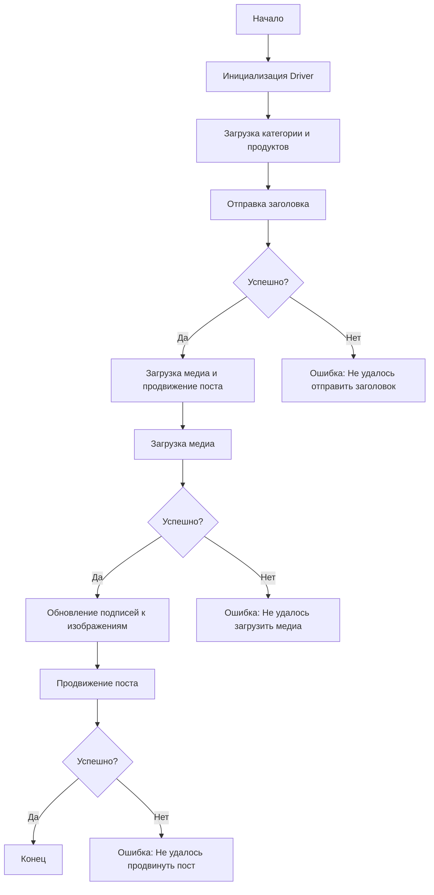

# Документация модуля `src.endpoints.advertisement.facebook.post_message_async`

## Обзор

Этот модуль, расположенный в `hypotez/src/endpoints/advertisement/facebook/scenarios`, предназначен для автоматизации процесса публикации сообщений на Facebook. Он позволяет отправлять заголовки, описания и медиафайлы, а также управлять процессом продвижения поста.

## Подробней

Модуль предоставляет функции для взаимодействия со страницей Facebook, используя локаторы для выполнения различных действий. Это позволяет автоматизировать процесс создания и продвижения рекламных постов. Основная цель модуля - упростить и ускорить процесс публикации контента на Facebook.

## Структура модуля

Для лучшего понимания структуры модуля представлена схема процесса:



### Легенда к схеме

1.  **Start**: Начало выполнения скрипта.
2.  **InitDriver**: Создание экземпляра класса `Driver`.
3.  **LoadCategoryAndProducts**: Загрузка данных категории и продуктов.
4.  **SendTitle**: Вызов функции `post_title` для отправки заголовка.
5.  **CheckTitleSuccess**: Проверка успешности отправки заголовка.
    *   **Да**: Переход к загрузке медиа и продвижению поста.
    *   **Нет**: Вывод ошибки "Не удалось отправить заголовок".
6.  **UploadMediaAndPromotePost**: Вызов функции `promote_post`.
7.  **UploadMedia**: Вызов функции `upload_media` для загрузки медиафайлов.
8.  **CheckMediaSuccess**: Проверка успешности загрузки медиа.
    *   **Да**: Переход к обновлению подписей к изображениям.
    *   **Нет**: Вывод ошибки "Не удалось загрузить медиа".
9.  **UpdateCaptions**: Вызов функции `update_images_captions` для обновления подписей.
10. **PromotePost**: Завершение процесса продвижения поста.
11. **CheckPromoteSuccess**: Проверка успешности продвижения поста.
    *   **Да**: Конец выполнения скрипта.
    *   **Нет**: Вывод ошибки "Не удалось продвинуть пост".

## Функции

### `post_title`

```python
def post_title(d: Driver, category: SimpleNamespace) -> bool:
    """Отправляет заголовок и описание кампании в поле сообщения на Facebook.

    Args:
        d (Driver): Экземпляр `Driver` для взаимодействия с веб-страницей.
        category (SimpleNamespace): Категория, содержащая заголовок и описание для отправки.

    Returns:
        bool: `True`, если заголовок и описание были успешно отправлены, иначе `None`.
    """
    ...
```

**Назначение**: Отправляет заголовок и описание кампании в поле сообщения на Facebook.

**Параметры**:

*   `d` (Driver): Экземпляр `Driver` для взаимодействия с веб-страницей.
*   `category` (SimpleNamespace): Категория, содержащая заголовок и описание для отправки.

**Возвращает**:

*   `bool`: Возвращает `True`, если заголовок и описание были успешно отправлены, иначе возвращает `None`.

**Как работает функция**:

1.  Функция `post_title` принимает экземпляр класса `Driver` и `SimpleNamespace`, содержащий заголовок и описание.
2.  Функция использует `driver.execute_locator` для поиска и заполнения полей заголовка и описания в посте Facebook.
3.  Если поля успешно заполнены, функция возвращает `True`, иначе `None`.

```
A[Начало]
|
B[Поиск и заполнение поля заголовка через driver.execute_locator]
|
C[Поиск и заполнение поля описания через driver.execute_locator]
|
D[Проверка успешности заполнения полей]
|
E[Возврат True, если поля заполнены успешно, иначе None]
|
F[Конец]
```

**Примеры**:

```python
from src.webdriver.driver import Driver
from types import SimpleNamespace

# Пример использования
driver = Driver(...)
category = SimpleNamespace(title="Заголовок кампании", description="Описание кампании")
result = post_title(driver, category)
if result:
    print("Заголовок и описание успешно отправлены.")
else:
    print("Не удалось отправить заголовок и описание.")
```

### `upload_media`

```python
def upload_media(d: Driver, products: List[SimpleNamespace], no_video: bool = False) -> bool:
    """Загружает медиафайлы на пост Facebook и обновляет их подписи.

    Args:
        d (Driver): Экземпляр `Driver` для взаимодействия с веб-страницей.
        products (List[SimpleNamespace]): Список продуктов, содержащих пути к медиафайлам.
        no_video (bool, optional): Флаг, указывающий, следует ли пропустить загрузку видео. По умолчанию `False`.

    Returns:
        bool: `True`, если медиафайлы были успешно загружены, иначе `None`.
    """
    ...
```

**Назначение**: Загружает медиафайлы на пост Facebook.

**Параметры**:

*   `d` (Driver): Экземпляр `Driver` для взаимодействия с веб-страницей.
*   `products` (List[SimpleNamespace]): Список продуктов, содержащих пути к медиафайлам.
*   `no_video` (bool): Флаг, указывающий, следует ли пропустить загрузку видео.

**Возвращает**:

*   `bool`: Возвращает `True`, если медиафайлы были успешно загружены, иначе `None`.

**Как работает функция**:

1.  Функция `upload_media` принимает экземпляр класса `Driver` и список `SimpleNamespace`, содержащих пути к медиафайлам.
2.  Функция использует `driver.execute_locator` для загрузки медиафайлов на пост Facebook.
3.  Если все медиафайлы успешно загружены, функция возвращает `True`, иначе `None`.

```
A[Начало]
|
B[Инициализация driver]
|
C[Цикл по списку продуктов]
|
D[Загрузка медиафайла для каждого продукта]
|
E[Проверка успешности загрузки медиа]
|
F[Возврат True, если все медиафайлы загружены успешно, иначе None]
|
G[Конец]
```

**Примеры**:

```python
from src.webdriver.driver import Driver
from types import SimpleNamespace

# Пример использования
driver = Driver(...)
products = [SimpleNamespace(local_image_path='путь/к/изображению1.jpg'), SimpleNamespace(local_image_path='путь/к/изображению2.jpg')]
result = upload_media(driver, products)
if result:
    print("Медиафайлы успешно загружены.")
else:
    print("Не удалось загрузить медиафайлы.")
```

### `update_images_captions`

```python
def update_images_captions(d: Driver, products: List[SimpleNamespace], textarea_list: List[WebElement]) -> None:
    """Асинхронно добавляет описания к загруженным медиафайлам.

    Args:
        d (Driver): Экземпляр `Driver` для взаимодействия с веб-страницей.
        products (List[SimpleNamespace]): Список продуктов с деталями для обновления.
        textarea_list (List[WebElement]): Список текстовых полей, куда добавляются подписи.
    """
    ...
```

**Назначение**: Асинхронно добавляет описания к загруженным медиафайлам.

**Параметры**:

*   `d` (Driver): Экземпляр `Driver` для взаимодействия с веб-страницей.
*   `products` (List[SimpleNamespace]): Список продуктов с деталями для обновления.
*   `textarea_list` (List[WebElement]): Список текстовых полей, куда добавляются подписи.

**Возвращает**:

*   `None`

**Как работает функция**:

1.  Функция `update_images_captions` принимает экземпляр класса `Driver`, список `SimpleNamespace`, содержащий детали продуктов, и список текстовых полей (`textarea_list`).
2.  Функция использует `driver.execute_locator` для добавления описаний к загруженным медиафайлам в соответствующие текстовые поля.
3.  Функция ничего не возвращает.

```
A[Начало]
|
B[Инициализация driver]
|
C[Цикл по списку продуктов и textarea_list]
|
D[Добавление описания к каждому медиафайлу]
|
E[Конец]
```

**Примеры**:

```python
from src.webdriver.driver import Driver
from selenium.webdriver.remote.webelement import WebElement
from types import SimpleNamespace

# Пример использования
driver = Driver(...)
products = [SimpleNamespace(description='Описание1'), SimpleNamespace(description='Описание2')]
textarea_list = [WebElement(...), WebElement(...)]
update_images_captions(driver, products, textarea_list)
print("Подписи к изображениям успешно обновлены.")
```

### `promote_post`

```python
def promote_post(d: Driver, category: SimpleNamespace, products: List[SimpleNamespace], no_video: bool = False) -> bool:
    """Управляет процессом продвижения поста с заголовком, описанием и медиафайлами.

    Args:
        d (Driver): Экземпляр `Driver` для взаимодействия с веб-страницей.
        category (SimpleNamespace): Детали категории, используемые для заголовка и описания поста.
        products (List[SimpleNamespace]): Список продуктов, содержащих медиа и детали для публикации.
        no_video (bool, optional): Флаг, указывающий, следует ли пропустить загрузку видео. По умолчанию `False`.

    Returns:
        bool: `True`, если пост был успешно продвинут, иначе `None`.
    """
    ...
```

**Назначение**: Управляет процессом продвижения поста с заголовком, описанием и медиафайлами.

**Параметры**:

*   `d` (Driver): Экземпляр `Driver` для взаимодействия с веб-страницей.
*   `category` (SimpleNamespace): Детали категории, используемые для заголовка и описания поста.
*   `products` (List[SimpleNamespace]): Список продуктов, содержащих медиа и детали для публикации.
*   `no_video` (bool): Флаг, указывающий, следует ли пропустить загрузку видео.

**Возвращает**:

*   `bool`: Возвращает `True`, если пост был успешно продвинут, иначе `None`.

**Как работает функция**:

1.  Функция `promote_post` принимает экземпляр класса `Driver`, `SimpleNamespace`, содержащий детали категории, и список `SimpleNamespace`, содержащий детали продуктов.
2.  Функция использует другие функции модуля (`post_title`, `upload_media`, `update_images_captions`) для выполнения шагов продвижения поста.
3.  Если все шаги выполнены успешно, функция возвращает `True`, иначе `None`.

```
A[Начало]
|
B[Отправка заголовка и описания через post_title]
|
C[Загрузка медиафайлов через upload_media]
|
D[Обновление подписей к изображениям через update_images_captions]
|
E[Проверка успешности всех шагов]
|
F[Возврат True, если все шаги выполнены успешно, иначе None]
|
G[Конец]
```

**Примеры**:

```python
from src.webdriver.driver import Driver
from types import SimpleNamespace

# Пример использования
driver = Driver(...)
category = SimpleNamespace(title="Заголовок", description="Описание")
products = [SimpleNamespace(local_image_path='путь/к/изображению.jpg', description='Описание изображения')]
result = promote_post(driver, category, products)
if result:
    print("Пост успешно продвинут.")
else:
    print("Не удалось продвинуть пост.")
```

## Использование

Для использования этого модуля выполните следующие шаги:

1.  Инициализация Driver: Создайте экземпляр класса `Driver`.
2.  Загрузка локаторов: Загрузите локаторы из JSON-файла.
3.  Вызов функций: Используйте предоставленные функции для отправки заголовка, загрузки медиа и продвижения поста.

## Зависимости

*   `selenium`: Для веб-автоматизации.
*   `asyncio`: Для асинхронных операций.
*   `pathlib`: Для обработки путей к файлам.
*   `types`: Для создания простых пространств имен.
*   `typing`: Для аннотаций типов.

## Обработка ошибок

Скрипт включает надежную обработку ошибок, чтобы обеспечить продолжение выполнения даже в случае, если некоторые элементы не найдены или если возникли проблемы с веб-страницей.

## Вклад

Вклад в этот скрипт приветствуется. Пожалуйста, убедитесь, что любые изменения хорошо документированы и включают соответствующие тесты.

## Лицензия

Этот скрипт лицензирован под MIT License. Подробности смотрите в файле `LICENSE`.