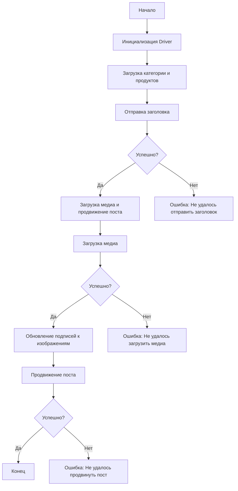

# Сценарий асинхронной публикации сообщения на Facebook

## Обзор

Этот скрипт предназначен для автоматизации процесса публикации сообщений на Facebook. Он взаимодействует со страницей Facebook, используя локаторы для отправки сообщений, загрузки медиафайлов и обновления подписей.

## Оглавление
1. [Обзор](#обзор)
2. [Основные возможности](#основные-возможности)
3. [Структура модуля](#структура-модуля)
4. [Легенда](#легенда)
5. [Функции](#функции)
   - [`post_title`](#post_title)
   - [`upload_media`](#upload_media)
   - [`update_images_captions`](#update_images_captions)
   - [`promote_post`](#promote_post)
6. [Использование](#использование)
7. [Пример](#пример)
8. [Зависимости](#зависимости)
9. [Обработка ошибок](#обработка-ошибок)
10. [Вклад](#вклад)
11. [Лицензия](#лицензия)

## Основные возможности

1.  **Отправка заголовка и описания**: Отправляет заголовок и описание кампании в поле сообщения на Facebook.
2.  **Загрузка медиафайлов**: Загружает медиафайлы (изображения и видео) на пост Facebook и обновляет их подписи.
3.  **Продвижение поста**: Управляет всем процессом продвижения поста с заголовком, описанием и медиафайлами.

## Структура модуля



## Легенда

1.  **Start**: Начало выполнения скрипта.
2.  **InitDriver**: Создание экземпляра класса `Driver`.
3.  **LoadCategoryAndProducts**: Загрузка данных категории и продуктов.
4.  **SendTitle**: Вызов функции `post_title` для отправки заголовка.
5.  **CheckTitleSuccess**: Проверка успешности отправки заголовка.
    *   **Да**: Переход к загрузке медиа и продвижению поста.
    *   **Нет**: Вывод ошибки "Не удалось отправить заголовок".
6.  **UploadMediaAndPromotePost**: Вызов функции `promote_post`.
7.  **UploadMedia**: Вызов функции `upload_media` для загрузки медиафайлов.
8.  **CheckMediaSuccess**: Проверка успешности загрузки медиа.
    *   **Да**: Переход к обновлению подписей к изображениям.
    *   **Нет**: Вывод ошибки "Не удалось загрузить медиа".
9.  **UpdateCaptions**: Вызов функции `update_images_captions` для обновления подписей.
10. **PromotePost**: Завершение процесса продвижения поста.
11. **CheckPromoteSuccess**: Проверка успешности продвижения поста.
    *   **Да**: Конец выполнения скрипта.
    *   **Нет**: Вывод ошибки "Не удалось продвинуть пост".

## Функции

### `post_title`

**Описание**: Отправляет заголовок и описание кампании в поле сообщения на Facebook.

**Параметры**:

*   `d` (Driver): Экземпляр `Driver` для взаимодействия с веб-страницей.
*   `category` (SimpleNamespace): Категория, содержащая заголовок и описание для отправки.

**Возвращает**:

*   `bool | None`: `True`, если заголовок и описание были успешно отправлены, иначе `None`.

### `upload_media`

**Описание**: Загружает медиафайлы на пост Facebook и обновляет их подписи.

**Параметры**:

*   `d` (Driver): Экземпляр `Driver` для взаимодействия с веб-страницей.
*   `products` (List[SimpleNamespace]): Список продуктов, содержащих пути к медиафайлам.
*   `no_video` (bool, optional): Флаг, указывающий, следует ли пропустить загрузку видео. По умолчанию `False`.

**Возвращает**:

*   `bool | None`: `True`, если медиафайлы были успешно загружены, иначе `None`.

### `update_images_captions`

**Описание**: Асинхронно добавляет описания к загруженным медиафайлам.

**Параметры**:

*   `d` (Driver): Экземпляр `Driver` для взаимодействия с веб-страницей.
*   `products` (List[SimpleNamespace]): Список продуктов с деталями для обновления.
*   `textarea_list` (List[WebElement]): Список текстовых полей, куда добавляются подписи.

**Возвращает**:
    - `None`: Функция ничего не возвращает.

### `promote_post`

**Описание**: Управляет процессом продвижения поста с заголовком, описанием и медиафайлами.

**Параметры**:

*   `d` (Driver): Экземпляр `Driver` для взаимодействия с веб-страницей.
*   `category` (SimpleNamespace): Детали категории, используемые для заголовка и описания поста.
*   `products` (List[SimpleNamespace]): Список продуктов, содержащих медиа и детали для публикации.
*   `no_video` (bool, optional): Флаг, указывающий, следует ли пропустить загрузку видео. По умолчанию `False`.

**Возвращает**:

*   `bool | None`: `True`, если пост был успешно продвинут, иначе `None`.

## Использование

Для использования этого скрипта выполните следующие шаги:

1.  **Инициализация Driver**: Создайте экземпляр класса `Driver`.
2.  **Загрузка локаторов**: Загрузите локаторы из JSON-файла.
3.  **Вызов функций**: Используйте предоставленные функции для отправки заголовка, загрузки медиа и продвижения поста.

## Пример

```python
from src.webdriver.driver import Driver
from types import SimpleNamespace
import asyncio

async def main():
    # Инициализация Driver
    driver = Driver(...)

    # Загрузка категории и продуктов
    category = SimpleNamespace(title="Заголовок кампании", description="Описание кампании")
    products = [SimpleNamespace(local_image_path='путь/к/изображению.jpg', ...)]

    # Отправка заголовка
    post_title(driver, category)

    # Загрузка медиа и продвижение поста
    await promote_post(driver, category, products)

if __name__ == "__main__":
    asyncio.run(main())
```

## Зависимости

*   `selenium`: Для веб-автоматизации.
*   `asyncio`: Для асинхронных операций.
*   `pathlib`: Для обработки путей к файлам.
*   `types`: Для создания простых пространств имен.
*   `typing`: Для аннотаций типов.

## Обработка ошибок

Скрипт включает надежную обработку ошибок, чтобы обеспечить продолжение выполнения даже в случае, если некоторые элементы не найдены или если возникли проблемы с веб-страницей. Это особенно полезно для обработки динамических или нестабильных веб-страниц.

## Вклад

Вклад в этот скрипт приветствуется. Пожалуйста, убедитесь, что любые изменения хорошо документированы и включают соответствующие тесты.

## Лицензия

Этот скрипт лицензирован под MIT License. Подробности смотрите в файле `LICENSE`.