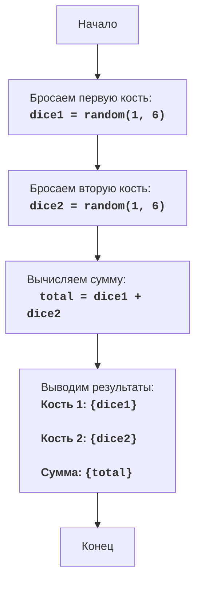

# DICE

## Обзор

Этот модуль имитирует игру в кости, где компьютер бросает две шестигранные кости и выводит значения каждой кости и их сумму.

## Оглавление

1. [Обзор](#обзор)
2. [Функции](#функции)
3. [Блок-схема](#блок-схема)
4. [Объяснение кода](#объяснение-кода)

## Функции

### `random.randint(a, b)`

**Описание**: Генерирует случайное целое число в диапазоне от `a` до `b` включительно.
    
**Параметры**:
- `a` (int): Начальное значение диапазона.
- `b` (int): Конечное значение диапазона.

**Возвращает**:
- `int`: Случайное целое число в диапазоне от `a` до `b`.

## Блок-схема

**Легенда**:

- **Start**: Начало программы.
- **RollDice1**: Генерируется случайное число от 1 до 6, представляющее результат броска первой кости, и сохраняется в переменной `dice1`.
- **RollDice2**: Генерируется случайное число от 1 до 6, представляющее результат броска второй кости, и сохраняется в переменной `dice2`.
- **CalculateSum**: Вычисляется сумма значений `dice1` и `dice2`, результат сохраняется в переменной `total`.
- **OutputResults**: Выводятся значения `dice1`, `dice2` и их сумма `total` на экран.
- **End**: Конец программы.

## Объяснение кода

1. **Импорт модуля `random`**:
   - `import random`: Импортирует модуль `random`, который используется для генерации случайных чисел.
2. **Генерация бросков костей**:
   - `dice1 = random.randint(1, 6)`: Генерирует случайное целое число от 1 до 6 (имитация броска шестигранной кости) и сохраняет его в переменной `dice1`.
   - `dice2 = random.randint(1, 6)`: Генерирует случайное целое число от 1 до 6 и сохраняет его в переменной `dice2`.
3. **Вычисление суммы**:
   - `total = dice1 + dice2`: Суммирует значения `dice1` и `dice2`, сохраняя результат в переменной `total`.
4. **Вывод результатов**:
   - `print(f"Кость 1: {dice1}")`: Выводит на экран значение первой кости.
   - `print(f"Кость 2: {dice2}")`: Выводит на экран значение второй кости.
   - `print(f"Сумма: {total}")`: Выводит на экран сумму значений обеих костей.