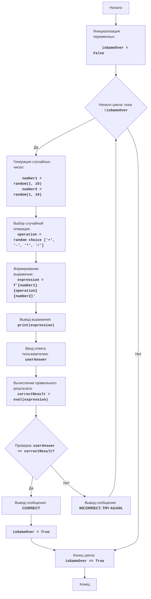

# MATHDI: Математические задачи

## Обзор

Игра "Математические задачи" предлагает пользователю решить простую математическую задачу (сложение, вычитание, умножение или деление) и проверяет правильность ответа. Игра генерирует случайные числа и операцию.

## Оглавление
1. [Описание игры](#описание-игры)
2. [Правила игры](#правила-игры)
3. [Алгоритм](#алгоритм)
4. [Блок-схема](#блок-схема)
5. [Объяснение кода](#объяснение-кода)

## Описание игры
Игра "Математические задачи" предлагает пользователю решить простую математическую задачу (сложение, вычитание, умножение или деление) и проверяет правильность ответа. Игра генерирует случайные числа и операцию.

## Правила игры
1.  Компьютер генерирует случайное математическое выражение (два случайных числа и одну случайную операцию из +,-,*,/).
2.  Игроку предлагается решить это выражение и ввести свой ответ.
3.  Компьютер проверяет, правильный ли ответ дал игрок.
4.  Если ответ правильный, игра сообщает об этом и заканчивается.
5.  Если ответ неправильный, игра сообщает, что ответ неверен и игра начинается заново.

## Алгоритм
1.  Установить флаг завершения игры в `False`.
2.  Начать цикл "пока игра не завершена":
    2.1 Сгенерировать два случайных целых числа `number1` и `number2` в диапазоне от 1 до 10.
    2.2 Выбрать случайную операцию `operation` из списка: "+", "-", "*", "/".
    2.3 Сформировать строку выражения `expression` на основе сгенерированных чисел и операции.
    2.4 Вывести пользователю математическое выражение.
    2.5 Получить от пользователя ответ и преобразовать его в число.
    2.6 Вычислить правильный результат выражения.
    2.7 Если ответ пользователя равен правильному результату, то вывести сообщение "CORRECT" и установить флаг завершения игры в `True`.
    2.8 Если ответ пользователя не равен правильному результату, то вывести сообщение "INCORRECT. TRY AGAIN.".
3.  Конец игры.

## Блок-схема

**Легенда**:
    Start - Начало программы.
    InitializeVariables - Инициализация переменной isGameOver в значение False.
    LoopStart - Начало цикла, который продолжается, пока isGameOver не станет True.
    GenerateNumbers - Генерация двух случайных целых чисел number1 и number2 в диапазоне от 1 до 10.
    SelectOperation - Выбор случайной математической операции (сложение, вычитание, умножение, деление).
    CreateExpression - Формирование математического выражения в виде строки из сгенерированных чисел и операции.
    OutputExpression - Вывод сформированного математического выражения для пользователя.
    InputAnswer - Получение ответа от пользователя и преобразование его в число.
    CalculateResult - Вычисление правильного результата выражения с помощью функции eval().
    CheckAnswer - Проверка, равен ли ответ пользователя правильному результату.
    OutputCorrect - Вывод сообщения "CORRECT", если ответ правильный.
    SetGameOver - Установка переменной isGameOver в True для завершения цикла.
    OutputIncorrect - Вывод сообщения "INCORRECT. TRY AGAIN.", если ответ неправильный.
    LoopEnd - Конец цикла, когда isGameOver становится True.
    End - Конец программы.

## Функции

### `main`

**Описание**:
Основная функция для запуска игры "Математические задачи".

**Параметры**:
- Нет параметров.

**Возвращает**:
- Нет возвращаемого значения.

**Вызывает исключения**:
- `ValueError`:  Возникает при некорректном вводе пользователем нечислового значения.
- `ZeroDivisionError`: Возникает при попытке деления на ноль в выражении.

### `random.randint(a: int, b: int) -> int`

**Описание**:
Возвращает случайное целое число N такое, что a <= N <= b.

**Параметры**:
- `a` (int): Нижняя граница диапазона (включительно).
- `b` (int): Верхняя граница диапазона (включительно).

**Возвращает**:
- `int`: Случайное целое число из заданного диапазона.

**Вызывает исключения**:
- Нет исключений.

### `random.choice(seq: Sequence[T]) -> T`
**Описание**:
Возвращает случайный элемент из непустой последовательности seq.

**Параметры**:
- `seq` (Sequence[T]): Последовательность, из которой выбирается случайный элемент.

**Возвращает**:
- `T`: Случайный элемент из последовательности.

**Вызывает исключения**:
- `IndexError`: Возникает, если последовательность пуста.

### `input(prompt: str) -> str`

**Описание**:
Выводит заданное сообщение `prompt` и считывает ввод пользователя.

**Параметры**:
- `prompt` (str): Сообщение, выводимое пользователю перед вводом.

**Возвращает**:
- `str`: Строка, введенная пользователем.

**Вызывает исключения**:
- Нет исключений.

### `eval(expression: str) -> Any`

**Описание**:
Выполняет строку `expression` как Python-выражение и возвращает его результат.

**Параметры**:
- `expression` (str): Строка, представляющая Python-выражение.

**Возвращает**:
- `Any`: Результат вычисления выражения.

**Вызывает исключения**:
- `SyntaxError`: Возникает при синтаксической ошибке в выражении.
- `NameError`: Возникает при использовании неопределенной переменной в выражении.
- `TypeError`: Возникает при использовании неправильных типов в выражении.
- `ZeroDivisionError`: Возникает при делении на ноль в выражении.

## Объяснение кода
1.  **Импорт модуля `random`**:
    -   `import random`: Импортирует модуль `random`, который используется для генерации случайных чисел и выбора случайной операции.
2. **Инициализация переменной**
   - `isGameOver = False`: Инициализируется флаг isGameOver как False. Этот флаг будет использоваться для контроля цикла игры.
3.  **Основной цикл игры `while not isGameOver:`**:
    -   Этот цикл выполняется, пока флаг `isGameOver` остается `False`. Как только ответ пользователя будет правильным, флаг будет установлен в `True`, и цикл завершится.
4.  **Генерация случайных чисел и операции**:
    -   `number1 = random.randint(1, 10)`: Генерирует случайное целое число от 1 до 10 и сохраняет его в `number1`.
    -   `number2 = random.randint(1, 10)`: Генерирует случайное целое число от 1 до 10 и сохраняет его в `number2`.
    -   `operations = ["+", "-", "*", "/"]`: Создает список допустимых математических операций.
    -   `operation = random.choice(operations)`: Выбирает случайную операцию из списка и сохраняет её в `operation`.
5.  **Формирование выражения**:
    -   `expression = f"{number1} {operation} {number2}"`: Формирует строку, представляющую математическое выражение, используя f-строку для вставки значений чисел и операции.
6.  **Вывод выражения пользователю**:
    -   `print(f"Решите: {expression} = ?")`: Выводит на экран математическое выражение для решения пользователем.
7.  **Получение ответа от пользователя**:
    -   `try...except ValueError`: Обрабатывает возможную ошибку ввода, если пользователь введет не число.
    -   `userAnswer = float(input("Ваш ответ: "))`: Запрашивает у пользователя ответ, преобразуя ввод в число с плавающей точкой (для возможности ввода не целых чисел).
8.  **Вычисление правильного ответа**:
      -  `try...except ZeroDivisionError`: Обрабатывает возможную ошибку деления на ноль
      -   `correctResult = eval(expression)`: Вычисляет правильный результат, используя функцию eval(). Она выполняет вычисление выражения, которое хранится в виде строки.
9.  **Проверка ответа пользователя**:
    -   `if userAnswer == correctResult:`: Проверяет, является ли введенный ответ пользователя правильным.
    -   `print("CORRECT")`: Выводит сообщение о правильном ответе.
    -   `isGameOver = True`: Устанавливает флаг `isGameOver` в `True`, что приводит к завершению основного цикла игры.
    -   `else:`: Если ответ неправильный.
    -   `print("INCORRECT. TRY AGAIN.")`: Выводит сообщение о неправильном ответе и предлагает попробовать снова.