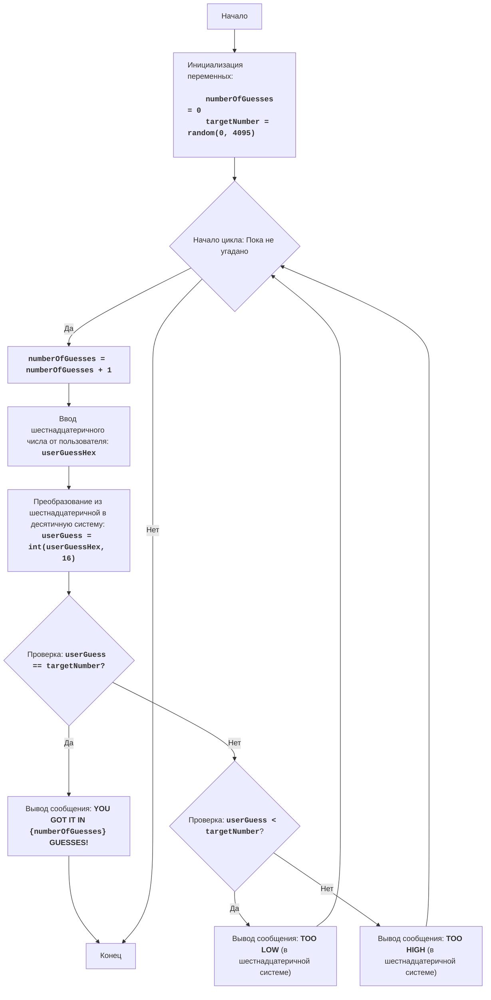

# HMRABI

## Обзор

Игра HMRABI имитирует игру, в которой нужно угадать число, выбранное компьютером, аналогично игре "Угадай число", но здесь вместо обычных чисел используются шестнадцатеричные числа. Число должно быть между 0 и FFF (4095 в десятичной системе), и пользователь должен вводить числа в этом формате, пока не угадает. Игра предоставляет подсказки, если введенное число слишком высокое или слишком низкое, но, в отличие от предыдущей игры, подсказки даются в шестнадцатеричной системе.

## Оглавление

1. [Обзор](#обзор)
2. [Игровые правила](#игровые-правила)
3. [Алгоритм](#алгоритм)
4. [Блок-схема](#блок-схема)
5. [Описание кода](#описание-кода)
6. [Функции](#функции)

## Игровые правила

1. Компьютер выбирает случайное число от 0 до 4095 (FFF в шестнадцатеричной системе).
2. Игрок вводит предположение в шестнадцатеричной системе.
3. Игра отвечает "TOO LOW", если предположение меньше выбранного числа, или "TOO HIGH", если предположение больше выбранного числа. Ответы даются в шестнадцатеричной системе.
4. Игра продолжается, пока игрок не угадает правильное число.

## Алгоритм

1. Сгенерируйте случайное число от 0 до 4095 (в десятичной системе) и сохраните его в переменной `targetNumber`.
2. Начните цикл, который продолжается, пока число не угадано:
    2.1. Получите предположение от пользователя в шестнадцатеричной системе и сохраните его в переменной `userGuess`.
    2.2. Преобразуйте предположение из шестнадцатеричной системы в десятичную.
    2.3. Если предположение равно выбранному числу, выйдите из цикла.
    2.4. Если предположение меньше выбранного числа, выведите "TOO LOW" в шестнадцатеричной системе.
    2.5. Если предположение больше выбранного числа, выведите "TOO HIGH" в шестнадцатеричной системе.
3. Выведите сообщение о победе игрока и количество попыток.
4. Конец игры.

## Блок-схема

Легенда:

*   **Start** - начало программы.
*   **InitializeVariables** - инициализация переменных: `numberOfGuesses` (счетчик попыток) инициализируется нулем, и `targetNumber` (загаданное число) генерируется случайным образом от 0 до 4095.
*   **LoopStart** - начало цикла, который выполняется до тех пор, пока число не будет угадано.
*   **IncreaseGuesses** - увеличение счетчика попыток на 1.
*   **InputGuess** - получение шестнадцатеричного числа от пользователя и сохранение его в переменной `userGuessHex`.
*   **ConvertHexToDec** - преобразование числа из шестнадцатеричной системы в десятичную и сохранение его в переменной `userGuess`.
*   **CheckGuess** - проверка, равно ли введенное число (в десятичной системе) загаданному числу.
*   **OutputWin** - вывод сообщения о победе, если число угадано, с количеством попыток.
*   **End** - конец программы.
*   **CheckLow** - проверка, меньше ли введенное число (в десятичной системе) загаданного числа.
*   **OutputLow** - вывод сообщения "TOO LOW" (в шестнадцатеричной системе), если введенное число меньше загаданного числа.
*   **OutputHigh** - вывод сообщения "TOO HIGH" (в шестнадцатеричной системе), если введенное число больше загаданного числа.

## Описание кода

1.  **Импорт модуля `random`**:
    -   `import random`: импорт модуля `random`, который используется для генерации случайного числа.
2.  **Инициализация переменных**:
    -   `numberOfGuesses = 0`: инициализация счетчика попыток нулем.
    -   `targetNumber = random.randint(0, 4095)`: генерация случайного числа от 0 до 4095 (что соответствует FFF в шестнадцатеричной системе) и сохранение его в переменной `targetNumber`.
3.  **Основной игровой цикл `while True:`**:
    -   Бесконечный цикл, который продолжается до тех пор, пока пользователь не угадает число.
    -   `numberOfGuesses += 1`: увеличение счетчика попыток на 1 в каждом цикле.
    -   **Ввод данных**:
        -   `userGuessHex = input("נחש מספר הקסדצימלי בין 0 ל-FFF: ")`: запрос шестнадцатеричного числа от пользователя и сохранение его в переменной `userGuessHex`.
        -   `try...except ValueError`: обработка возможных ошибок, если пользователь вводит недопустимые данные в шестнадцатеричной системе.
        -   `userGuess = int(userGuessHex, 16)`: преобразование ввода из шестнадцатеричной системы в десятичную.
    -   **Проверка, угадано ли число**:
        -   `if userGuess == targetNumber:`: проверка, равно ли число, преобразованное в десятичную систему, загаданному числу.
        -   `print(f"מזל טוב! ניחשת את המספר ב-{numberOfGuesses} ניסיונות!")`: вывод сообщения о победе с количеством попыток.
        -   `break`: завершение цикла (и игры) если число угадано.
    -   **Подсказки**:
        -   `elif userGuess < targetNumber:`: проверка, меньше ли введенное число загаданного.
        -   `print(f"TOO LOW ({hex(userGuess)[2:].upper()})")`: вывод сообщения "TOO LOW", когда ответ преобразуется обратно в шестнадцатеричную систему.
        -   `else`: если число не угадано и не меньше загаданного, то оно больше него.
        -   `print(f"TOO HIGH ({hex(userGuess)[2:].upper()})")`: вывод сообщения "TOO HIGH", когда ответ преобразуется обратно в шестнадцатеричную систему.

Функция `hex()` преобразует десятичное число в шестнадцатеричную строку, а `[2:].upper()` убирает префикс `0x` и делает буквы заглавными.

## Функции
В данном файле нет отдельных функций. Весь код выполняется в глобальной области видимости.