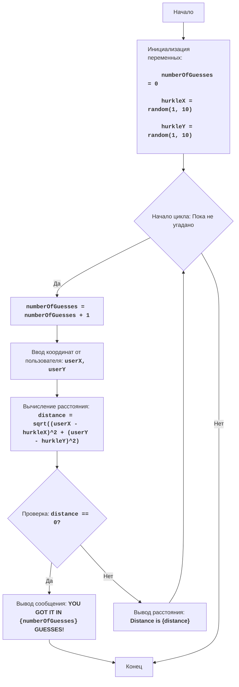

# HURKLE

## Обзор

Игра "HURKLE" - это игра-угадайка, где игрок пытается найти местоположение "HURKLE" (изначально имя робота). HURKLE расположен в случайном месте на доске 10 на 10, и игрок пытается угадать его координаты (X,Y). После каждой попытки игрок получает подсказку, указывающую на расстояние от попытки до фактического местоположения HURKLE, но не в конкретном направлении. Цель состоит в том, чтобы найти HURKLE за минимальное количество попыток.

## Содержание

- [Обзор](#обзор)
- [Правила игры](#правила-игры)
- [Алгоритм](#алгоритм)
- [Блок-схема](#блок-схема)
- [Описание кода](#описание-кода)

## Правила игры

1. HURKLE размещается случайным образом на доске 10 на 10.
2. Игрок вводит пару координат (X, Y) от 1 до 10.
3. После каждой попытки игра показывает расстояние между попыткой и местоположением HURKLE.
4. Игра продолжается до тех пор, пока игрок правильно не угадает координаты HURKLE.
5. Количество попыток подсчитывается.

## Алгоритм

1. Установите количество попыток равным 0.
2. Создайте случайные координаты (HURKLE_X, HURKLE_Y) между 1 и 10 для местоположения HURKLE.
3. Начните цикл "пока HURKLE не найден":
    3.1. Увеличьте количество попыток на 1.
    3.2. Запросите у игрока ввод координат (X, Y).
    3.3. Вычислите расстояние между попыткой и местоположением HURKLE с помощью формулы расстояния между двумя точками.
    3.4. Если расстояние равно 0, значит, игрок угадал правильно, перейдите к шагу 4.
    3.5. Покажите игроку расстояние.
4. Выведите сообщение о победе с количеством попыток.
5. Конец игры.

## Блок-схема


Легенда:
    
   - **Start** - Начало программы.
    
   - **InitializeVariables** - Инициализация переменных: numberOfGuesses (количество попыток) инициализируется 0, hurkleX и hurkleY (координаты HURKLE) создаются случайным образом между 1 и 10.
   
   - **LoopStart** - Начало цикла, который продолжается пока HURKLE не угадан.
   
   - **IncreaseGuesses** - Увеличение счетчика попыток на 1.
   
   - **InputCoordinates** - Ввод координат от пользователя и сохранение их в переменных userX и userY.
    
   - **CalculateDistance** - Вычисление расстояния между предположением и местоположением HURKLE.
   
   - **CheckDistance** - Проверка, равно ли расстояние 0 (был ли HURKLE угадан).
   
   - **OutputWin** - Вывод сообщения о победе, если HURKLE был угадан, с количеством попыток.
  
   - **End** - Конец программы.
  
   - **OutputDistance** - Вывод расстояния от предположения до местоположения HURKLE.

## Описание кода

```python
import random
import math

# Инициализация счетчика попыток
numberOfGuesses = 0
# Создание случайных координат между 1 и 10 для местоположения HURKLE
hurkleX = random.randint(1, 10)
hurkleY = random.randint(1, 10)

# Главный игровой цикл
while True:
    # Увеличение счетчика попыток
    numberOfGuesses += 1
    # Запрос координат у пользователя
    try:
        userX = int(input("Введите координату X (между 1 и 10): "))
        userY = int(input("Введите координату Y (между 1 и 10): "))
        # Проверка, что ввод находится в допустимом диапазоне
        if not (1 <= userX <= 10 and 1 <= userY <= 10):
            print("Координаты должны быть между 1 и 10.")
            continue
    except ValueError:
        print("Пожалуйста, введите целые числа.")
        continue
    # Вычисление расстояния между попыткой и местоположением HURKLE
    distance = math.sqrt((userX - hurkleX)**2 + (userY - hurkleY)**2)
    # Проверка, был ли HURKLE угадан
    if distance == 0:
        print(f"Поздравляю! Вы нашли HURKLE за {numberOfGuesses} попыток!")
        break  # Завершение цикла, если HURKLE угадан
    else:
      print(f"Расстояние от HURKLE: {distance:.2f}")
```

<br>

**Описание кода:**

1.  **Импорт модулей**:
    *   `import random`: импортирует модуль `random` для генерации случайных чисел.
    *   `import math`: импортирует модуль `math` для использования функции `sqrt` для вычисления квадратного корня.

2.  **Инициализация переменных**:
    *   `numberOfGuesses = 0`: инициализирует переменную для подсчета количества попыток, начиная с 0.
    *   `hurkleX = random.randint(1, 10)`: создает случайную координату X между 1 и 10 для местоположения HURKLE.
    *   `hurkleY = random.randint(1, 10)`: создает случайную координату Y между 1 и 10 для местоположения HURKLE.

3.  **Игровой цикл `while True:`**:
    *   Бесконечный цикл, продолжается до тех пор, пока пользователь не угадает местоположение HURKLE.
    *   `numberOfGuesses += 1`: увеличивает счетчик попыток на 1 при каждом проходе цикла.

4.  **Получение ввода от пользователя**:
    *   `try...except ValueError`: блок try-except для обработки ошибок ввода (если пользователь вводит что-то, что не является целым числом).
    *   `userX = int(input("Введите координату X (между 1 и 10): "))`: запрашивает координату X от пользователя и преобразует ее в целое число.
    *   `userY = int(input("Введите координату Y (между 1 и 10): "))`: запрашивает координату Y от пользователя и преобразует ее в целое число.
    *   `if not (1 <= userX <= 10 and 1 <= userY <= 10):`: проверяет, находятся ли введенные координаты в допустимом диапазоне (от 1 до 10). Если нет, выводится сообщение, и цикл переходит к следующей итерации.

5.  **Вычисление расстояния**:
    *   `distance = math.sqrt((userX - hurkleX)**2 + (userY - hurkleY)**2)`: вычисляет расстояние между предположением и местоположением HURKLE, используя формулу расстояния между двумя точками.

6.  **Проверка победы**:
    *   `if distance == 0:`: проверяет, равно ли расстояние 0, то есть угадал ли игрок местоположение HURKLE.
    *   `print(f"Поздравляю! Вы нашли HURKLE за {numberOfGuesses} попыток!")`: выводит сообщение о победе с количеством попыток.
    *   `break`: завершает цикл (и игру), если HURKLE найден.

7.  **Вывод расстояния**:
    *   `else:`: если HURKLE не найден.
    *   `print(f"Расстояние от HURKLE: {distance:.2f}")`: выводит расстояние между предположением и местоположением HURKLE, округленное до двух десятичных знаков.