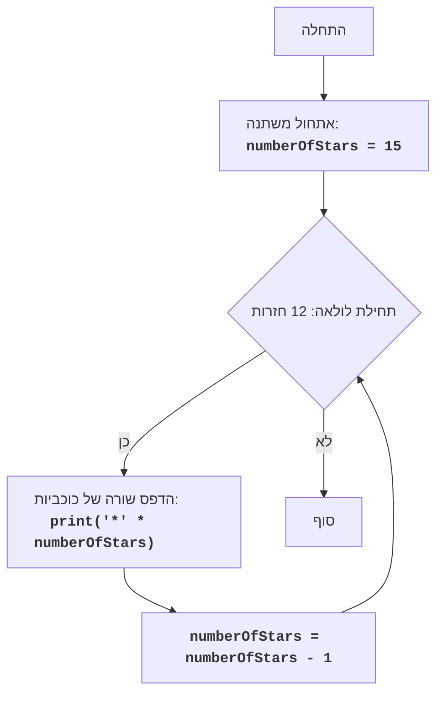

# KINEMA

## Обзор

Модуль представляет собой простую игру "Кинема", которая выводит на экран последовательность строк, состоящих из звездочек. Количество звездочек в каждой строке уменьшается на единицу, создавая эффект "лестницы" вниз.

## Оглавление

1. [Обзор](#обзор)
2. [Описание алгоритма](#описание-алгоритма)
3. [Описание кода](#описание-кода)

## Описание алгоритма

1. Инициализация переменной `numberOfStars` значением 15 (количество звездочек в первой строке).
2. Запуск цикла, который выполняется 12 раз (количество строк).
3. Внутри цикла:
    - Вывод строки, содержащей `numberOfStars` звездочек.
    - Уменьшение значения `numberOfStars` на 1.
4. Завершение игры.

## Описание кода

```python
"""
<KINEMA>:
=================
קושי: 4
-----------------
המשחק "קינמה" הוא משחק פשוט המציג סדרת תווי כוכבית, אשר משתנה במספר התווים בכל שורה, תוך כדי תנועה כלפי מטה, יוצר מעין תבנית של "סולם" הפוך.
כל שורה מכילה מספר כוכביות, אשר מתחיל במספר מסויים, וקטן באחד בכל שורה, כאשר מספר השורות הוא 12.
המשחק מסתיים לאחר סיום הדפסת כל השורות.

חוקי המשחק:
1. המשחק מדפיס 12 שורות של כוכביות.
2. מספר הכוכביות בשורה הראשונה הוא 15.
3. מספר הכוכביות בכל שורה לאחר מכן קטן ב-1 ממספר הכוכביות בשורה הקודמת.
4. המשחק מסתיים לאחר הדפסת כל 12 השורות.

-----------------
אלגוריתם:
1. אתחל משתנה `numberOfStars` ל-15 (מספר הכוכביות בשורה הראשונה).
2. התחל לולאה שתרוץ 12 פעמים (מספר השורות).
3. בתוך הלולאה:
    3.1 הדפס שורה המכילה `numberOfStars` כוכביות.
    3.2 הפחת את `numberOfStars` ב-1.
4. סוף המשחק.
-----------------
תרשים זרימה:

"""
 
Legenda:
    Start - התחלת התוכנית.
    InitializeStars - אתחול המשתנה numberOfStars (מספר הכוכביות בשורה הנוכחית) ל-15.
    LoopStart - תחילת הלולאה, שרצה 12 פעמים (כמספר השורות להדפסה).
    PrintStars - הדפסת שורה של כוכביות, כאשר מספר הכוכביות נקבע על ידי המשתנה numberOfStars.
    DecrementStars - הפחתת מספר הכוכביות (numberOfStars) ב-1 לקראת השורה הבאה.
    End - סוף התוכנית.
"""
__author__ = 'hypo69 (hypo69@davidka.net)'
"""
הסברים:
המשחק "קינמה" מדפיס דוגמה פשוטה של סדרת כוכביות שמשתנה במספר הכוכביות בשורה, יוצרת מעין סולם יורד.
licence:MIT(../licence)
"""
# אתחול מספר הכוכביות בשורה הראשונה
numberOfStars = 15

# לולאה להדפסת 12 שורות
for _ in range(12):
    # הדפסת שורה של כוכביות
    print('*' * numberOfStars)
    # הפחתת מספר הכוכביות בשורה הבאה
    numberOfStars -= 1

"""
הסבר הקוד:
1.  **אתחול משתנה `numberOfStars`**:
    -   `numberOfStars = 15`: המשתנה `numberOfStars` מאותחל ל-15, שזה מספר הכוכביות בשורה הראשונה.
2.  **לולאה `for`**:
    -   `for _ in range(12):`: לולאה שרצה 12 פעמים, שזה מספר השורות שנרצה להדפיס.
    -   הסימן `_` משמש כאן כאינדקס משתנה שלא משתמשים בו בתוך הלולאה, מקובל בפייתון.
3.  **הדפסת כוכביות**:
    -   `print('*' * numberOfStars)`: מדפיס שורה של כוכביות. `*` משמש כאופרטור כפל על מחרוזות, כך שהקוד מדפיס את הכוכבית מספר פעמים השווה לערך של `numberOfStars`.
4.  **הפחתת מספר כוכביות**:
    -   `numberOfStars -= 1`: מקטין את ערכו של `numberOfStars` ב-1 לאחר כל שורה, כך שבכל שורה יש כוכבית אחת פחות מהשורה הקודמת.
5.  **סיום הלולאה**:
    - לאחר שהלולאה רצה 12 פעמים, התוכנית מסיימת את ריצתה.
"""
```

### Переменные

-   `numberOfStars`: Целочисленная переменная, представляющая количество звездочек в текущей строке. Инициализируется значением 15.

### Циклы

-   `for _ in range(12)`: Цикл, который выполняется 12 раз, обеспечивая печать 12 строк.

### Операции

-   `print('*' * numberOfStars)`: Вывод на экран строки, состоящей из звездочек, количество которых определяется переменной `numberOfStars`.
-   `numberOfStars -= 1`: Уменьшение значения переменной `numberOfStars` на 1 после каждой итерации цикла.

### Описание работы кода
1. Инициализируется переменная `numberOfStars` со значением 15, что соответствует количеству звездочек в первой строке.
2. Запускается цикл, который выполняется 12 раз.
3. На каждой итерации цикла:
    - Выводится строка звездочек, где количество звездочек равно текущему значению `numberOfStars`.
    - Значение `numberOfStars` уменьшается на 1, чтобы в следующей строке было на одну звездочку меньше.
4. После завершения цикла программа завершает свою работу.