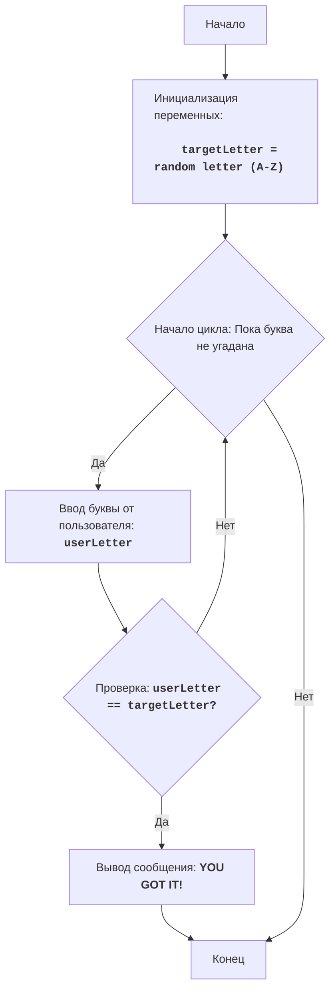

# חידון אותיות (LIT QZ)

## Обзор

Этот модуль реализует простую игру "Угадай букву", в которой компьютер выбирает случайную букву из алфавита, а игрок должен ее угадать. Игра продолжается до тех пор, пока игрок не угадает правильную букву.

## Оглавление

- [Обзор](#обзор)
- [Функции](#функции)
- [Описание переменных](#описание-переменных)
- [Алгоритм](#алгоритм)
- [Диаграмма потока](#диаграмма-потока)

## Функции

В данном модуле нет пользовательских функций. Весь код выполняется в глобальной области видимости.

## Описание переменных

### `targetLetter`

- **Описание**: Содержит случайную букву из алфавита (A-Z), которую должен угадать игрок.
- **Тип**: `str`

### `userLetter`

- **Описание**: Содержит букву, введенную игроком в качестве попытки угадать загаданную букву.
- **Тип**: `str`

## Алгоритм

1. Выбрать случайную букву из A до Z.
2. Начать цикл "пока буква не угадана":
    2.1. Запросить у пользователя ввод буквы.
    2.2. Если введенная буква равна выбранной букве, игра закончена.
3. Вывести сообщение "YOU GOT IT!"
4. Конец игры.

## Диаграмма потока

**Легенда:**

- `Start` - Начало программы.
- `InitializeVariables` - Инициализация переменной: `targetLetter` (загаданная буква) создается случайно из букв A-Z.
- `LoopStart` - Начало цикла, который продолжается, пока буква не угадана.
- `InputLetter` - Ввод буквы от пользователя и сохранение ее в переменной `userLetter`.
- `CheckLetter` - Проверка, равна ли введенная буква загаданной букве.
- `OutputWin` - Вывод сообщения о победе, если буква угадана.
- `End` - Конец программы.