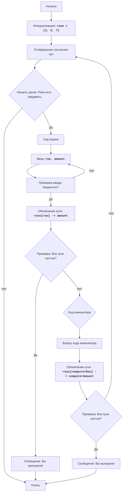

# Игра NIM

## Обзор

Данный модуль реализует игру NIM, в которой два игрока (человек и компьютер) по очереди удаляют предметы из трех куч. Цель игры - не удалить последний предмет.

## Содержание

- [Обзор](#обзор)
- [Функции](#функции)
  - [`display_rows`](#display_rows)
  - [`computer_move`](#computer_move)
- [Алгоритм Игры](#алгоритм-игры)
- [Схема Игры](#схема-игры)

## Функции

### `display_rows`

**Описание**: Выводит текущее состояние куч предметов на экран.

**Параметры**:
- Нет параметров.

**Возвращает**:
- Нет возвращаемого значения.

### `computer_move`

**Описание**: Выбирает случайный ход для компьютера.

**Параметры**:
- Нет параметров.

**Возвращает**:
- `Tuple[Optional[int], Optional[int]]`: Кортеж, содержащий номер выбранной строки и количество предметов для удаления, или `(None, None)`, если нет доступных ходов.

## Алгоритм Игры

1. **Инициализация**:
   - Инициализируется список `rows` с начальным количеством предметов в каждой куче: `[3, 5, 7]`.
2. **Отображение состояния**:
   - Вызывается функция `display_rows` для отображения текущего состояния куч.
3. **Игровой цикл**:
   - Начинается основной игровой цикл, который продолжается до тех пор, пока все кучи не станут пустыми.
   - **Ход игрока**:
     - Запрашивается ввод от игрока для выбора кучи и количества предметов для удаления.
     - Проверяется корректность ввода:
       - Выбранная куча должна быть в диапазоне от 1 до 3.
       - Количество предметов должно быть положительным и не больше текущего количества в выбранной куче.
     - Обновляется количество предметов в выбранной куче.
   - **Проверка победы игрока**:
     - Проверяется, не пусты ли все кучи. Если да, то игрок проиграл, и игра завершается.
   - **Ход компьютера**:
     - Вызывается функция `computer_move` для выбора хода компьютера.
     - Обновляется количество предметов в выбранной компьютером куче.
     - Выводится сообщение о ходе компьютера.
   - **Проверка победы компьютера**:
     - Проверяется, не пусты ли все кучи. Если да, то компьютер проиграл, и игра завершается.
4. **Завершение игры**:
   - Выводится сообщение о результате игры.

## Схема Игры
