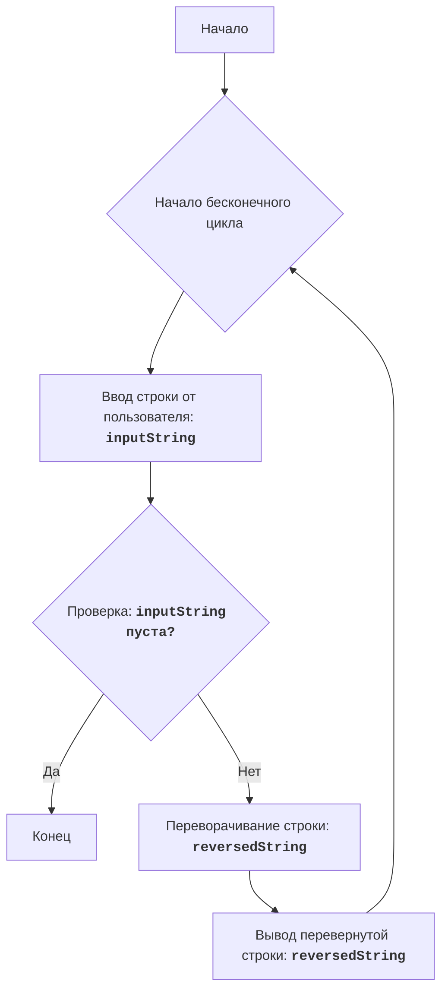

# REVRSE

## Обзор

Этот модуль реализует простую игру "REVRSE", в которой компьютер просит пользователя ввести строку текста, а затем выводит эту строку в обратном порядке. Игра продолжается до тех пор, пока пользователь не введет пустую строку.

## Оглавление

1. [Описание](#описание)
2. [Функции](#функции)
   - [Основной цикл игры](#основной-цикл-игры)
3. [Алгоритм](#алгоритм)
4. [Блок-схема](#блок-схема)
5. [Детальное описание кода](#детальное-описание-кода)
6. [Лицензия](#лицензия)

## Описание

Игра "REVRSE" - это простая игра в слова, где компьютер просит пользователя ввести текст. Затем компьютер меняет порядок символов в строке и выводит ее в обратном порядке. Игра продолжается до тех пор, пока пользователь не введет пустую строку.

**Правила игры:**
1. Компьютер просит пользователя ввести строку текста.
2. Компьютер меняет порядок символов во введенной строке.
3. Компьютер отображает перевернутую строку пользователю.
4. Игра продолжается до тех пор, пока пользователь не введет пустую строку.

## Функции

### Основной цикл игры

Основной цикл игры обрабатывает ввод пользователя и выводит перевернутую строку.

**Описание**:
Основной цикл игры. Запрашивает у пользователя строку, переворачивает её и выводит.
Игра продолжается пока пользователь не введет пустую строку.

**Параметры**:
- Нет параметров.

**Возвращает**:
- Нет возвращаемого значения.

**Вызывает исключения**:
- Нет исключений.

## Алгоритм
1. Начать бесконечный цикл.
2. Внутри цикла запросить у пользователя ввод строки.
3. Если введенная строка пуста, выйти из цикла.
4. Перевернуть порядок символов в строке.
5. Показать перевернутую строку пользователю.
6. Продолжать цикл, пока строка не будет пустой.

## Блок-схема

**Легенда:**

-   `Start`: Начало программы.
-   `LoopStart`: Начало бесконечного цикла, который будет продолжаться, пока пользователь не введет пустую строку.
-   `InputString`: Ввод строки от пользователя и сохранение её в переменной `inputString`.
-   `CheckEmpty`: Проверка, является ли введенная строка пустой.
-  `End`: Конец программы (если строка пуста).
-  `ReverseString`: Переворачивание порядка символов в строке и сохранение результата в переменной `reversedString`.
-   `OutputReversed`: Вывод перевернутой строки пользователю.

## Детальное описание кода
1.  **Бесконечный цикл `while True:`**:
    -   Этот цикл позволяет пользователю продолжать вводить и переворачивать строки до тех пор, пока он не введет пустую строку.
2.  **Получение ввода от пользователя**:
    -   `input_string = input("Введите строку (или нажмите Enter для завершения): ")`: Выводит сообщение пользователю и позволяет ему ввести строку. Ввод сохраняется в переменной `input_string`.
3.  **Проверка, пустая ли строка**:
    -   `if not input_string:`: Проверяет, является ли строка, введенная пользователем, пустой. Пустая строка в Python считается `False` в логической проверке.
4.  **Выход из цикла**:
    -   `break`: Если строка пуста, команда `break` останавливает бесконечный цикл, и игра завершается.
5.  **Переворачивание строки**:
    -   `reversed_string = input_string[::-1]`: Использует slicing для переворачивания порядка символов в строке. `[::-1]` создает перевернутую копию строки, которая сохраняется в переменной `reversed_string`.
6.  **Вывод результата**:
    -   `print("Перевернутая строка:", reversed_string)`: Выводит перевернутую строку пользователю.

## Лицензия

Лицензия: [MIT](../licence)