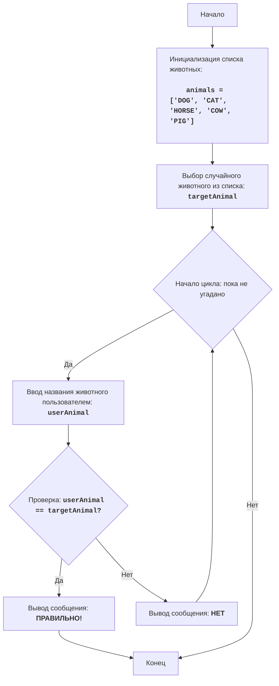

# Игра "ANIMAL"

## Обзор

Игра "ANIMAL" - это игра в угадывание животного, в которой компьютер выбирает случайное животное из списка, а игрок пытается его угадать, вводя свои предположения. Игра продолжается до тех пор, пока игрок не угадает животное.

## Оглавление

- [Обзор](#обзор)
- [Функции](#функции)
- [Переменные](#переменные)
- [Описание кода](#описание-кода)
- [Блок-схема](#блок-схема)

## Функции

В данном файле нет пользовательских функций, так как логика игры реализована в основном цикле.

## Переменные

### `animals`

**Описание**: Список животных для игры.

**Тип**: `list` of `str`

**Значение по умолчанию**: `['DOG', 'CAT', 'HORSE', 'COW', 'PIG']`

### `targetAnimal`

**Описание**: Случайно выбранное животное для угадывания.

**Тип**: `str`

**Значение**:  Выбирается случайным образом из списка `animals` при запуске программы.

### `userAnimal`

**Описание**: Ввод пользователя.

**Тип**: `str`

**Значение**:  Значение, введенное пользователем, приведенное к верхнему регистру.

## Описание кода

1.  **Импорт модуля `random`**:
    -   `import random`: Импортирует модуль `random`, который используется для случайного выбора животного.
2.  **Список животных**:
    -   `animals = ['DOG', 'CAT', 'HORSE', 'COW', 'PIG']`: Создает список строк с названиями животных.
3.  **Выбор случайного животного**:
    -   `targetAnimal = random.choice(animals)`: Выбирает случайное животное из списка `animals` и сохраняет его в переменной `targetAnimal`.
4.  **Основной цикл игры `while True:`**:
    -   Бесконечный цикл, который продолжается до тех пор, пока игрок не угадает животное.
    -   **Ввод данных**:
        -   `userAnimal = input("Угадайте животное (DOG, CAT, HORSE, COW, PIG): ").upper()`: Запрашивает у пользователя ввод названия животного и приводит его к верхнему регистру для сравнения без учета регистра.
    -   **Условие победы**:
        -   `if userAnimal == targetAnimal:`: Проверяет, совпадает ли введенное пользователем название животного с загаданным.
        -   `print("ПРАВИЛЬНО!")`: Выводит сообщение о победе, если животное угадано.
        -   `break`: Завершает цикл (игру), если животное угадано.
    -   **Сообщение о неверном ответе**:
        -   `else:`: Выполняется, если введенное название животного не совпадает с загаданным.
        -   `print("НЕТ")`: Выводит сообщение "НЕТ", если ответ неверный.

## Блок-схема

**Легенда**:
- Start - Начало программы.
- InitializeAnimals - Инициализация списка животных.
- ChooseRandomAnimal - Выбор случайного животного из списка и сохранение его в переменной `targetAnimal`.
- LoopStart - Начало цикла, который продолжается, пока животное не угадано.
- InputAnimal - Запрос у пользователя ввода названия животного и сохранение его в переменной `userAnimal`.
- CheckAnimal - Проверка, равно ли введенное название животного `userAnimal` загаданному животному `targetAnimal`.
- OutputWin - Вывод сообщения о победе, если названия животных равны.
- End - Конец программы.
- OutputWrong - Вывод сообщения "НЕТ", если введенное название животного не совпадает с загаданным.