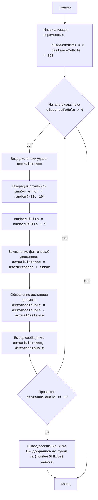

# GOLF

## Обзор

Игра "Гольф" - это текстовая игра, в которой игрок пытается достичь лунки за наименьшее количество ударов. Игрок вводит расстояние до лунки, и программа вычисляет результат удара на основе расстояния и случайного фактора. Цель игры - пройти лунку, нанося удары с различными дистанциями, и завершить игру с минимальным количеством ударов.

## Содержание

- [Обзор](#обзор)
- [Игровой процесс](#игровой-процесс)
- [Алгоритм](#алгоритм)
- [Блок-схема](#блок-схема)
- [Описание кода](#описание-кода)

## Игровой процесс

1. Игрок начинает игру с нулевым количеством ударов.
2. Игрок вводит расстояние, на которое он хочет ударить мяч.
3. Программа генерирует случайное отклонение от заданного расстояния, симулируя неточность удара.
4. Программа сообщает игроку фактическое расстояние, на которое был нанесен удар.
5. Программа рассчитывает расстояние до лунки.
6. Игра продолжается до тех пор, пока расстояние до лунки не станет равно нулю.
7. После достижения лунки игра заканчивается, и программа сообщает количество ударов, которое понадобилось для достижения цели.

## Алгоритм

1. Установить количество ударов в 0.
2. Установить расстояние до лунки в 250 ярдов.
3. Начать цикл, пока расстояние до лунки не равно 0:
    3.1 Запросить у игрока ввод дистанции удара.
    3.2 Сгенерировать случайное число в диапазоне от -10 до 10 (погрешность удара).
    3.3 Увеличить количество ударов на 1.
    3.4 Вычислить фактическое расстояние удара, добавив погрешность к введенной дистанции.
    3.5 Обновить расстояние до лунки, вычитая фактическое расстояние удара.
    3.6 Вывести сообщение с указанием фактического расстояния удара и оставшегося расстояния до лунки.
4. Вывести сообщение "УРА! Вы добрались до лунки за {количество ударов} ударов."
5. Конец игры.

## Блок-схема

## Описание кода

1.  **Импорт модуля `random`**:
    -   `import random`: Импортирует модуль `random`, который используется для генерации случайных чисел.

2.  **Инициализация переменных**:
    -   `numberOfHits = 0`: Инициализирует переменную `numberOfHits` для подсчета количества ударов.
    -   `distanceToHole = 250`: Устанавливает начальное расстояние до лунки в 250 ярдов.

3.  **Основной игровой цикл `while distanceToHole > 0:`**:
    -   Этот цикл продолжается до тех пор, пока расстояние до лунки `distanceToHole` не станет меньше или равно 0.

    -   **Ввод данных**:
        -   `try...except ValueError`: Блок `try-except` обрабатывает возможные ошибки ввода. Если пользователь введет не число, то будет выведено сообщение об ошибке.
        -   `userDistance = float(input("Введите дистанцию удара: "))`: Запрашивает у пользователя дистанцию удара и преобразует ее в число с плавающей точкой.

    -   `error = random.randint(-10, 10)`: Генерирует случайное целое число от -10 до 10, которое представляет собой ошибку в ударе.
    -   `numberOfHits += 1`: Увеличивает счетчик количества ударов на 1.
    -   `actualDistance = userDistance + error`: Вычисляет фактическую дистанцию удара, добавляя ошибку к введенной пользователем дистанции.
    -   `distanceToHole -= actualDistance`: Обновляет расстояние до лунки, вычитая из него фактическую дистанцию удара.
    -   `print(f"Фактическая дистанция удара: {actualDistance:.2f} ярдов")`: Выводит фактическую дистанцию удара с точностью до двух знаков после запятой.
    -   `print(f"Расстояние до лунки: {distanceToHole:.2f} ярдов")`: Выводит оставшееся расстояние до лунки с точностью до двух знаков после запятой.

4.  **Вывод сообщения о победе**:
    -   `print(f"УРА! Вы добрались до лунки за {numberOfHits} ударов.")`: Выводит сообщение о победе с указанием количества ударов, потребовавшихся для достижения лунки.