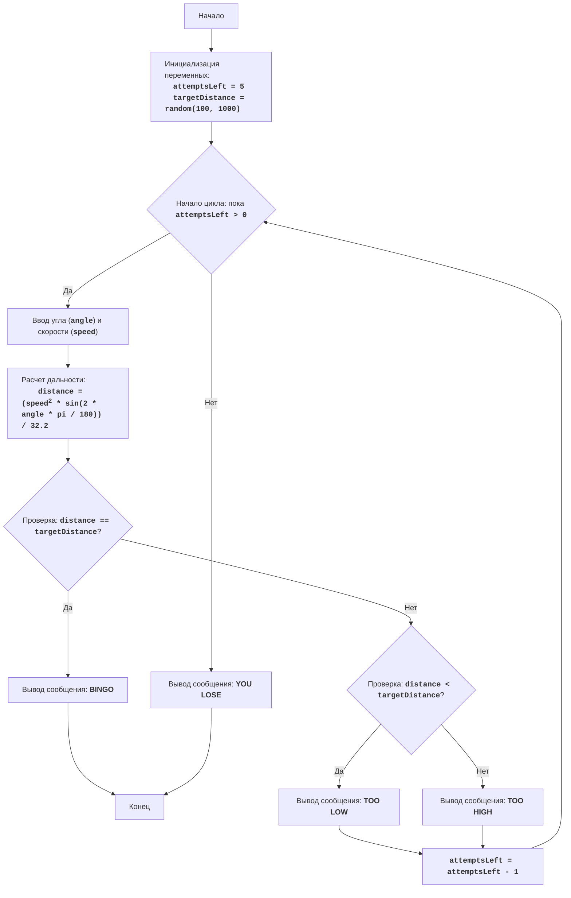

# Игра "GUNNER"

## Обзор

Игра "GUNNER" - это симуляция стрельбы по мишени. Игрок вводит угол выстрела и его скорость, а компьютер рассчитывает, попадет ли снаряд в цель. Игрок имеет 5 попыток и после каждой попытки, получает подсказку: "TOO LOW", "TOO HIGH" или "BINGO".

## Оглавление

1. [Описание игры](#описание-игры)
2. [Правила игры](#правила-игры)
3. [Алгоритм игры](#алгоритм-игры)
4. [Блок-схема](#блок-схема)
5. [Модули](#модули)
6. [Переменные](#переменные)
7. [Игровой цикл](#игровой-цикл)
8. [Ввод данных](#ввод-данных)
9. [Проверка ввода угла](#проверка-ввода-угла)
10. [Расчет дальности](#расчет-дальности-полета)
11. [Проверка попадания](#проверка-попадания)
12. [Уменьшение попыток](#уменьшение-количества-попыток)
13. [Вывод сообщения о проигрыше](#вывод-сообщения-о-проигрыше)

## Описание игры
Игра "GUNNER" - это симулятор стрельбы по мишени. Игрок вводит угол и скорость выстрела, а компьютер проверяет, попал ли снаряд в цель. Игрок имеет 5 попыток и получает подсказки.

## Правила игры
1. Расстояние до цели генерируется случайным образом от 100 до 1000 футов.
2. Игрок вводит угол выстрела (0-90 градусов) и скорость выстрела.
3. Дальность полета рассчитывается по формуле.
4. Результат выводится как "TOO LOW", "TOO HIGH" или "BINGO".
5. Игра длится 5 попыток или до попадания в цель.

## Алгоритм игры
1. Установить количество попыток равным 5.
2. Сгенерировать случайное расстояние до цели (100-1000 футов).
3. Начать цикл, пока есть попытки:
    - Запросить угол и скорость выстрела.
    - Рассчитать дальность полета.
    - Если дальность равна расстоянию до цели, вывести "BINGO" и завершить игру.
    - Если дальность меньше, вывести "TOO LOW".
    - Если дальность больше, вывести "TOO HIGH".
    - Уменьшить количество попыток.
4. Если после 5 попыток цель не поражена, вывести сообщение о проигрыше.

## Блок-схема


## Модули
### `random`
Используется для генерации случайного расстояния до цели.
### `math`
Используется для математических вычислений (синус и перевод градусов в радианы).

## Переменные

- `attemptsLeft`: Количество оставшихся попыток (начинается с 5).
- `targetDistance`: Случайное расстояние до цели (от 100 до 1000 футов).
- `angle`: Угол выстрела, введенный пользователем.
- `speed`: Скорость выстрела, введенная пользователем.
- `distance`: Рассчитанная дальность полета снаряда.
- `angle_radians`: Угол выстрела в радианах.

## Игровой цикл
Основной игровой цикл выполняется, пока у игрока есть оставшиеся попытки (`attemptsLeft > 0`).

## Ввод данных
### `try...except ValueError`
Блок обрабатывает возможные ошибки ввода нечисловых значений.
```python
try:
    angle = float(input("Введите угол выстрела в градусах (0-90): "))
    speed = float(input("Введите скорость выстрела в футах в секунду: "))
except ValueError as ex:
    print("Пожалуйста, введите числовые значения.")
    continue
```
###  `angle`
Запрашивает у пользователя угол выстрела и преобразует его в число с плавающей точкой.
###  `speed`
Запрашивает у пользователя скорость выстрела и преобразует ее в число с плавающей точкой.

## Проверка ввода угла
```python
if not (0 <= angle <= 90):
    print("Угол должен быть в диапазоне от 0 до 90 градусов.")
    continue
```
Проверяет, находится ли угол в допустимом диапазоне (от 0 до 90 градусов). Выводит сообщение об ошибке, если угол введен неверно, и переходит к следующей итерации цикла.

## Расчет дальности полета
```python
angle_radians = math.radians(angle)
distance = (speed**2 * math.sin(2 * angle_radians)) / 32.2
```
- `angle_radians = math.radians(angle)`: Преобразует угол из градусов в радианы.
- `distance`: Вычисляет дальность полета снаряда по формуле.

## Проверка попадания
```python
if abs(distance - targetDistance) < 0.01:
    print("BINGO!")
    break
elif distance < targetDistance:
    print("TOO LOW")
else:
    print("TOO HIGH")
```
- Проверяет, попал ли снаряд в цель, используя погрешность для сравнения чисел с плавающей точкой.
- Выводит "BINGO" и завершает игру при попадании.
- Выводит "TOO LOW", если снаряд не долетел.
- Выводит "TOO HIGH", если снаряд перелетел.

## Уменьшение количества попыток
```python
attemptsLeft -= 1
```
Уменьшает количество оставшихся попыток на 1.

## Вывод сообщения о проигрыше
```python
if attemptsLeft == 0:
    print("YOU LOSE")
```
Выводит сообщение "YOU LOSE", если попытки закончились.