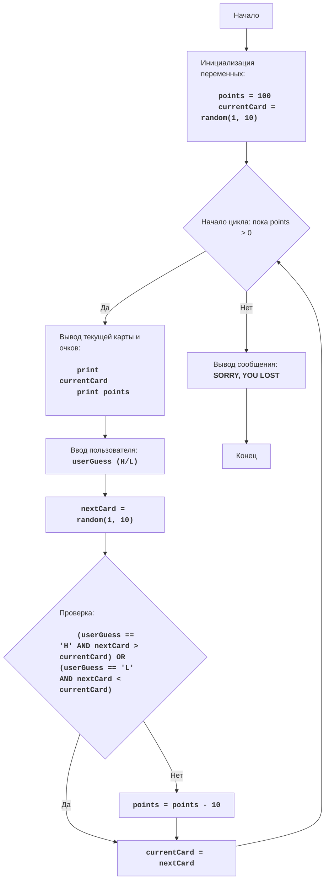

# Игра ACE

## Обзор

Игра "ACE" - это карточная игра, в которой игрок угадывает, является ли следующая карта выше или ниже текущей. Игрок начинает с 100 очков и теряет 10 очков за каждую ошибку, продолжая игру пока не потеряет все очки. В конце игры выводится сообщение о проигрыше.

## Оглавление

1. [Обзор](#обзор)
2. [Игровой процесс](#игровой-процесс)
3. [Алгоритм](#алгоритм)
4. [Блок-схема](#блок-схема)
5. [Описание кода](#описание-кода)

## Игровой процесс
- Игрок начинает с 100 очками.
- Компьютер выбирает случайную карту (от 1 до 10).
- Игрок угадывает, будет ли следующая карта выше (H) или ниже (L) текущей.
- Компьютер выбирает следующую карту.
- Если игрок угадал правильно, очки не изменяются.
- Если игрок угадал неверно, очки уменьшаются на 10.
- Игра продолжается до тех пор, пока у игрока не останется 0 очков.

## Алгоритм
1. Установить начальное количество очков в 100.
2. Сгенерировать случайную карту (от 1 до 10) и присвоить ее переменной текущей карты.
3. Начать цикл "пока количество очков больше 0":
    3.1. Вывести текущую карту и количество очков.
    3.2. Запросить у игрока ввод H (выше) или L (ниже).
    3.3. Сгенерировать случайную следующую карту (от 1 до 10).
    3.4. Если игрок ввел H и следующая карта больше текущей, или если игрок ввел L и следующая карта меньше текущей, то ничего не делать.
    3.5. Если игрок ввел H и следующая карта не больше текущей, или если игрок ввел L и следующая карта не меньше текущей, то уменьшить количество очков на 10.
    3.6. Присвоить следующую карту текущей карте.
4. Вывести сообщение "SORRY, YOU LOST".
5. Конец игры.

## Блок-схема

**Легенда:**
    Start - Начало программы.
    InitializeVariables - Инициализация переменных: points (количество очков) устанавливается в 100, а currentCard (текущая карта) генерируется случайным образом от 1 до 10.
    LoopStart - Начало цикла, который продолжается, пока количество очков больше 0.
    DisplayInfo - Вывод текущей карты и количества очков.
    InputGuess - Запрос у пользователя ввода H (выше) или L (ниже) и сохранение его в переменной userGuess.
    GenerateNextCard - Генерация случайной следующей карты от 1 до 10.
    CheckGuess - Проверка, угадал ли игрок правильно (если ввел H, то следующая карта больше текущей, или если ввел L, то следующая карта меньше текущей).
    UpdateCurrentCard - Присваивание следующей карты текущей.
    DecreasePoints - Уменьшение количества очков на 10, если игрок ошибся.
    OutputLoss - Вывод сообщения о проигрыше, если количество очков стало 0.
    End - Конец программы.

## Описание кода

### Импорт модуля `random`
- `import random`: Импортирует модуль `random`, который используется для генерации случайных чисел.

### Инициализация переменных
- `points = 100`: Устанавливает начальное количество очков игрока в 100.
- `currentCard = random.randint(1, 10)`: Генерирует случайную карту от 1 до 10 и сохраняет ее в `currentCard`.

### Основной цикл `while points > 0:`
- Цикл продолжается, пока количество очков игрока больше 0.
- `print("Текущая карта:", currentCard)`: Выводит текущую карту.
- `print("Ваши очки:", points)`: Выводит текущее количество очков.
- `userGuess = input("Следующая карта будет выше (H) или ниже (L)? ").upper()`: Запрашивает у пользователя, будет ли следующая карта выше или ниже. Преобразует ввод к верхнему регистру.
- **Проверка ввода**:
    - `while userGuess not in ("H", "L"):`: Цикл, который проверяет, пока пользователь не введет правильный вариант "H" или "L".
    - `print("Неверный ввод, пожалуйста, введите H или L")`: Сообщение об ошибке ввода.
- `nextCard = random.randint(1, 10)`: Генерирует случайную следующую карту.
- **Условие угадывания**:
    - `if (userGuess == "H" and nextCard > currentCard) or \\ (userGuess == "L" and nextCard < currentCard):`: Проверяет, угадал ли игрок, основываясь на вводе пользователя и значениях текущей и следующей карты.
    - `print ("Угадали! Следующая карта:", nextCard)`: Выводит сообщение, что игрок угадал.
    - `pass`: Если игрок угадал, ничего не делаем.
- **Условие проигрыша**:
    - `else:`: Если игрок не угадал.
    - `print ("Не угадали! Следующая карта:", nextCard)`: Выводим сообщение о неверном угадывании.
    - `points -= 10`: Уменьшает количество очков игрока на 10 за неправильный ответ.
- `currentCard = nextCard`: Присваивает следующую карту в качестве текущей.

### Вывод сообщения о проигрыше
- `print("SORRY, YOU LOST")`: Выводит сообщение о проигрыше после того, как количество очков игрока становится равным 0.