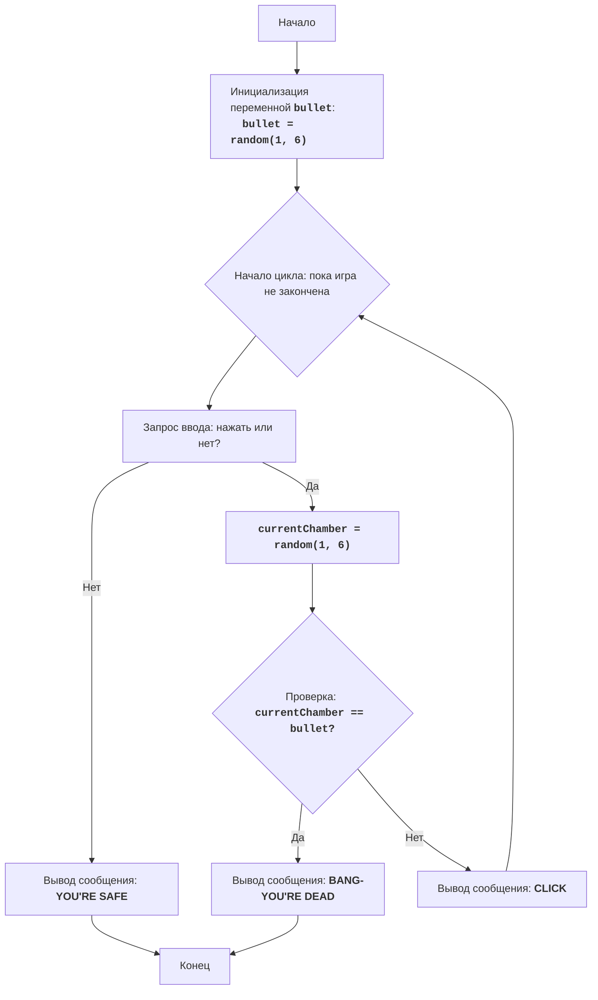

# Игра "Русская Рулетка"

## Обзор

Данный модуль реализует простую игру "Русская Рулетка", в которой игрок должен решить, нажать на курок или остановиться, имитируя вращение барабана револьвера с одним патроном.

## Оглавление

- [Обзор](#обзор)
- [Игровой процесс](#игровой-процесс)
- [Функции](#функции)
- [Используемые библиотеки](#используемые-библиотеки)
- [Блок-схема](#блок-схема)
- [Объяснение кода](#объяснение-кода)

## Игровой процесс

1.  Компьютер имитирует барабан револьвера с шестью каморами, в одну из которых случайным образом помещается патрон.
2.  Игрок решает, нажать на курок ("нажать" или "да") или остановить игру ("нет").
3.  Если игрок решает нажать на курок, то происходит проверка, был ли патрон в текущей каморе.
4.  Если патрон был, игрок проигрывает.
5.  Если патрона не было, игра продолжается, и компьютер имитирует следующее вращение барабана.
6.  Если игрок решает остановить игру, он считается победителем.

## Функции

В данном коде нет отдельных функций, так как основная логика игры реализована в виде последовательного кода.

## Используемые библиотеки

- `random`: Используется для генерации случайных чисел, имитирующих положение патрона в барабане револьвера.

## Блок-схема

Легенда:
   - Start - Начало игры.
   - InitializeBullet - Инициализация переменной `bullet` случайным числом от 1 до 6, представляющим камору с патроном.
   - LoopStart - Начало цикла, который продолжается до тех пор, пока игрок не решит остановиться или не проиграет.
   - InputChoice - Запрос ввода от игрока: "нажать" или "нет".
   - OutputWin - Вывод сообщения "YOU'RE SAFE", если игрок выбирает "нет", и завершение игры.
   - End - Конец игры.
   - GenerateChamber - Генерация случайного числа `currentChamber` от 1 до 6, представляющего текущую камору.
   - CheckChamber - Проверка, совпадает ли `currentChamber` с каморой с патроном `bullet`.
   - OutputLose - Вывод сообщения "BANG-YOU'RE DEAD" и завершение игры, если камора с патроном совпала.
   - OutputClick - Вывод сообщения "CLICK", если патрон не попался, и продолжение цикла.

## Объяснение кода

1.  **Импорт модуля `random`:**
    -   `import random`: Импортирует модуль `random`, который используется для генерации случайных чисел.
2.  **Инициализация положения патрона:**
    -   `bullet = random.randint(1, 6)`: Генерирует случайное целое число от 1 до 6, представляющее номер каморы, в которой находится патрон. Эта переменная хранит "заряженную" камору.
3.  **Основной игровой цикл:**
    -   `while True:`: Бесконечный цикл, который продолжается до тех пор, пока игра не закончится (игрок не решит остановиться или не проиграет).
    -   **Запрос выбора у игрока:**
        -   `choice = input("Нажать на курок? (да/нет): ").lower()`: Запрашивает у пользователя ввод (нажать или нет) и переводит ввод в нижний регистр для упрощения сравнения.
    -   **Условие победы (выбор "нет"):**
        -   `if choice == "нет":`: Если игрок вводит "нет", то он выигрывает.
        -   `print("Вы в безопасности!")`: Выводит сообщение о победе.
        -   `break`: Завершает цикл, то есть игра заканчивается.
    -   **Условие продолжения игры (выбор "да"):**
        -   `if choice == "да":`: Если игрок вводит "да", то игра продолжается.
        -   `current_chamber = random.randint(1, 6)`: Генерирует случайное целое число от 1 до 6, представляющее номер текущей каморы.
        -   **Проверка проигрыша:**
            -   `if current_chamber == bullet:`: Проверяет, совпадает ли номер текущей каморы с номером каморы, в которой находится патрон.
            -   `print("БАХ-Вы мертвы!")`: Если камора с патроном совпала, то игрок проигрывает и выводится сообщение о проигрыше.
            -   `break`: Завершает цикл, то есть игра заканчивается.
        -   **Продолжение игры:**
            -   `else:`: Если патрон не был в текущей каморе.
            -   `print("Щелчок")`: Выводится сообщение, что патрона не было и игра продолжается.
    -   **Обработка некорректного ввода:**
        - `else:`:  Если ввод не "да" и не "нет"
        - `print("Некорректный ввод. Пожалуйста, введите \'да\' или \'нет\'.")`: Выводится сообщение о некорректном вводе.