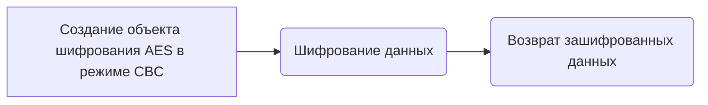
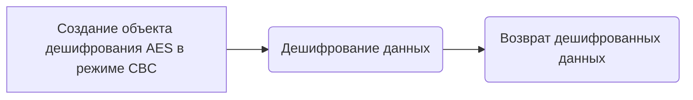
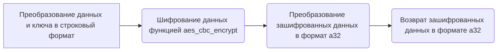
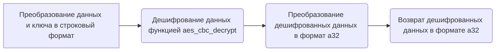
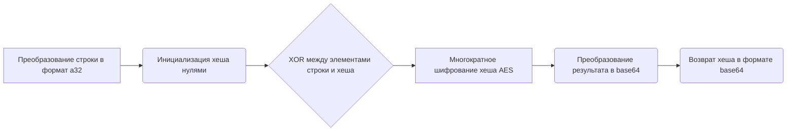
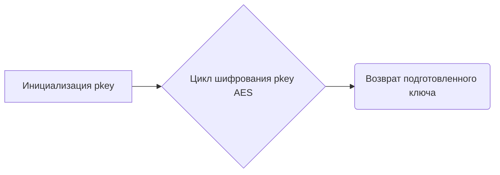
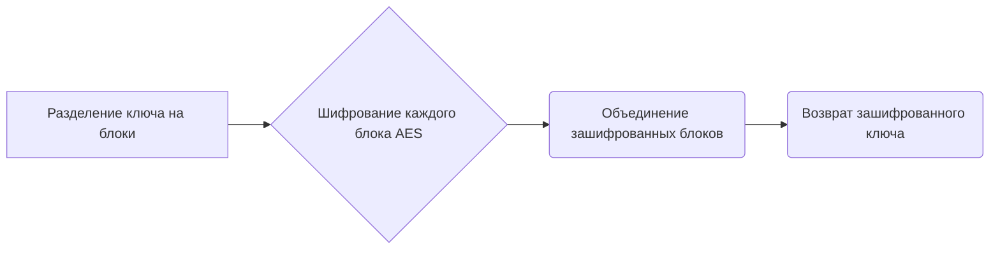
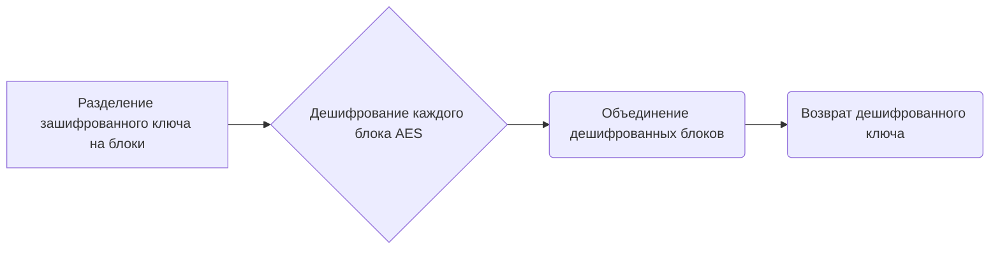
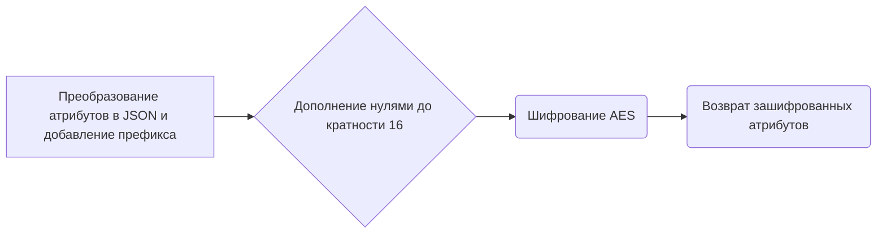
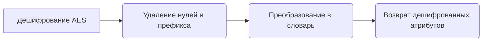

# Модуль crypto.py

## Обзор

Модуль `crypto.py` предоставляет набор функций для шифрования и дешифрования данных, используемых в контексте работы с сервисом Mega. Эти функции включают в себя шифрование AES в режиме CBC, вычисление хешей, подготовку ключей и шифрование/дешифрование атрибутов. Модуль предназначен для обеспечения безопасности данных при передаче и хранении.

## Подробней

Этот модуль содержит функции, которые обеспечивают криптографические операции, необходимые для взаимодействия с API Mega. Он включает в себя шифрование и дешифрование с использованием AES в режиме CBC, а также функции для подготовки ключей и хеширования строк. Все эти функции важны для обеспечения конфиденциальности и целостности данных, передаваемых между клиентом и сервером Mega.

## Функции

### `aes_cbc_encrypt`

```python
def aes_cbc_encrypt(data, key):
    """ Функция шифрует данные с использованием алгоритма AES в режиме CBC.

    Args:
        data (bytes): Данные для шифрования.
        key (bytes): Ключ шифрования.

    Returns:
        bytes: Зашифрованные данные.
    """
    ...
```

**Назначение**: Шифрование данных с использованием алгоритма AES (Advanced Encryption Standard) в режиме CBC (Cipher Block Chaining).

**Параметры**:
- `data` (bytes): Данные, которые необходимо зашифровать.
- `key` (bytes): Ключ, используемый для шифрования данных.

**Возвращает**:
- `bytes`: Зашифрованные данные.

**Как работает функция**:
1. Создает объект шифрования AES с использованием предоставленного ключа и режима CBC, с вектором инициализации (IV), заполненным нулями.
2. Выполняет шифрование предоставленных данных с использованием созданного объекта шифрования.



**Примеры**:
```python
key = b'Sixteen byte key'
data = b'This is some data'
encrypted_data = aes_cbc_encrypt(data, key)
print(encrypted_data)
```

### `aes_cbc_decrypt`

```python
def aes_cbc_decrypt(data, key):
    """ Функция дешифрует данные, зашифрованные алгоритмом AES в режиме CBC.

    Args:
        data (bytes): Зашифрованные данные.
        key (bytes): Ключ дешифрования.

    Returns:
        bytes: Дешифрованные данные.
    """
    ...
```

**Назначение**: Дешифрование данных, которые были зашифрованы с использованием алгоритма AES в режиме CBC.

**Параметры**:
- `data` (bytes): Зашифрованные данные, которые необходимо дешифровать.
- `key` (bytes): Ключ, используемый для дешифрования данных.

**Возвращает**:
- `bytes`: Дешифрованные данные.

**Как работает функция**:
1. Создает объект дешифрования AES с использованием предоставленного ключа и режима CBC, с вектором инициализации (IV), заполненным нулями.
2. Выполняет дешифрование предоставленных данных с использованием созданного объекта дешифрования.



**Примеры**:
```python
key = b'Sixteen byte key'
encrypted_data = b'...'  # Replace with actual encrypted data
decrypted_data = aes_cbc_decrypt(encrypted_data, key)
print(decrypted_data)
```

### `aes_cbc_encrypt_a32`

```python
def aes_cbc_encrypt_a32(data, key):
    """ Функция шифрует данные, представленные в формате a32, с использованием алгоритма AES в режиме CBC.

    Args:
        data (list[int]): Данные для шифрования в формате a32.
        key (list[int]): Ключ шифрования в формате a32.

    Returns:
        list[int]: Зашифрованные данные в формате a32.
    """
    ...
```

**Назначение**: Шифрование данных в формате a32 с использованием AES в режиме CBC.

**Параметры**:
- `data` (list[int]): Данные для шифрования, представленные в виде списка 32-битных целых чисел.
- `key` (list[int]): Ключ шифрования, представленный в виде списка 32-битных целых чисел.

**Возвращает**:
- `list[int]`: Зашифрованные данные в формате a32.

**Как работает функция**:
1. Преобразует входные данные и ключ из формата a32 в строковый формат.
2. Вызывает функцию `aes_cbc_encrypt` для шифрования данных.
3. Преобразует зашифрованные данные обратно в формат a32.



**Примеры**:
```python
data = [1, 2, 3, 4]
key = [5, 6, 7, 8]
encrypted_data = aes_cbc_encrypt_a32(data, key)
print(encrypted_data)
```

### `aes_cbc_decrypt_a32`

```python
def aes_cbc_decrypt_a32(data, key):
    """ Функция дешифрует данные, представленные в формате a32, с использованием алгоритма AES в режиме CBC.

    Args:
        data (list[int]): Зашифрованные данные в формате a32.
        key (list[int]): Ключ дешифрования в формате a32.

    Returns:
        list[int]: Дешифрованные данные в формате a32.
    """
    ...
```

**Назначение**: Дешифрование данных в формате a32 с использованием AES в режиме CBC.

**Параметры**:
- `data` (list[int]): Зашифрованные данные, представленные в виде списка 32-битных целых чисел.
- `key` (list[int]): Ключ дешифрования, представленный в виде списка 32-битных целых чисел.

**Возвращает**:
- `list[int]`: Дешифрованные данные в формате a32.

**Как работает функция**:
1. Преобразует входные данные и ключ из формата a32 в строковый формат.
2. Вызывает функцию `aes_cbc_decrypt` для дешифрования данных.
3. Преобразует дешифрованные данные обратно в формат a32.



**Примеры**:
```python
data = [1, 2, 3, 4]
key = [5, 6, 7, 8]
decrypted_data = aes_cbc_decrypt_a32(data, key)
print(decrypted_data)
```

### `stringhash`

```python
def stringhash(s, aeskey):
    """ Функция вычисляет хеш строки с использованием AES-шифрования.

    Args:
        s (str): Строка для вычисления хеша.
        aeskey (list[int]): Ключ AES для хеширования.

    Returns:
        str: Хеш строки в формате base64.
    """
    ...
```

**Назначение**: Вычисление хеша строки с использованием AES-шифрования в режиме CBC.

**Параметры**:
- `s` (str): Строка, для которой вычисляется хеш.
- `aeskey` (list[int]): Ключ AES, используемый в процессе хеширования (представлен в формате a32).

**Возвращает**:
- `str`: Хеш строки, закодированный в формате base64.

**Как работает функция**:
1. Преобразует входную строку `s` в формат a32.
2. Инициализирует хеш `h32` нулями.
3. Выполняет XOR между элементами строки в формате a32 и элементами хеша.
4. Многократно (0x4000 раз) шифрует хеш с использованием AES в режиме CBC и ключа `aeskey`.
5. Преобразует результат в base64.



**Примеры**:
```python
string = "example_string"
aes_key = [1, 2, 3, 4]
hash_value = stringhash(string, aes_key)
print(hash_value)
```

### `prepare_key`

```python
def prepare_key(a):
    """ Функция подготавливает ключ для шифрования.

    Args:
        a (list[int]): Входные данные для подготовки ключа.

    Returns:
        list[int]: Подготовленный ключ.
    """
    ...
```

**Назначение**: Подготовка ключа для шифрования путем многократного применения AES-шифрования.

**Параметры**:
- `a` (list[int]): Входные данные, используемые для подготовки ключа (представлены в формате a32).

**Возвращает**:
- `list[int]`: Подготовленный ключ (представлен в формате a32).

**Как работает функция**:
1. Инициализирует `pkey` фиксированным набором 32-битных целых чисел.
2. Многократно (0x10000 раз) выполняет шифрование `pkey` с использованием частей входных данных `a` в качестве ключа AES.



**Примеры**:
```python
input_data = [1, 2, 3, 4, 5, 6, 7, 8]
prepared_key = prepare_key(input_data)
print(prepared_key)
```

### `encrypt_key`

```python
def encrypt_key(a, key):
    """ Функция шифрует ключ.

    Args:
        a (list[int]): Ключ для шифрования.
        key (list[int]): Ключ шифрования.

    Returns:
        list[int]: Зашифрованный ключ.
    """
    ...
```

**Назначение**: Шифрование ключа `a` с использованием ключа `key` посредством AES-шифрования в режиме CBC.

**Параметры**:
- `a` (list[int]): Ключ, который необходимо зашифровать (представлен в формате a32).
- `key` (list[int]): Ключ, используемый для шифрования (представлен в формате a32).

**Возвращает**:
- `list[int]`: Зашифрованный ключ (представлен в формате a32).

**Как работает функция**:
1. Разделяет ключ `a` на блоки по 4 элемента.
2. Шифрует каждый блок с помощью AES в режиме CBC, используя ключ `key`.
3. Объединяет зашифрованные блоки в один список.



**Примеры**:
```python
key_to_encrypt = [1, 2, 3, 4, 5, 6, 7, 8]
encryption_key = [9, 10, 11, 12]
encrypted_key = encrypt_key(key_to_encrypt, encryption_key)
print(encrypted_key)
```

### `decrypt_key`

```python
def decrypt_key(a, key):
    """ Функция дешифрует ключ.

    Args:
        a (list[int]): Зашифрованный ключ.
        key (list[int]): Ключ дешифрования.

    Returns:
        list[int]: Дешифрованный ключ.
    """
    ...
```

**Назначение**: Дешифрование ключа `a` с использованием ключа `key` посредством AES-дешифрования в режиме CBC.

**Параметры**:
- `a` (list[int]): Зашифрованный ключ, который необходимо дешифровать (представлен в формате a32).
- `key` (list[int]): Ключ, используемый для дешифрования (представлен в формате a32).

**Возвращает**:
- `list[int]`: Дешифрованный ключ (представлен в формате a32).

**Как работает функция**:
1. Разделяет зашифрованный ключ `a` на блоки по 4 элемента.
2. Дешифрует каждый блок с помощью AES в режиме CBC, используя ключ `key`.
3. Объединяет дешифрованные блоки в один список.



**Примеры**:
```python
encrypted_key = [1, 2, 3, 4, 5, 6, 7, 8]
decryption_key = [9, 10, 11, 12]
decrypted_key = decrypt_key(encrypted_key, decryption_key)
print(decrypted_key)
```

### `enc_attr`

```python
def enc_attr(attr, key):
    """ Функция шифрует атрибуты, добавляя префикс 'MEGA'.

    Args:
        attr (dict): Атрибуты для шифрования.
        key (list[int]): Ключ шифрования.

    Returns:
        bytes: Зашифрованные атрибуты.
    """
    ...
```

**Назначение**: Шифрование атрибутов (представленных в виде словаря) с добавлением префикса "MEGA" и использованием AES в режиме CBC.

**Параметры**:
- `attr` (dict): Атрибуты, которые необходимо зашифровать.
- `key` (list[int]): Ключ, используемый для шифрования (представлен в формате a32).

**Возвращает**:
- `bytes`: Зашифрованные атрибуты.

**Как работает функция**:
1. Преобразует атрибуты в JSON-строку и добавляет префикс "MEGA".
2. Дополняет строку нулями до кратной длины 16 байт, если это необходимо.
3. Шифрует полученную строку с использованием AES в режиме CBC и ключа `key`.



**Примеры**:
```python
attributes = {"name": "example", "size": 1024}
encryption_key = [1, 2, 3, 4]
encrypted_attributes = enc_attr(attributes, encryption_key)
print(encrypted_attributes)
```

### `dec_attr`

```python
def dec_attr(attr, key):
    """ Функция дешифрует атрибуты, удаляя префикс 'MEGA'.

    Args:
        attr (bytes): Зашифрованные атрибуты.
        key (list[int]): Ключ дешифрования.

    Returns:
        dict: Дешифрованные атрибуты.
    """
    ...
```

**Назначение**: Дешифрование атрибутов, зашифрованных с использованием AES в режиме CBC, с последующим удалением префикса "MEGA".

**Параметры**:
- `attr` (bytes): Зашифрованные атрибуты.
- `key` (list[int]): Ключ, используемый для дешифрования (представлен в формате a32).

**Возвращает**:
- `dict`: Дешифрованные атрибуты (представлены в виде словаря).

**Как работает функция**:
1. Дешифрует атрибуты с использованием AES в режиме CBC и ключа `key`.
2. Удаляет добавленные нули и префикс "MEGA".
3. Преобразует полученную строку JSON в словарь.



**Примеры**:
```python
encrypted_attributes = b"..."  # Replace with actual encrypted attributes
decryption_key = [1, 2, 3, 4]
decrypted_attributes = dec_attr(encrypted_attributes, decryption_key)
print(decrypted_attributes)