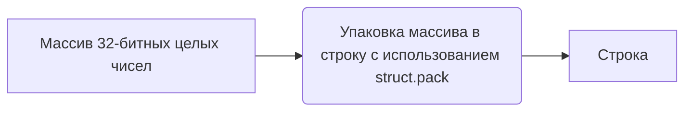
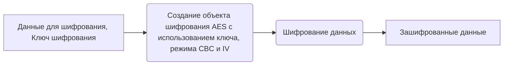
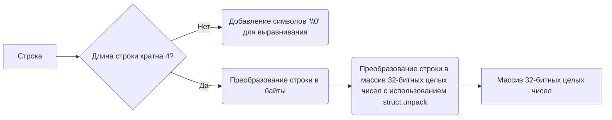
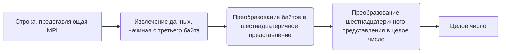
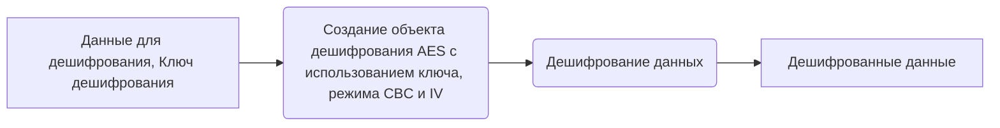
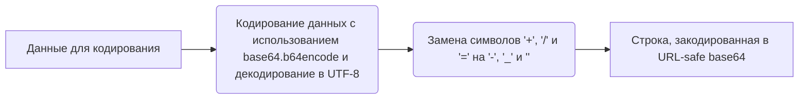
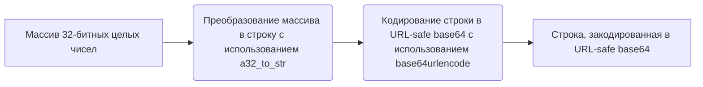
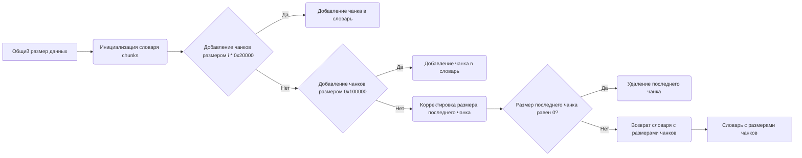

# Модуль `utils.py` для работы с Mega

## Обзор

Модуль `utils.py` предоставляет набор утилитных функций для работы с сервисом Mega. Эти функции включают в себя преобразование данных, шифрование и дешифрование, кодирование и декодирование в base64, а также управление размером чанков данных.

## Подробней

Этот модуль содержит набор низкоуровневых функций, необходимых для взаимодействия с API Mega. Функции выполняют преобразование данных между различными форматами (например, между массивами 32-битных целых чисел и строками), шифрование и дешифрование данных с использованием AES в режиме CBC, а также кодирование и декодирование данных в формат Base64.

## Функции

### `a32_to_str`

```python
def a32_to_str(a):
    """Преобразует массив 32-битных целых чисел в строку.

    Args:
        a (list[int]): Массив 32-битных целых чисел.

    Returns:
        str: Строка, полученная из массива целых чисел.

    Пример:
        >>> a32_to_str([1, 2, 3])
        b'\\x00\\x00\\x00\\x01\\x00\\x00\\x00\\x02\\x00\\x00\\x00\\x03'
    """
    ...
```

**Как работает функция**:
1. Функция принимает на вход массив 32-битных целых чисел `a`.
2. Использует `struct.pack` для упаковки массива в строку, где каждый элемент представляется как 4-байтовое целое число в сетевом порядке байтов (big-endian).
3. Возвращает полученную строку.



**Примеры**:
```python
    >>> a32_to_str([1, 2, 3])
    b'\\x00\\x00\\x00\\x01\\x00\\x00\\x00\\x02\\x00\\x00\\x00\\x03'
```

### `aes_cbc_encrypt`

```python
def aes_cbc_encrypt(data, key):
    """Шифрует данные с использованием AES в режиме CBC.

    Args:
        data (bytes): Данные для шифрования.
        key (bytes): Ключ шифрования.

    Returns:
        bytes: Зашифрованные данные.

    Пример:
        >>> key = b'\\x00' * 16
        >>> data = b'example data'
        >>> aes_cbc_encrypt(data, key)
        b'\\xa6\\xbb\\x9c\\x0f\\x8b\\x0b\\x1b\\xdd\\xbb\\x04\\x92\\x11\\x90\\xba\\x0e\\xdf'
    """
    ...
```

**Как работает функция**:
1. Функция принимает на вход данные `data` и ключ `key` для шифрования.
2. Создает объект шифрования AES с использованием ключа `key`, режима CBC и вектора инициализации (IV), заполненного нулями.
3. Шифрует данные `data` с использованием созданного объекта шифрования.
4. Возвращает зашифрованные данные.



**Примеры**:
```python
    >>> key = b'\\x00' * 16
    >>> data = b'example data'
    >>> aes_cbc_encrypt(data, key)
    b'\\xa6\\xbb\\x9c\\x0f\\x8b\\x0b\\x1b\\xdd\\xbb\\x04\\x92\\x11\\x90\\xba\\x0e\\xdf'
```

### `aes_cbc_encrypt_a32`

```python
def aes_cbc_encrypt_a32(data, key):
    """Шифрует данные, представленные в виде массива 32-битных целых чисел, с использованием AES в режиме CBC.

    Args:
        data (list[int]): Данные для шифрования в виде массива 32-битных целых чисел.
        key (list[int]): Ключ шифрования в виде массива 32-битных целых чисел.

    Returns:
        tuple[int]: Зашифрованные данные в виде массива 32-битных целых чисел.
    """
    ...
```

**Как работает функция**:
1. Функция принимает на вход данные `data` и ключ `key` в виде массивов 32-битных целых чисел.
2. Преобразует массивы `data` и `key` в строки с помощью функции `a32_to_str`.
3. Шифрует полученную строку с помощью функции `aes_cbc_encrypt`.
4. Преобразует зашифрованную строку обратно в массив 32-битных целых чисел с помощью функции `str_to_a32`.
5. Возвращает зашифрованные данные в виде массива 32-битных целых чисел.

```mermaid
graph LR
    A[Данные для шифрования (a32), Ключ шифрования (a32)] --> B(Преобразование массивов a32 в строки);
    B --> C(Шифрование данных с использованием AES в режиме CBC);
    C --> D(Преобразование зашифрованной строки обратно в массив a32);
    D --> E[Зашифрованные данные (a32)]
```

### `str_to_a32`

```python
def str_to_a32(b):
    """Преобразует строку в массив 32-битных целых чисел.

    Args:
        b (str): Строка для преобразования.

    Returns:
        tuple[int]: Массив 32-битных целых чисел, полученный из строки.

    Raises:
        TypeError: Если входные данные не являются строкой или байтами.

    Пример:
        >>> str_to_a32(b'\\x00\\x00\\x00\\x01\\x00\\x00\\x00\\x02\\x00\\x00\\x00\\x03')
        (1, 2, 3)
    """
    ...
```

**Как работает функция**:
1. Функция принимает на вход строку `b`.
2. Если длина строки не кратна 4, добавляет символы `\0` для выравнивания.
3. Преобразует строку в байты, если она представлена в виде обычной строки (str).
4. Использует `struct.unpack` для преобразования строки в массив 32-битных целых чисел.
5. Возвращает полученный массив.



**Примеры**:
```python
    >>> str_to_a32(b'\\x00\\x00\\x00\\x01\\x00\\x00\\x00\\x02\\x00\\x00\\x00\\x03')
    (1, 2, 3)
```

### `mpi2int`

```python
def mpi2int(s):
    """Преобразует строку, представляющую собой MPI (Multi-Precision Integer), в целое число.

    Args:
        s (bytes): Строка, представляющая MPI.

    Returns:
        int: Целое число, полученное из MPI.

    Пример:
        >>> mpi2int(b'\\x00\\x02\\x01\\x00')
        256
    """
    ...
```

**Как работает функция**:
1. Функция принимает на вход строку `s`, представляющую MPI.
2. Извлекает данные, начиная с третьего байта (`s[2:]`).
3. Преобразует полученные байты в шестнадцатеричное представление с помощью `binascii.hexlify`.
4. Преобразует шестнадцатеричное представление в целое число с основанием 16.
5. Возвращает полученное целое число.



**Примеры**:
```python
    >>> mpi2int(b'\\x00\\x02\\x01\\x00')
    256
```

### `aes_cbc_decrypt`

```python
def aes_cbc_decrypt(data, key):
    """Дешифрует данные с использованием AES в режиме CBC.

    Args:
        data (bytes): Данные для дешифрования.
        key (bytes): Ключ дешифрования.

    Returns:
        bytes: Дешифрованные данные.

    Пример:
        >>> key = b'\\x00' * 16
        >>> data = b'\\xa6\\xbb\\x9c\\x0f\\x8b\\x0b\\x1b\\xdd\\xbb\\x04\\x92\\x11\\x90\\xba\\x0e\\xdf'
        >>> aes_cbc_decrypt(data, key)
        b'example data\\r\\r\\r\\r\\r\\r\\r'
    """
    ...
```

**Как работает функция**:
1. Функция принимает на вход данные `data` и ключ `key` для дешифрования.
2. Создает объект дешифрования AES с использованием ключа `key`, режима CBC и вектора инициализации (IV), заполненного нулями.
3. Дешифрует данные `data` с использованием созданного объекта дешифрования.
4. Возвращает дешифрованные данные.



**Примеры**:
```python
    >>> key = b'\\x00' * 16
    >>> data = b'\\xa6\\xbb\\x9c\\x0f\\x8b\\x0b\\x1b\\xdd\\xbb\\x04\\x92\\x11\\x90\\xba\\x0e\\xdf'
    >>> aes_cbc_decrypt(data, key)
    b'example data\\r\\r\\r\\r\\r\\r\\r'
```

### `aes_cbc_decrypt_a32`

```python
def aes_cbc_decrypt_a32(data, key):
    """Дешифрует данные, представленные в виде массива 32-битных целых чисел, с использованием AES в режиме CBC.

    Args:
        data (list[int]): Данные для дешифрования в виде массива 32-битных целых чисел.
        key (list[int]): Ключ дешифрования в виде массива 32-битных целых чисел.

    Returns:
        tuple[int]: Дешифрованные данные в виде массива 32-битных целых чисел.
    """
    ...
```

**Как работает функция**:
1. Функция принимает на вход данные `data` и ключ `key` в виде массивов 32-битных целых чисел.
2. Преобразует массивы `data` и `key` в строки с помощью функции `a32_to_str`.
3. Дешифрует полученную строку с помощью функции `aes_cbc_decrypt`.
4. Преобразует дешифрованную строку обратно в массив 32-битных целых чисел с помощью функции `str_to_a32`.
5. Возвращает дешифрованные данные в виде массива 32-битных целых чисел.

```mermaid
graph LR
    A[Данные для дешифрования (a32), Ключ дешифрования (a32)] --> B(Преобразование массивов a32 в строки);
    B --> C(Дешифрование данных с использованием AES в режиме CBC);
    C --> D(Преобразование дешифрованной строки обратно в массив a32);
    D --> E[Дешифрованные данные (a32)]
```

### `base64urldecode`

```python
def base64urldecode(data):
    """Декодирует строку из URL-safe base64.

    Args:
        data (str): Строка для декодирования.

    Returns:
        bytes: Декодированные данные.

    Пример:
        >>> base64urldecode('YSBzaW1wbGUgc3RyaW5n')
        b'a simple string'
    """
    ...
```

**Как работает функция**:
1. Функция принимает на вход строку `data` для декодирования из URL-safe base64.
2. Добавляет необходимое количество символов `=` для правильной обработки base64.
3. Заменяет символы `-`, `_` и `,` на `+`, `/` и `` соответственно.
4. Декодирует строку с использованием `base64.b64decode`.
5. Возвращает декодированные данные.

```mermaid
graph LR
    A[Строка для декодирования (URL-safe base64)] --> B(Добавление символов '=' для правильной обработки base64);
    B --> C(Замена символов '-', '_' и ',' на '+', '/' и '');
    C --> D(Декодирование строки с использованием base64.b64decode);
    D --> E[Декодированные данные]
```

**Примеры**:
```python
    >>> base64urldecode('YSBzaW1wbGUgc3RyaW5n')
    b'a simple string'
```

### `base64_to_a32`

```python
def base64_to_a32(s):
    """Декодирует строку из URL-safe base64 и преобразует результат в массив 32-битных целых чисел.

    Args:
        s (str): Строка для декодирования.

    Returns:
        tuple[int]: Массив 32-битных целых чисел, полученный из декодированной строки.
    """
    ...
```

**Как работает функция**:
1. Функция принимает на вход строку `s` для декодирования из URL-safe base64.
2. Декодирует строку с использованием функции `base64urldecode`.
3. Преобразует декодированную строку в массив 32-битных целых чисел с использованием функции `str_to_a32`.
4. Возвращает полученный массив.

```mermaid
graph LR
    A[Строка для декодирования (URL-safe base64)] --> B(Декодирование строки с использованием base64urldecode);
    B --> C(Преобразование декодированной строки в массив 32-битных целых чисел с использованием str_to_a32);
    C --> D[Массив 32-битных целых чисел]
```

### `base64urlencode`

```python
def base64urlencode(data):
    """Кодирует данные в URL-safe base64.

    Args:
        data (bytes): Данные для кодирования.

    Returns:
        str: Строка, закодированная в URL-safe base64.

    Пример:
        >>> base64urlencode(b'a simple string')
        'YSBzaW1wbGUgc3RyaW5n'
    """
    ...
```

**Как работает функция**:
1. Функция принимает на вход данные `data` для кодирования в URL-safe base64.
2. Кодирует данные с использованием `base64.b64encode` и декодирует результат в UTF-8.
3. Заменяет символы `+`, `/` и `=` на `-`, `_` и `` соответственно.
4. Возвращает закодированную строку.



**Примеры**:
```python
    >>> base64urlencode(b'a simple string')
    'YSBzaW1wbGUgc3RyaW5n'
```

### `a32_to_base64`

```python
def a32_to_base64(a):
    """Преобразует массив 32-битных целых чисел в строку, закодированную в URL-safe base64.

    Args:
        a (list[int]): Массив 32-битных целых чисел.

    Returns:
        str: Строка, закодированная в URL-safe base64.
    """
    ...
```

**Как работает функция**:
1. Функция принимает на вход массив 32-битных целых чисел `a`.
2. Преобразует массив в строку с помощью функции `a32_to_str`.
3. Кодирует полученную строку в URL-safe base64 с помощью функции `base64urlencode`.
4. Возвращает закодированную строку.



### `get_chunks`

```python
def get_chunks(size):
    """Определяет размеры чанков для передачи данных.

    Args:
        size (int): Общий размер данных.

    Returns:
        dict: Словарь, где ключи - начальные позиции чанков, а значения - их размеры.
    """
    ...
```

**Как работает функция**:
1. Функция принимает на вход общий размер данных `size`.
2. Инициализирует пустой словарь `chunks` для хранения размеров чанков.
3. Определяет размеры чанков, начиная с 0x20000 (131072 байт) и увеличивая их в несколько раз, пока не достигнет максимального размера чанка или не приблизится к общему размеру данных.
4. Добавляет чанки размером 0x100000 (1048576 байт) до тех пор, пока не будет обработан весь объем данных.
5. Корректирует размер последнего чанка, чтобы он соответствовал оставшемуся объему данных.
6. Удаляет последний чанк, если его размер равен 0.
7. Возвращает словарь с размерами чанков.

