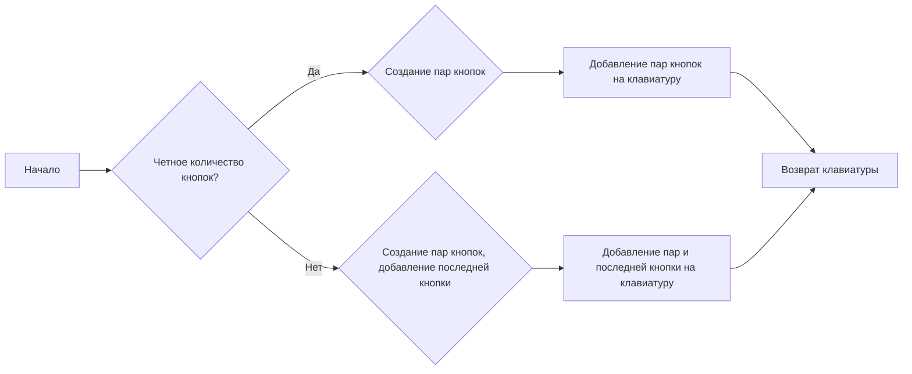
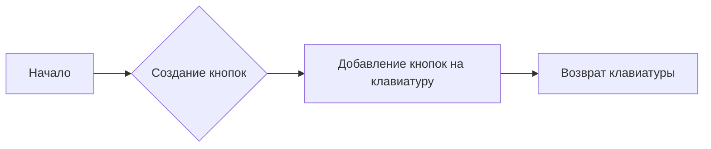
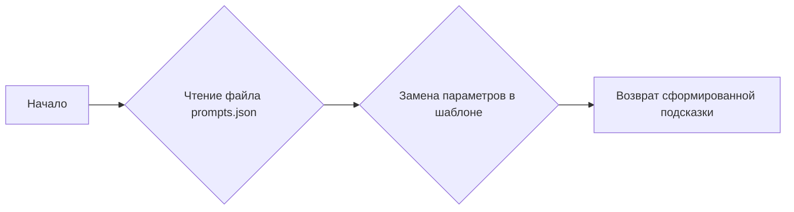
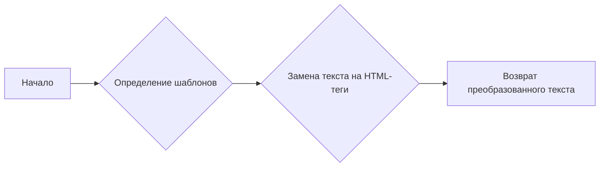

# Модуль AuxiliaryClasses.py

## Обзор

Модуль содержит вспомогательные классы для работы с Telegram ботом, включая:

- `keyboards`: Класс для создания различных типов клавиатур, используемых в боте.
- `PromptsCompressor`: Класс для сжатия и обработки текстовых подсказок (prompts) для бота.

## Подробней

Модуль предоставляет инструменты для упрощения создания клавиатур и обработки текстовых запросов, что делает код бота более организованным и удобным в поддержке. Класс `keyboards` содержит методы для генерации кнопок и разметки клавиатур, а `PromptsCompressor` позволяет динамически формировать текстовые запросы на основе шаблонов и пользовательских данных.

## Классы

### `keyboards`

**Описание**: Класс предназначен для создания и управления различными типами клавиатур, используемых в Telegram боте.

**Принцип работы**: Класс предоставляет методы для создания инлайн-клавиатур с двумя полями и клавиатур с кнопками ответа. Это позволяет упростить взаимодействие с пользователем, предоставляя ему готовые варианты выбора.

**Методы**:

- `_keyboard_two_blank(self, data: list[str], name: list[str]) -> types.InlineKeyboardMarkup`:
    Создает инлайн-клавиатуру с двумя полями в каждом ряду.
- `_reply_keyboard(self, name: list[str])`:
    Создает клавиатуру с кнопками ответа.

#### `_keyboard_two_blank`

```python
def _keyboard_two_blank(self, data: list[str], name: list[str]) -> types.InlineKeyboardMarkup:
    """
    Создает инлайн-клавиатуру с двумя кнопками в каждом ряду.

    Args:
        data (list[str]): Список данных, которые будут передаваться в callback_data кнопок.
        name (list[str]): Список названий кнопок, отображаемых пользователю.

    Returns:
        types.InlineKeyboardMarkup: Объект инлайн-клавиатуры.
    """
    ...
```

**Назначение**: Метод создает инлайн-клавиатуру, в которой кнопки располагаются попарно в каждом ряду. Callback-данные кнопок берутся из списка `data`, а отображаемые названия - из списка `name`.

**Параметры**:
- `data` (list[str]): Список строковых данных для callback кнопок.
- `name` (list[str]): Список строковых названий кнопок.

**Возвращает**:
- `types.InlineKeyboardMarkup`: Объект инлайн-клавиатуры для Telegram бота.

**Как работает функция**:

1.  **Инициализация клавиатуры**: Создается объект `types.InlineKeyboardMarkup` для хранения кнопок.
2.  **Создание кнопок**: Генерируется список кнопок `types.InlineKeyboardButton` на основе входных данных `data` и `name`.
3.  **Упаковка кнопок в ряды**: Кнопки добавляются в клавиатуру попарно. Если количество кнопок нечетное, последняя кнопка добавляется отдельно.



**Примеры**:

```python
keyboard = keyboards()._keyboard_two_blank(data=['1', '2', '3'], name=['Один', 'Два', 'Три'])
```

#### `_reply_keyboard`

```python
def _reply_keyboard(self, name: list[str]):
    """
    Создает клавиатуру с кнопками ответа.

    Args:
        name (list[str]): Список названий кнопок, отображаемых пользователю.

    Returns:
        types.ReplyKeyboardMarkup: Объект клавиатуры с кнопками ответа.
    """
    ...
```

**Назначение**: Метод создает клавиатуру с кнопками ответа, которые отображаются пользователю для быстрого выбора вариантов.

**Параметры**:
- `name` (list[str]): Список строковых названий кнопок.

**Возвращает**:
- `types.ReplyKeyboardMarkup`: Объект клавиатуры с кнопками ответа для Telegram бота.

**Как работает функция**:

1.  **Инициализация клавиатуры**: Создается объект `types.ReplyKeyboardMarkup` с возможностью изменения размера.
2.  **Создание кнопок**: Генерируется список кнопок `types.KeyboardButton` на основе входных данных `name`.
3.  **Добавление кнопок на клавиатуру**: Кнопки добавляются на клавиатуру.



**Примеры**:

```python
keyboard = keyboards()._reply_keyboard(name=['Да', 'Нет', 'Отмена'])
```

### `PromptsCompressor`

**Описание**: Класс предназначен для сжатия и обработки текстовых подсказок (prompts) для Telegram бота.

**Принцип работы**: Класс инициализируется с предопределенными размерами команд и предоставляет метод для получения подсказок на основе индекса и списка информации. Также содержит статический метод для вставки HTML-тегов в текст ответа.

**Аттрибуты**:
- `commands_size (list[list[str]])`: Список, определяющий размер каждой команды. Используется для проверки соответствия входных данных и шаблона подсказки.

**Методы**:

- `__init__(self)`: Инициализирует класс с определением размеров команд.
- `get_prompt(self, info: list[str], ind: int) -> str`: Получает текстовую подсказку на основе предоставленной информации и индекса.
- `html_tags_insert(response: str) -> str`: Статический метод для вставки HTML-тегов в текст ответа.

#### `__init__`

```python
def __init__(self):
    """
    Инициализирует класс PromptsCompressor.
    Определяет размеры команд, используемые в методе get_prompt.
    """
    ...
```

**Назначение**: Метод инициализирует класс `PromptsCompressor`, устанавливая размеры команд, используемые в методе `get_prompt`.

**Как работает функция**:

1.  **Определение размеров команд**: Инициализируется атрибут `self.commands_size`, содержащий список списков строк. Каждый внутренний список определяет ожидаемые параметры для определенной команды.

**Примеры**:

```python
compressor = PromptsCompressor()
```

#### `get_prompt`

```python
def get_prompt(self, info: list[str], ind: int) -> str:
    """
    Получает текстовую подсказку на основе предоставленной информации и индекса.

    Args:
        info (list[str]): Список строк, содержащих информацию для вставки в подсказку.
        ind (int): Индекс команды, которую необходимо получить.

    Returns:
        str: Сформированная текстовая подсказка.
    """
    ...
```

**Назначение**: Метод получает текстовую подсказку из файла `prompts.json` на основе предоставленной информации и индекса команды.

**Параметры**:
- `info` (list[str]): Список строковых значений, которые будут вставлены в шаблон подсказки.
- `ind` (int): Индекс шаблона подсказки, который необходимо использовать.

**Возвращает**:
- `str`: Сформированная текстовая подсказка.

**Как работает функция**:

1.  **Чтение файла с подсказками**: Открывается файл `prompts.json` и загружаются команды.
2.  **Замена параметров в шаблоне**: В цикле заменяются плейсхолдеры в шаблоне подсказки на значения из списка `info`.



**Примеры**:

```python
compressor = PromptsCompressor()
prompt = compressor.get_prompt(info=['Тема', 'Аудитория', 'Длина'], ind=0)
```

#### `html_tags_insert`

```python
@staticmethod
def html_tags_insert(response: str) -> str:
    """
    Статический метод для вставки HTML-тегов в текст ответа.

    Args:
        response (str): Текст ответа, в который необходимо вставить HTML-теги.

    Returns:
        str: Текст ответа с вставленными HTML-тегами.
    """
    ...
```

**Назначение**: Статический метод, который вставляет HTML-теги в текст ответа на основе заданных регулярных выражений.

**Параметры**:
- `response` (str): Строка, в которой нужно заменить текст HTML-тегами.

**Возвращает**:
- `str`: Преобразованная строка с HTML-тегами.

**Как работает функция**:

1.  **Определение шаблонов**: Задаются регулярные выражения для поиска и замены текста на HTML-теги.
2.  **Замена текста тегами**: В цикле происходит замена текста на соответствующие HTML-теги с использованием регулярных выражений.



**Примеры**:

```python
text = PromptsCompressor.html_tags_insert(response='#### Заголовок\\n**Жирный текст**')
```