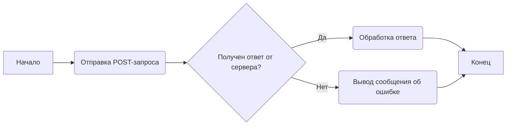
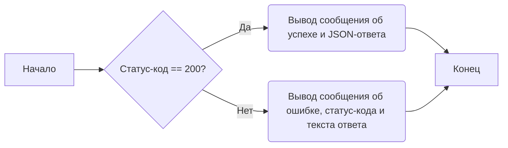

# Модуль для проверки ngrok

## Обзор

Этот модуль содержит пример кода для отправки POST-запроса к API, предположительно, работающему через ngrok. Он демонстрирует, как установить заголовки авторизации и контента, отправить JSON-данные и обработать ответ от сервера.

## Подробней

Этот код предназначен для отправки данных на локальный сервер, доступный через ngrok. Он включает установку необходимых заголовков и обработку ответа от сервера. Важно заменить `YOUR_API_TOKEN` на актуальный API-токен.

## Функции

### `Отправка POST-запроса`

```python
response = requests.post(url, headers=headers, json=data)
```

**Назначение**: Отправляет POST-запрос на указанный URL с заданными заголовками и данными в формате JSON.

**Параметры**:
- `url` (str): URL-адрес для отправки запроса.
- `headers` (dict): Словарь с HTTP-заголовками для запроса.
- `json` (dict): Словарь с данными, которые будут сериализованы в JSON и отправлены в теле запроса.

**Возвращает**:
- Объект `response` от библиотеки `requests`, содержащий информацию об ответе сервера.

**Как работает функция**:

1.  **Отправка запроса**: Отправляет POST-запрос на указанный URL с заданными заголовками и данными в формате JSON.
2.  **Получение ответа**: Получает ответ от сервера.



**Примеры**:

```python
import requests

# URL API
url = "127.0.0.1:8443"

# Заголовки
headers = {
    "Authorization": "Bearer YOUR_API_TOKEN",
    "Content-Type": "application/json"
}

# Данные для отправки
data = {
    "key1": "value1",
    "key2": "value2"
}

# Отправка POST-запроса
response = requests.post(url, headers=headers, json=data)
```

### `Обработка ответа`

```python
if response.status_code == 200:
    print("Успешно:", response.json())
else:
    print("Ошибка:", response.status_code, response.text)
```

**Назначение**: Проверяет статус код ответа и выводит соответствующее сообщение об успехе или ошибке.

**Параметры**:
- `response` (requests.Response): Объект ответа, полученный от сервера.

**Возвращает**:
- Ничего (выводит сообщение в консоль).

**Как работает функция**:

1.  **Проверка статус-кода**: Проверяет, равен ли статус-код ответа 200 (успех).
2.  **Вывод сообщения**: Если статус-код 200, выводит сообщение об успехе и JSON-ответ. В противном случае выводит сообщение об ошибке, статус-код и текст ответа.



**Примеры**:

```python
import requests

# URL API
url = "127.0.0.1:8443"

# Заголовки
headers = {
    "Authorization": "Bearer YOUR_API_TOKEN",
    "Content-Type": "application/json"
}

# Данные для отправки
data = {
    "key1": "value1",
    "key2": "value2"
}

# Отправка POST-запроса
response = requests.post(url, headers=headers, json=data)

# Обработка ответа
if response.status_code == 200:
    print("Успешно:", response.json())
else:
    print("Ошибка:", response.status_code, response.text)