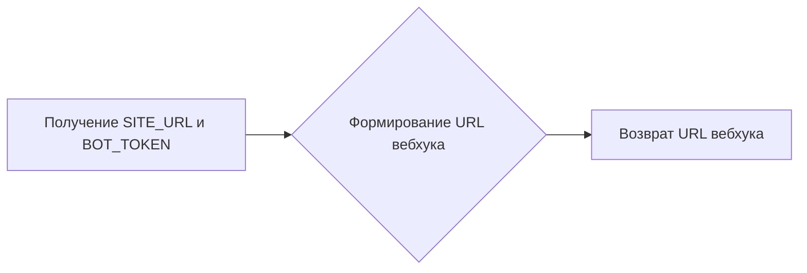
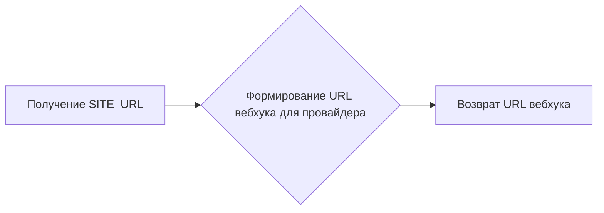

# Модуль конфигурации бота Telegram для цифрового рынка
## Обзор

Этот модуль содержит настройки и конфигурации для Telegram-бота цифрового рынка, включая токен бота, идентификаторы администраторов, URL сайта, параметры доступа к базе данных и другие необходимые параметры. Модуль использует библиотеки `aiogram` и `pydantic_settings` для управления ботом и загрузки переменных среды.

## Подробней

Этот модуль предназначен для централизованного хранения и управления конфигурацией Telegram-бота. Он загружает переменные среды из файла `.env` и предоставляет их в виде атрибутов класса `Settings`. Это упрощает доступ к настройкам бота и делает код более читаемым и поддерживаемым.
Модуль также инициализирует бота и диспетчер `aiogram`, а также настраивает логирование с использованием библиотеки `loguru`.

## Классы

### `Settings`

**Описание**: Класс настроек, который загружает переменные среды из файла `.env` и предоставляет их в виде атрибутов.

**Принцип работы**:
Класс `Settings` наследуется от `BaseSettings` из библиотеки `pydantic_settings`. Это позволяет автоматически загружать переменные среды из файла `.env` и преобразовывать их в соответствующие типы данных. Класс также содержит методы для динамического формирования URL-адресов вебхуков.

**Аттрибуты**:

-   `BOT_TOKEN` (str): Токен Telegram-бота.
-   `ADMIN_IDS` (List[int]): Список идентификаторов администраторов бота.
-   `PROVIDER_TOKEN` (str): Токен провайдера платежей.
-   `FORMAT_LOG` (str): Формат логов (по умолчанию: "{time:YYYY-MM-DD at HH:mm:ss} | {level} | {message}").
-   `LOG_ROTATION` (str): Размер ротации логов (по умолчанию: "10 MB").
-   `DB_URL` (str): URL-адрес базы данных (по умолчанию: 'sqlite+aiosqlite:///data/db.sqlite3').
-   `SITE_URL` (str): URL-адрес сайта.
-   `SITE_HOST` (str): Хост сайта.
-   `SITE_PORT` (int): Порт сайта.
-   `MRH_LOGIN` (str): Логин MRH. <что такое MRH?>
-   `MRH_PASS_1` (str): Пароль MRH 1. <что такое MRH?>
-   `MRH_PASS_2` (str): Пароль MRH 2. <что такое MRH?>
-   `IN_TEST` (int): Флаг, указывающий на тестовую среду.

**Методы**:

-   `get_webhook_url`(): Формирует URL-адрес вебхука на основе токена бота и URL сайта.
-   `get_provider_hook_url`(): Формирует URL-адрес вебхука для провайдера платежей на основе токена бота и URL сайта.

## Функции

### `get_webhook_url`

```python
def get_webhook_url(self) -> str:
    """Динамически формирует путь для вебхука на основе токена и URL сайта."""
    ...
```

**Назначение**: Формирует URL-адрес вебхука для Telegram-бота.

**Параметры**:

-   `self` (Settings): Экземпляр класса `Settings`.

**Возвращает**:

-   `str`: URL-адрес вебхука.

**Как работает функция**:

1.  Функция извлекает значения `SITE_URL` и `BOT_TOKEN` из экземпляра класса `Settings`.
2.  Формирует URL-адрес вебхука, объединяя `SITE_URL` и `BOT_TOKEN` в строку.
3.  Возвращает полученный URL-адрес.



**Примеры**:

```python
settings = Settings(BOT_TOKEN="your_bot_token", SITE_URL="https://example.com")
webhook_url = settings.get_webhook_url
print(webhook_url)  # Вывод: https://example.com/your_bot_token
```

### `get_provider_hook_url`

```python
def get_provider_hook_url(self) -> str:
    """Динамически формирует путь для вебхука на основе токена и URL сайта."""
    ...
```

**Назначение**: Формирует URL-адрес вебхука для провайдера платежей.

**Параметры**:

-   `self` (Settings): Экземпляр класса `Settings`.

**Возвращает**:

-   `str`: URL-адрес вебхука для провайдера платежей.

**Как работает функция**:

1.  Функция извлекает значение `SITE_URL` из экземпляра класса `Settings`.
2.  Формирует URL-адрес вебхука для провайдера платежей, добавляя `/robokassa` к `SITE_URL`.
3.  Возвращает полученный URL-адрес.



**Примеры**:

```python
settings = Settings(SITE_URL="https://example.com")
provider_hook_url = settings.get_provider_hook_url
print(provider_hook_url)  # Вывод: https://example.com/robokassa
```

## Переменные модуля

-   `settings`: Экземпляр класса `Settings`, содержащий все настройки бота.
-   `bot`: Экземпляр класса `Bot` из библиотеки `aiogram`, инициализированный с токеном бота и режимом разбора HTML.
-   `dp`: Экземпляр класса `Dispatcher` из библиотеки `aiogram`, используемый для обработки входящих обновлений.
-   `admins`: Список идентификаторов администраторов бота, полученный из настроек.
-   `log_file_path`: Путь к файлу логов.
-   `logger`: Объект логгера, настроенный для записи логов в файл.
-   `database_url`: URL-адрес базы данных, полученный из настроек.