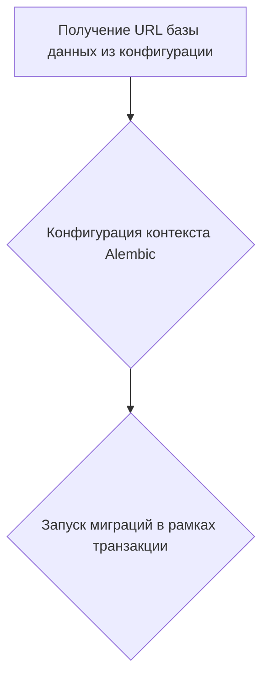
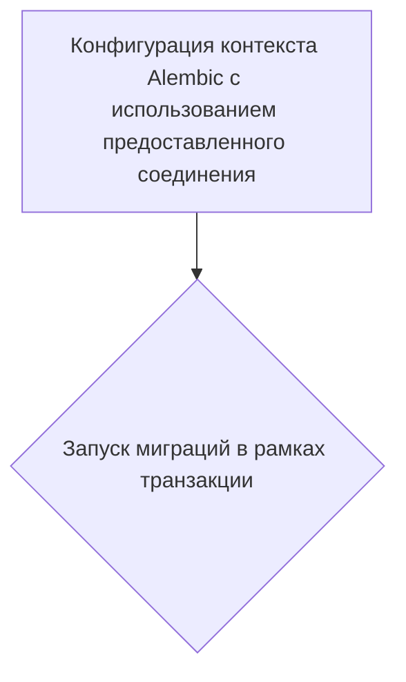
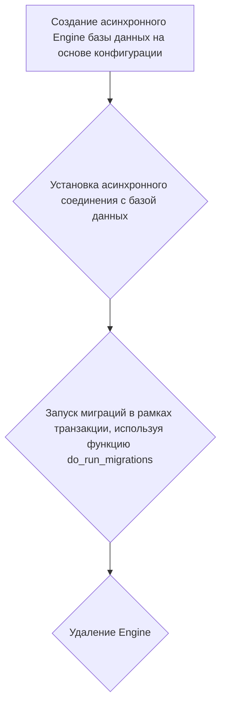

# Модуль для конфигурации и запуска миграций базы данных

## Обзор

Этот модуль предназначен для настройки и запуска миграций базы данных, используя Alembic. Он поддерживает как онлайн, так и оффлайн режимы миграции, а также асинхронное выполнение миграций.

## Подробней

Модуль выполняет следующие задачи:

- Настраивает параметры подключения к базе данных из файла конфигурации Alembic.
- Определяет целевую метадату для миграций.
- Предоставляет функции для запуска миграций в различных режимах (оффлайн, онлайн).
- Поддерживает асинхронное выполнение миграций для повышения производительности.

## Функции

### `run_migrations_offline`

```python
def run_migrations_offline() -> None:
    """
    Запускает миграции в 'offline' режиме.

    Этот режим конфигурирует контекст только с URL и без Engine.
    Пропускается создание Engine, и не требуется доступность DBAPI.

    Вызовы context.execute() выводят строку в вывод скрипта.
    """
    ...
```

**Назначение**: Запускает миграции базы данных в режиме offline. В этом режиме не требуется активное подключение к базе данных.

**Как работает функция**:

1.  **Получение URL**: Извлекает URL базы данных из конфигурации Alembic.
2.  **Конфигурация контекста**: Настраивает контекст Alembic с использованием URL, целевой метадаты и параметров диалекта.
3.  **Запуск миграций**: Запускает миграции в рамках транзакции.



### `do_run_migrations`

```python
def do_run_migrations(connection: Connection) -> None:
    """
    Конфигурирует контекст и запускает миграции, используя предоставленное соединение.
    
    Args:
        connection (Connection): Активное соединение с базой данных.
    """
    ...
```

**Назначение**: Выполняет миграции базы данных, используя предоставленное соединение.

**Параметры**:

*   `connection` (`Connection`): Активное соединение с базой данных.

**Как работает функция**:

1.  **Конфигурация контекста**: Настраивает контекст Alembic с использованием предоставленного соединения и целевой метадаты.
2.  **Запуск миграций**: Запускает миграции в рамках транзакции.



### `run_async_migrations`

```python
async def run_async_migrations() -> None:
    """
    Создает Engine и связывает соединение с контекстом для асинхронного выполнения миграций.
    """
    ...
```

**Назначение**: Асинхронно запускает миграции базы данных.

**Как работает функция**:

1.  **Создание Engine**: Создает асинхронный Engine базы данных на основе конфигурации.
2.  **Установка соединения**: Устанавливает асинхронное соединение с базой данных.
3.  **Запуск миграций**: Запускает миграции в рамках транзакции, используя функцию `do_run_migrations`.
4.  **Удаление Engine**: Освобождает ресурсы, связанные с Engine.



### `run_migrations_online`

```python
def run_migrations_online() -> None:
    """
    Запускает миграции в 'online' режиме.
    """
    ...
```

**Назначение**: Запускает миграции базы данных в режиме online.

**Как работает функция**:

1.  **Асинхронный запуск**: Запускает асинхронные миграции с использованием `asyncio.run`.

```mermaid
graph TD
    A[Запуск асинхронных миграций с использованием asyncio.run];