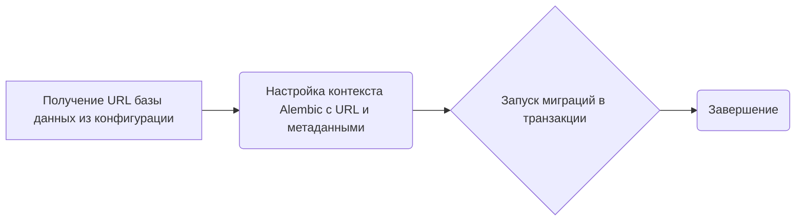
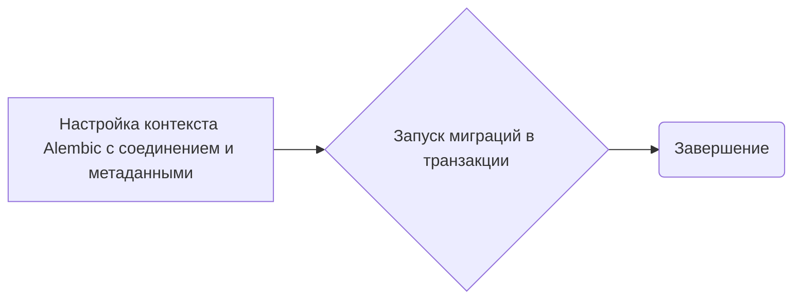
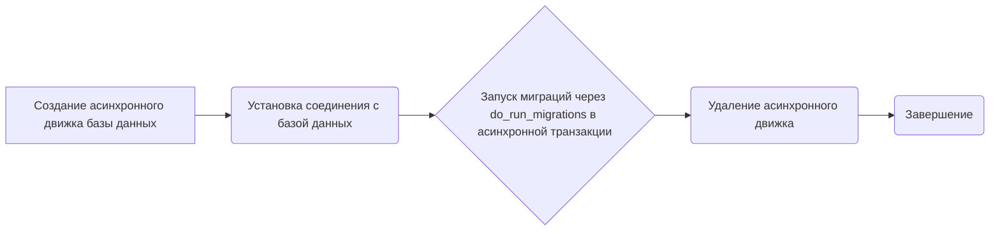
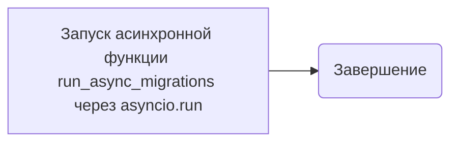

# Модуль для миграции базы данных

## Обзор

Модуль `env.py` предназначен для настройки и запуска миграций базы данных с использованием Alembic. Он поддерживает как онлайн, так и офлайн режимы миграции, а также асинхронные операции.

## Подробней

Этот модуль является частью системы миграции базы данных, которая позволяет автоматически обновлять схему базы данных при изменении моделей. Он использует Alembic для управления миграциями и поддерживает как синхронные, так и асинхронные операции. Модуль настраивает Alembic для работы с базой данных, используя URL-адрес, указанный в конфигурации.

## Функции

### `run_migrations_offline`

```python
def run_migrations_offline() -> None:
    """Run migrations in 'offline' mode.

    This configures the context with just a URL
    and not an Engine, though an Engine is acceptable
    here as well.  By skipping the Engine creation
    we don't even need a DBAPI to be available.

    Calls to context.execute() here emit the given string to the
    script output.

    """
    url = config.get_main_option("sqlalchemy.url")
    context.configure(
        url=url,
        target_metadata=target_metadata,
        literal_binds=True,
        dialect_opts={"paramstyle": "named"},
    )

    with context.begin_transaction():
        context.run_migrations()
```

**Назначение**: Выполняет миграции базы данных в "оффлайн" режиме.

**Как работает функция**:
1.  **Получение URL базы данных**: Извлекает URL базы данных из конфигурации Alembic.
2.  **Настройка контекста Alembic**: Настраивает контекст Alembic с использованием URL базы данных и метаданных целевой модели.
3.  **Запуск миграций**: Запускает миграции в рамках транзакции.



**Примеры**:
```python
# Пример вызова функции
run_migrations_offline()
```

### `do_run_migrations`

```python
def do_run_migrations(connection: Connection) -> None:
    context.configure(connection=connection, target_metadata=target_metadata)

    with context.begin_transaction():
        context.run_migrations()
```

**Назначение**: Выполняет миграции базы данных, используя предоставленное соединение.

**Параметры**:
*   `connection` (`Connection`): Соединение с базой данных, которое будет использоваться для выполнения миграций.

**Как работает функция**:
1.  **Настройка контекста Alembic**: Настраивает контекст Alembic, используя предоставленное соединение и метаданные целевой модели.
2.  **Запуск миграций**: Запускает миграции в рамках транзакции.



**Примеры**:
```python
# Пример вызова функции
# Для вызова этой функции требуется активное соединение с базой данных
# Пример использования внутри асинхронной функции:
# async with engine.connect() as connection:
#     await connection.run_sync(do_run_migrations)
```

### `run_async_migrations`

```python
async def run_async_migrations() -> None:
    """In this scenario we need to create an Engine
    and associate a connection with the context.

    """

    connectable = async_engine_from_config(
        config.get_section(config.config_ini_section, {}),
        prefix="sqlalchemy.",
        poolclass=pool.NullPool,
    )

    async with connectable.connect() as connection:
        await connection.run_sync(do_run_migrations)

    await connectable.dispose()
```

**Назначение**: Асинхронно выполняет миграции базы данных.

**Как работает функция**:
1.  **Создание асинхронного движка**: Создает асинхронный движок базы данных, используя конфигурацию Alembic.
2.  **Установка соединения**: Устанавливает соединение с базой данных с использованием асинхронного движка.
3.  **Запуск миграций**: Запускает миграции, используя функцию `do_run_migrations` в рамках асинхронной транзакции.
4.  **Удаление движка**: Закрывает все соединения в пуле соединений.



**Примеры**:
```python
# Пример вызова функции
# await run_async_migrations()
```

### `run_migrations_online`

```python
def run_migrations_online() -> None:
    """Run migrations in 'online' mode."""

    asyncio.run(run_async_migrations())
```

**Назначение**: Выполняет миграции базы данных в "онлайн" режиме, используя асинхронный подход.

**Как работает функция**:
1.  **Запуск асинхронных миграций**: Запускает асинхронную функцию `run_async_migrations` с использованием `asyncio.run`.



**Примеры**:
```python
# Пример вызова функции
run_migrations_online()