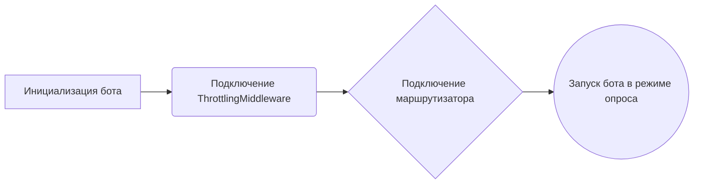

# Модуль запуска Telegram-бота для работы с фильмами
## Обзор
Модуль `run.py` является точкой входа для Telegram-бота, предназначенного для работы с фильмами. Он инициализирует и запускает бота, используя библиотеку `aiogram` для обработки взаимодействий с пользователем через Telegram. Модуль загружает необходимые переменные окружения, настраивает диспетчер для обработки сообщений и включает маршрутизатор с обработчиками команд бота.

## Подробней
Этот модуль выполняет основные функции запуска и настройки Telegram-бота. Он загружает токен бота из переменных окружения, создает экземпляр бота и диспетчера, подключает промежуточное ПО для контроля частоты запросов и регистрирует маршрутизатор с обработчиками команд. После этого бот запускается в режиме опроса (polling), ожидая входящие сообщения от пользователей. Кроме того, модуль настраивает систему логирования для записи информации о работе бота.

## Функции

### `main`

```python
async def main() -> None:
    """Асинхронная функция для запуска Telegram-бота.
    Args:
        None
    Returns:
        None
    """
```

**Назначение**: Запускает Telegram-бота, инициализирует диспетчер, подключает маршрутизатор и начинает процесс опроса.

**Как работает функция**:
1. **Инициализация бота**: Создается экземпляр бота `aiogram.Bot` с использованием токена, полученного из переменных окружения.
2. **Подключение middleware**: Добавляется промежуточное ПО `ThrottlingMiddleware` для контроля частоты запросов к боту.
3. **Подключение маршрутизатора**: В диспетчер включается маршрутизатор `router`, содержащий обработчики команд и сообщений бота.
4. **Запуск бота**: Бот запускается в режиме опроса (`start_polling`), ожидая входящие сообщения от пользователей.



**Примеры**:

```python
# Пример запуска функции main (обычно запускается asyncio.run())
import asyncio
async def test_main():
    await main()
asyncio.run(test_main())
```
## Запуск бота
```python
if __name__ == "__main__":
    logging.basic_colorized_config(
        level=logging.INFO,
        format='%(asctime)s - [%(levelname)s] - %(name)s - '\
               '(%(filename)s).%(funcName)s(%(lineno)d) - %(message)s',
        datefmt='%H:%M:%S'
    )
    asyncio.run(main())
```

**Назначение**: Настраивает систему логирования и запускает основную функцию `main` в асинхронном режиме.

**Как работает**:
1. **Настройка логирования**: Используется `logging.basic_colorized_config` для настройки логирования с определенным уровнем, форматом и датой.
2. **Запуск бота**: Функция `main` запускается с помощью `asyncio.run`, что позволяет выполнять асинхронный код.

```mermaid
graph LR
A[Настройка логирования] --> B((Запуск main() через asyncio))
```

**Примеры**:
```python
# Пример запуска бота (обычно выполняется при запуске скрипта)
if __name__ == "__main__":
    import asyncio
    import logging
    import betterlogging as logging
    logging.basic_colorized_config(
        level=logging.INFO,
        format='%(asctime)s - [%(levelname)s] - %(name)s - '\
               '(%(filename)s).%(funcName)s(%(lineno)d) - %(message)s',
        datefmt='%H:%M:%S'
    )
    async def run_main():
      await main()
    asyncio.run(run_main())