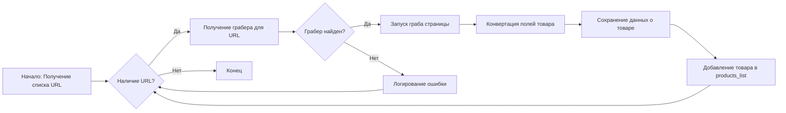
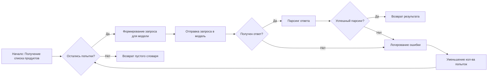

# Модуль исполнения сценария создания мехирона для Сергея Казаринова

## Обзор

Модуль `from_supplier_to_prestashop.py` предназначен для извлечения, разбора и обработки данных о товарах от поставщиков с целью их последующей публикации в PrestaShop. Модуль автоматизирует процесс подготовки данных, их обработки с использованием AI и интеграции с PrestaShop.

## Подробнее

Модуль содержит класс `SupplierToPrestashopProvider`, который выполняет основные задачи по сбору данных о товарах, их обработке с использованием AI, сохранению и публикации в PrestaShop. Он также включает функции для создания отчетов и публикации информации в Facebook. Модуль использует различные вспомогательные функции для работы с файлами, изображениями и строками.

## Классы

### `SupplierToPrestashopProvider`

**Описание**: Класс обрабатывает извлечение, разбор и сохранение данных о продуктах поставщиков. Данные могут быть получены как с сайтов поставщиков, так и из файла JSON.

**Атрибуты**:
- `driver` (Driver): Экземпляр Selenium WebDriver для управления браузером.
- `export_path` (Path): Путь для экспорта данных.
- `mexiron_name` (str): Название мехирона.
- `price` (float): Цена товара.
- `timestamp` (str): Временная метка.
- `products_list` (list): Список обработанных данных о продуктах.
- `model` (GoogleGenerativeAI): Экземпляр модели Google Gemini для обработки текста.
- `config` (SimpleNamespace): Объект с настройками конфигурации.
- `local_images_path` (Path): Путь к локальным изображениям товаров.
- `lang` (str): Язык.
- `gemini_api` (str): API ключ Gemini.
- `presta_api` (str): API ключ PrestaShop.
- `presta_url` (str): URL PrestaShop.

**Методы**:
- `__init__`: Инициализирует экземпляр класса `SupplierToPrestashopProvider`.
- `initialise_ai_model`: Инициализирует модель Gemini.
- `run_scenario`: Выполняет сценарий разбора товаров, их обработки через AI и сохранения данных.
- `save_product_data`: Сохраняет данные об отдельном товаре в файл.
- `process_ai`: Обрабатывает список продуктов с использованием AI модели.
- `read_data_from_json`: Загружает JSON файлы и фотографии, полученные через телеграм.
- `save_in_prestashop`: Сохраняет товары в PrestaShop.
- `post_facebook`: Исполняет сценарий рекламного модуля `facebook`.
- `create_report`: Отправляет задание на создание мехирона в формате `html` и `pdf`.

#### `__init__`

```python
    def __init__(self, 
                 lang:str, 
                 gemini_api: str,
                 presta_api: str,
                 presta_url: str,
                 driver: Optional [Driver] = None,
                 ):
        """
        Initializes SupplierToPrestashopProvider class with required components.

        Args:
            driver (Driver): Selenium WebDriver instance.
            

        """
```

**Назначение**: Инициализирует класс `SupplierToPrestashopProvider` с необходимыми компонентами.

**Параметры**:
- `lang` (str): Язык.
- `gemini_api` (str): API ключ Gemini.
- `presta_api` (str): API ключ PrestaShop.
- `presta_url` (str): URL PrestaShop.
- `driver` (Optional[Driver]): Экземпляр Selenium WebDriver. По умолчанию `None`.

**Как работает функция**:
1. Инициализирует API ключи и URL.
2. Пытается загрузить конфигурационный файл `emil.json` из директории `src/endpoints/emil/`.
3. Инициализирует временную метку.
4. Инициализирует драйвер Firefox, если драйвер не был передан.
5. Инициализирует модель Gemini.

#### `initialise_ai_model`

```python
    def initialise_ai_model(self):\n        """Инициализация модели Gemini"""
```

**Назначение**: Инициализирует модель Gemini.

**Как работает функция**:
1. Формирует путь к файлу с системными инструкциями для Gemini.
2. Читает содержимое файла.
3. Инициализирует модель GoogleGenerativeAI с API ключом и системными инструкциями.
4. Если происходит ошибка во время загрузки инструкций, логирует ошибку и возвращает `None`.

#### `run_scenario`

```python
    async def run_scenario(
        self, 
        urls: list[str],\n        price: Optional[str] = \'\', \n        mexiron_name: Optional[str] = \'\', \n        
    ) -> bool:
        """
        Executes the scenario: parses products, processes them via AI, and stores data.

        Args:
            system_instruction (Optional[str]): System instructions for the AI model.
            price (Optional[str]): Price to process.
            mexiron_name (Optional[str]): Custom Mexiron name.
            urls (Optional[str | List[str]]): Product page URLs.

        Returns:
            bool: True if the scenario executes successfully, False otherwise.

        .. todo:
            сделать логер перед отрицательным выходом из функции. 
            Важно! модель ошибается. 

        """
```

**Назначение**: Выполняет сценарий: парсит продукты, обрабатывает их через AI и сохраняет данные.

**Параметры**:
- `urls` (list[str]): Список URL-адресов товаров.
- `price` (Optional[str]): Цена товара. По умолчанию `''`.
- `mexiron_name` (Optional[str]): Название мехирона. По умолчанию `''`.

**Возвращает**:
- `bool`: `True`, если сценарий выполнен успешно, `False` в противном случае.

**Как работает функция**:
1. Определяет кортеж необходимых полей товара.
2. Итерируется по списку URL-адресов.
3. Получает грабер для каждого URL.
4. Если грабер не найден, логирует ошибку и переходит к следующему URL.
5. Запускает граб страницы.
6. Конвертирует поля товара.
7. Сохраняет данные о товаре.



#### `save_product_data`

```python
    async def save_product_data(self, product_data: dict):\n        """
        Saves individual product data to a file.

        Args:
            product_data (dict): Formatted product data.
        """
```

**Назначение**: Сохраняет данные об отдельном товаре в файл.

**Параметры**:
- `product_data` (dict): Отформатированные данные о товаре.

**Как работает функция**:
1. Формирует путь к файлу для сохранения данных о товаре.
2. Сохраняет данные в файл в формате JSON.
3. Если происходит ошибка во время сохранения, логирует ошибку.

#### `process_ai`

```python
    async def process_ai(self, products_list: List[str], lang:str,  attempts: int = 3) -> tuple | bool:\n        """
        Processes the product list through the AI model.

        Args:
            products_list (str): List of product data dictionaries as a string.
            attempts (int, optional): Number of attempts to retry in case of failure. Defaults to 3.

        Returns:
            tuple: Processed response in `ru` and `he` formats.
            bool: False if unable to get a valid response after retries.

        .. note::
            Модель может возвращать невелидный результат.
            В таком случае я переспрашиваю модель разумное количество раз.
        """
```

**Назначение**: Обрабатывает список продуктов с использованием AI модели.

**Параметры**:
- `products_list` (List[str]): Список данных о продуктах в виде строки.
- `lang` (str): Язык.
- `attempts` (int): Количество попыток повторной отправки запроса в случае неудачи. По умолчанию 3.

**Возвращает**:
- `tuple`: Обработанный ответ в форматах `ru` и `he`.
- `bool`: `False`, если не удалось получить допустимый ответ после нескольких попыток.

**Как работает функция**:
1. Проверяет количество оставшихся попыток. Если их нет, возвращает пустой словарь.
2. Формирует путь к файлу с командой для модели.
3. Читает содержимое файла.
4. Формирует запрос для модели.
5. Отправляет запрос в модель.
6. Пытается распарсить ответ модели.
7. Если ответ не распарсился, логирует ошибку и повторяет запрос.



#### `read_data_from_json`

```python
    async def read_data_from_json(self):\n        """Загружаю JSON файлы и фотки, которые я сделал через телеграм"""
```

**Назначение**: Загружает JSON файлы и фотографии, полученные через телеграм.

**Как работает функция**:
1. Загружает JSON данные из файла, расположенного по пути `self.local_images_path`.
2. Выводит загруженные данные в консоль.

#### `save_in_prestashop`

```python
    async def save_in_prestashop(self, products_list:ProductFields | list[ProductFields]) -> bool:\n        """Функция, которая сохраняет товары в Prestashop emil-design.com """
```

**Назначение**: Сохраняет товары в PrestaShop.

**Параметры**:
- `products_list` (ProductFields | list[ProductFields]): Список товаров для сохранения.

**Как работает функция**:
1. Преобразует входные данные в список, если они не являются списком.
2. Инициализирует класс `PrestaProduct` с API ключом и URL PrestaShop.
3. Итерируется по списку товаров и добавляет каждый товар в PrestaShop.

#### `post_facebook`

```python
    async def post_facebook(self, mexiron:SimpleNamespace) -> bool:\n        """Функция исполняет сценарий рекламного модуля `facvebook`."""
```

**Назначение**: Исполняет сценарий рекламного модуля `facebook`.

**Параметры**:
- `mexiron` (SimpleNamespace): Объект с данными для публикации в Facebook.

**Как работает функция**:
1. Переходит на страницу Facebook.
2. Формирует заголовок для публикации.
3. Публикует заголовок.
4. Загружает медиафайлы.
5. Публикует сообщение.

#### `create_report`

```python
    async def create_report(self, data: dict, lang:str, html_file: Path, pdf_file: Path) -> bool:\n        """Функция отправляет задание на создание мехирона в формате `html` и `pdf`.\n        Если мехорон в pdf создался (`generator.create_report()` вернул True) - \n        отправить его боту
        """
```

**Назначение**: Отправляет задание на создание мехирона в формате `html` и `pdf`.

**Параметры**:
- `data` (dict): Данные для отчета.
- `lang` (str): Язык.
- `html_file` (Path): Путь к HTML файлу.
- `pdf_file` (Path): Путь к PDF файлу.

**Как работает функция**:
1. Инициализирует класс `ReportGenerator`.
2. Запускает создание отчета в форматах `html` и `pdf`.
3. Если отчет создан успешно, отправляет PDF файл боту.

## Функции

### `main`

```python
async def main(suppier_to_presta):\n    """На данный момент функция читает JSON со списком фотографий , которые были получены от Эмиля"""
```

**Назначение**:  Функция читает JSON со списком фотографий, полученных от Эмиля, и сохраняет их в PrestaShop.

**Параметры**:
- `suppier_to_presta`: Экземпляр класса `SupplierToPrestashopProvider`.

**Как работает функция**:
1. Определяет язык.
2. Загружает данные о товарах из JSON файла.
3. Инициализирует класс `SupplierToPrestashopProvider`.
4. Сохраняет товары в PrestaShop.