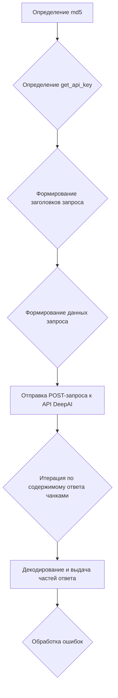

# Модуль `DeepAi.py`

## Обзор

Модуль предназначен для взаимодействия с сервисом DeepAI для генерации ответов на основе предоставленных сообщений. Он включает в себя функцию для создания запросов к API DeepAI и обработки ответов в потоковом режиме. Модуль использует подходы для динамического формирования API-ключей и отправки запросов с пользовательскими заголовками.

## Подробней

Модуль `DeepAi.py` предоставляет возможность взаимодействовать с DeepAI для генерации текстовых ответов на основе заданных сообщений. Он предназначен для использования в рамках более крупной системы, такой как `g4f`, где требуется интеграция с различными AI-провайдерами. Модуль включает в себя функции для формирования API-ключей, отправки POST-запросов к API DeepAI и обработки потоковых ответов.

Взаимодействие с DeepAI осуществляется через функцию `_create_completion`, которая принимает сообщения, модель и другие параметры для генерации ответа. Функция `get_api_key` используется для создания API-ключа на основе user-agent, а функция `md5` применяется для хеширования строк.

Модуль предназначен для интеграции с системой `g4f` и предоставляет функциональность для взаимодействия с AI-провайдером DeepAI. Он позволяет генерировать текстовые ответы на основе заданных сообщений и использовать потоковый режим для обработки больших объемов данных.

## Функции

### `_create_completion`

```python
def _create_completion(model: str, messages: list, stream: bool, **kwargs):
    """ Функция создает запрос к API DeepAI и обрабатывает ответ.

    Args:
        model (str): Идентификатор модели для использования.
        messages (list): Список сообщений для отправки в запросе.
        stream (bool): Флаг, указывающий, следует ли использовать потоковый режим.
        **kwargs: Дополнительные параметры.

    Returns:
        Generator[str, None, None]: Генератор, выдающий части ответа из API DeepAI.

    Raises:
        requests.exceptions.HTTPError: Если возникает ошибка при отправке запроса или обработке ответа.
    """
```

**Как работает функция**:

1.  Определяется внутренняя функция `md5` для вычисления MD5-хеша строки.
2.  Определяется внутренняя функция `get_api_key` для генерации API-ключа на основе user-agent.
3.  Формируются заголовки запроса, включая динамически сгенерированный API-ключ и user-agent.
4.  Формируются данные для отправки в теле запроса, включая стиль чата и историю сообщений.
5.  Отправляется POST-запрос к API DeepAI с использованием библиотеки `requests` в потоковом режиме.
6.  Итерируется по содержимому ответа чанками, декодируются и выдаются как части ответа.
7.  Обрабатываются возможные ошибки при отправке запроса или обработке ответа.



**Внутренние функции**:

#### `md5`

```python
def md5(text: str) -> str:
    """ Вычисляет MD5-хеш строки.

    Args:
        text (str): Строка для вычисления хеша.

    Returns:
        str: MD5-хеш строки в виде шестнадцатеричного представления.
    """
```

Функция `md5` вычисляет MD5-хеш переданной строки.

#### `get_api_key`

```python
def get_api_key(user_agent: str) -> str:
    """ Генерирует API-ключ на основе user-agent.

    Args:
        user_agent (str): User-agent для генерации API-ключа.

    Returns:
        str: Сгенерированный API-ключ.
    """
```

Функция `get_api_key` генерирует API-ключ на основе предоставленного user-agent. Она использует случайное число и MD5-хеширование для создания уникального ключа.

**Примеры**:

```python
# Пример вызова функции _create_completion
model = 'gpt-3.5-turbo'
messages = [{'role': 'user', 'content': 'Hello, how are you?'}]
stream = True
# completion = _create_completion(model=model, messages=messages, stream=stream)
# for chunk in completion:
#     print(chunk, end='')

# Пример вызова внутренней функции md5
text = 'test_string'
# md5_hash = md5(text)
# print(md5_hash)

# Пример вызова внутренней функции get_api_key
user_agent = 'Mozilla/5.0 (Windows NT 10.0; Win64; x64) AppleWebKit/537.36 (KHTML, like Gecko) Chrome/114.0.0.0 Safari/537.36'
# api_key = get_api_key(user_agent)
# print(api_key)
```

## Переменные

-   `url` (str): URL API DeepAI.
-   `model` (list): Список поддерживаемых моделей.
-   `supports_stream` (bool): Флаг, указывающий на поддержку потокового режима.
-   `needs_auth` (bool): Флаг, указывающий на необходимость аутентификации.
-   `params` (str): Строка с информацией о поддержке типов параметров функцией `_create_completion`.