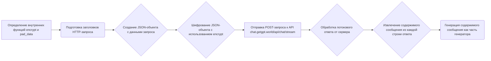

# Модуль GetGpt для работы с провайдером GetGpt в проекте Hypotez
## Обзор
Модуль `GetGpt.py` предоставляет функциональность для взаимодействия с провайдером GetGpt, который использует модель `gpt-3.5-turbo` через API `chat.getgpt.world`. Он включает функции для шифрования данных, создания запросов и потоковой обработки ответов от сервера.

## Подробнее
Этот модуль предназначен для использования в рамках проекта `hypotez` для обеспечения взаимодействия с моделью `gpt-3.5-turbo` через API `chat.getgpt.world`. Он содержит функции для шифрования данных, создания запросов и потоковой обработки ответов от сервера. Модуль использует библиотеку `requests` для отправки HTTP-запросов и библиотеку `Crypto` для шифрования данных.

## Функции

### `_create_completion`

```python
def _create_completion(model: str, messages: list, stream: bool, **kwargs):
    """Создает запрос на completion к API GetGpt и обрабатывает потоковый ответ.

    Args:
        model (str): Идентификатор используемой модели (например, 'gpt-3.5-turbo').
        messages (list): Список сообщений для отправки в запросе.
        stream (bool): Флаг, указывающий, следует ли использовать потоковый режим.
        **kwargs: Дополнительные параметры запроса, такие как `frequency_penalty`, `max_tokens`, `presence_penalty`, `temperature`, `top_p`.

    Yields:
        str: Части контента из потокового ответа.

    Raises:
        requests.exceptions.RequestException: Если возникает ошибка при отправке запроса.
        json.JSONDecodeError: Если не удается декодировать JSON из ответа.
        Exception: Если возникает ошибка при шифровании данных.

    Внутренние функции:
        encrypt(e: str) -> str: Шифрует переданные данные.
        pad_data(data: bytes) -> bytes: Дополняет данные для соответствия размеру блока AES.
    """
```

#### Как работает функция `_create_completion`

1. **Определение внутренних функций**:
   - Определяются две внутренние функции: `encrypt` и `pad_data`. Функция `encrypt` шифрует переданные данные с использованием алгоритма AES, а `pad_data` дополняет данные для соответствия размеру блока AES.
2. **Подготовка заголовков**:
   - Формируются заголовки HTTP-запроса, включающие `Content-Type`, `Referer` и `user-agent`.
3. **Подготовка данных**:
   - Создается JSON-объект с данными для запроса, включающий сообщения, параметры модели и другие параметры, переданные в `kwargs`.
4. **Шифрование данных**:
   - JSON-объект преобразуется в строку и шифруется с использованием функции `encrypt`.
5. **Отправка запроса**:
   - Отправляется POST-запрос к API `chat.getgpt.world/api/chat/stream` с зашифрованными данными и заголовками.
6. **Обработка потокового ответа**:
   - Обрабатывается потоковый ответ от сервера. Каждая строка ответа декодируется и извлекается содержимое сообщения.
7. **Генерация результатов**:
   - Извлеченное содержимое сообщения возвращается как часть генератора.



**Примеры**:

```python
# Пример вызова функции _create_completion
model = 'gpt-3.5-turbo'
messages = [{'role': 'user', 'content': 'Hello, how are you?'}]
stream = True
kwargs = {'max_tokens': 100}

# Внимание! Этот код не будет работать без реального HTTP-сервера и ключей шифрования.
# for chunk in _create_completion(model, messages, stream, **kwargs):
#     print(chunk, end='')
```

#### `encrypt(e: str) -> str`

```python
    def encrypt(e):
        """Шифрует переданные данные с использованием AES.

        Args:
            e (str): Строка для шифрования.

        Returns:
            str: Зашифрованная строка.
        """
```
Функция `encrypt` принимает строку `e`, генерирует случайные ключи и векторы инициализации, шифрует строку с использованием AES в режиме CBC, и возвращает зашифрованную строку вместе с ключами и векторами инициализации.

#### `pad_data(data: bytes) -> bytes`

```python
    def pad_data(data: bytes) -> bytes:
        """Дополняет данные для соответствия размеру блока AES.

        Args:
            data (bytes): Данные для дополнения.

        Returns:
            bytes: Дополненные данные.
        """
```

Функция `pad_data` принимает байтовую строку `data`, вычисляет размер необходимого дополнения, добавляет дополнение к данным и возвращает дополненные данные.

### `params`

```python
params = f'g4f.Providers.{os.path.basename(__file__)[:-3]} supports: ' + \
    '(%s)' % ', '.join(\
        [f'{name}: {get_type_hints(_create_completion)[name].__name__}' for name in _create_completion.__code__.co_varnames[:_create_completion.__code__.co_argcount]])
```

Строка `params` формирует строку с информацией о поддержке параметров функцией `_create_completion`. Она извлекает имена параметров и их типы из аннотаций типов функции `_create_completion` и формирует строку, содержащую эту информацию.