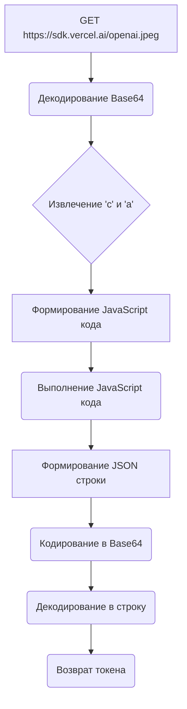
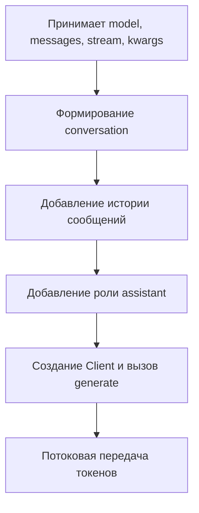

# Модуль `Vercel.py`

## Обзор

Модуль предназначен для взаимодействия с сервисом Vercel AI для генерации текста с использованием различных моделей машинного обучения. Он предоставляет клиентский класс `Client` для установки соединения, получения токена авторизации, формирования запросов и получения результатов генерации текста.

## Подробнее

Этот модуль является провайдером для работы с API Vercel AI. Он содержит информацию о поддерживаемых моделях и логику для взаимодействия с ними. Модуль использует `curl_cffi` для выполнения HTTP-запросов, `execjs` для выполнения JavaScript-кода, и `threading` для организации потоковой обработки ответов от сервера.

## Классы

### `Client`

**Описание**: Класс `Client` предназначен для взаимодействия с API Vercel AI. Он предоставляет методы для получения токена авторизации, формирования запросов и получения результатов генерации текста.

**Принцип работы**:
1.  Инициализируется сессия `requests.Session()` для выполнения HTTP-запросов.
2.  Устанавливаются заголовки по умолчанию, которые будут использоваться во всех запросах.
3.  Метод `get_token()` получает и декодирует токен авторизации, необходимый для взаимодействия с API.
4.  Метод `get_default_params()` извлекает параметры по умолчанию для указанной модели из словаря `vercel_models`.
5.  Метод `generate()` формирует и отправляет запрос на генерацию текста, а также обрабатывает потоковый ответ от сервера.

**Атрибуты**:

*   `session` (requests.Session): Сессия для выполнения HTTP-запросов.
*   `headers` (dict): Заголовки HTTP-запросов по умолчанию.

**Методы**:

*   `__init__(self)`: Инициализирует экземпляр класса `Client`, настраивает сессию и заголовки.
*   `get_token(self) -> str`: Получает токен авторизации от Vercel AI.
*   `get_default_params(self, model_id: str) -> dict`: Возвращает параметры по умолчанию для указанной модели.
*   `generate(self, model_id: str, prompt: str, params: dict = {}) -> Generator[str, None, None]`: Генерирует текст на основе указанной модели и промпта.

### `Client.__init__`

```python
def __init__(self):
    """
    Инициализирует сессию и устанавливает заголовки по умолчанию для HTTP-запросов.

    Args:
        self (Client): Экземпляр класса `Client`.

    Returns:
        None
    """
    ...
```

### `Client.get_token`

```python
def get_token(self) -> str:
    """
    Получает токен авторизации от Vercel AI.

    Args:
        self (Client): Экземпляр класса `Client`.

    Returns:
        str: Декодированный токен авторизации.
    """
    ...
```

**Как работает функция**:

1.  **Получение закодированной строки:** Функция отправляет GET-запрос к `https://sdk.vercel.ai/openai.jpeg` и получает текст ответа, который представляет собой строку в кодировке Base64.
2.  **Декодирование Base64:** Полученная строка декодируется из Base64 в JSON.
3.  **Извлечение кода и аргументов:** Из JSON извлекаются значения ключей `c` и `a`, которые представляют собой код JavaScript и аргументы для этого кода.
4.  **Формирование JavaScript кода:** Формируется строка JavaScript кода, которая включает в себя определение глобального объекта `globalThis` и функцию `token`, возвращающую результат выполнения кода извлеченного из JSON.
5.  **Выполнение JavaScript кода:** С использованием `execjs.compile(code).call('token')` выполняется скомпилированный JavaScript код.
6.  **Формирование JSON строки:** Результат выполнения JavaScript кода формируется в виде JSON строки, содержащей ключи `r` (результат выполнения JavaScript) и `t` (значение из исходного JSON).
7.  **Кодирование в Base64:** Полученная JSON строка кодируется в Base64.
8.  **Возврат токена:** Результат декодируется из байтов в строку и возвращается.



**Примеры**:

```python
client = Client()
token = client.get_token()
print(token) # Вывод: <токен авторизации>
```

### `Client.get_default_params`

```python
def get_default_params(self, model_id: str) -> dict:
    """
    Возвращает параметры по умолчанию для указанной модели.

    Args:
        self (Client): Экземпляр класса `Client`.
        model_id (str): Идентификатор модели.

    Returns:
        dict: Словарь параметров по умолчанию для указанной модели.
    """
    ...
```

**Как работает функция**:

1.  Функция принимает `model_id` как входной параметр, который идентифицирует конкретную модель.
2.  Она ищет параметры, соответствующие указанному `model_id` в словаре `vercel_models`.
3.  После нахождения, функция извлекает параметры из `vercel_models[model_id]['parameters']` и формирует словарь, где ключами являются имена параметров, а значениями - значения по умолчанию (`'value'`) для этих параметров.
4.  Возвращает словарь параметров по умолчанию.

```mermaid
graph TD
    A[Принимает model_id] --> B{Поиск model_id в vercel_models};
    B -- Найдено --> C[Извлечение параметров];
    C --> D[Формирование словаря параметров];
    B -- Не найдено --> E[Обработка ошибки (модель не найдена)];
    D --> F(Возврат словаря параметров);
```

**Примеры**:

```python
client = Client()
model_id = 'anthropic:claude-instant-v1'
default_params = client.get_default_params(model_id)
print(default_params) # Вывод: {'temperature': 1, 'maximumLength': 200, 'topP': 1, 'topK': 1, 'presencePenalty': 1, 'frequencyPenalty': 1, 'stopSequences': ['\n\nHuman:']}
```

### `Client.generate`

```python
def generate(self, model_id: str, prompt: str, params: dict = {}) -> Generator[str, None, None]:
    """
    Генерирует текст на основе указанной модели и промпта.

    Args:
        self (Client): Экземпляр класса `Client`.
        model_id (str): Идентификатор модели.
        prompt (str): Текст запроса.
        params (dict, optional): Дополнительные параметры запроса. По умолчанию {}.

    Yields:
        str: Части сгенерированного текста.
    """
    ...
```

**Как работает функция**:

1.  **Преобразование идентификатора модели:** Если `model_id` не содержит ":", функция пытается найти его в словаре `models` и заменяет на соответствующий идентификатор.
2.  **Получение параметров по умолчанию:** Функция вызывает `self.get_default_params(model_id)` для получения параметров по умолчанию для указанной модели.
3.  **Формирование полезной нагрузки (payload):** Параметры по умолчанию, параметры, переданные в функцию (`params`), и `prompt` объединяются в словарь `payload`, который будет отправлен в запросе.
4.  **Формирование заголовков:** Формируются заголовки запроса, включая токен авторизации, полученный с помощью `self.get_token()`.
5.  **Создание очереди для чанков:** Создается очередь `chunks_queue` для хранения фрагментов сгенерированного текста.
6.  **Определение функции обратного вызова (callback):** Определяется функция `callback(data)`, которая помещает декодированные фрагменты данных в очередь `chunks_queue`.
7.  **Определение потока запроса (request_thread):** Определяется функция `request_thread()`, которая отправляет POST-запрос к API Vercel AI и обрабатывает ответ.  В случае ошибки, делается до 3х попыток отправки запроса.
8.  **Запуск потока запроса:** Запускается поток `request_thread`, который отправляет запрос и обрабатывает ответ в фоновом режиме.
9.  **Обработка фрагментов и генерация текста:** В основном цикле функция пытается получить фрагменты текста из очереди `chunks_queue`.  Полученные фрагменты добавляются к переменной `text`, разделяются на строки, и каждая новая строка преобразуется в JSON и генерируется как часть результата.
10. **Обработка ошибок и завершение:** Если в процессе возникает ошибка, она поднимается. Если ответ получен и очередь пуста, цикл завершается.

```mermaid
graph TD
    A[Принимает model_id, prompt, params] --> B{model_id содержит ':'?};
    B -- Нет --> C[Поиск model_id в models];
    C --> D[Получение параметров по умолчанию];
    B -- Да --> D;
    D --> E[Формирование payload];
    E --> F[Формирование заголовков];
    F --> G[Создание chunks_queue];
    G --> H[Определение callback(data)];
    H --> I[Определение request_thread()];
    I --> J[Запуск потока request_thread];
    J --> K[Цикл обработки фрагментов];
    K -- Получен фрагмент --> L[Добавление к text];
    L --> M[Разделение на строки];
    M --> N[Преобразование в JSON и генерация];
    K -- Ошибка --> O[Поднятие ошибки];
    K -- Ответ получен и очередь пуста --> P(Завершение);
```

**Примеры**:

```python
client = Client()
model_id = 'anthropic:claude-instant-v1'
prompt = 'Напиши короткое стихотворение о весне.'
for chunk in client.generate(model_id, prompt):
    print(chunk) # Вывод: <фрагменты сгенерированного текста>
```

## Функции

### `_create_completion`

```python
def _create_completion(model: str, messages: list, stream: bool, **kwargs):
    """
    Создает завершение текста на основе указанной модели и списка сообщений.

    Args:
        model (str): Идентификатор модели.
        messages (list): Список сообщений для формирования запроса.
        stream (bool): Флаг потоковой передачи данных.
        **kwargs: Дополнительные параметры запроса.

    Yields:
        str: Части сгенерированного текста.
    """
    ...
```

**Как работает функция**:

1.  **Инициализация разговора:** Формируется строка `conversation`, представляющая собой контекст разговора между человеком и языковой моделью.
2.  **Формирование истории сообщений:** Происходит итерация по списку сообщений `messages`, где каждое сообщение добавляется в строку `conversation` в формате "роль: содержание".
3.  **Добавление роли ассистента:** В конце строки `conversation` добавляется указание на роль ассистента ("assistant: ").
4.  **Генерация завершения:** Создается экземпляр класса `Client` и вызывается метод `generate` для генерации завершения текста на основе сформированного контекста.
5.  **Потоковая передача токенов:** В цикле происходит итерация по токенам, полученным от метода `generate`, и каждый токен генерируется как часть результата.



**Примеры**:

```python
model = 'anthropic:claude-instant-v1'
messages = [
    {'role': 'human', 'content': 'Привет!'},
    {'role': 'assistant', 'content': 'Здравствуйте!'}
]
stream = True
for token in _create_completion(model, messages, stream):
    print(token) # Вывод: <фрагменты сгенерированного текста>
```

## Переменные

### `url`

```python
url: str = 'https://play.vercel.ai'
```

**Описание**: URL-адрес сервиса Vercel AI.

### `supports_stream`

```python
supports_stream: bool = True
```

**Описание**: Флаг, указывающий на поддержку потоковой передачи данных.

### `needs_auth`

```python
needs_auth: bool = False
```

**Описание**: Флаг, указывающий на необходимость авторизации.

### `models`

```python
models: Dict[str, str] = {
    'claude-instant-v1': 'anthropic:claude-instant-v1',
    'claude-v1': 'anthropic:claude-v1',
    'alpaca-7b': 'replicate:replicate/alpaca-7b',
    'stablelm-tuned-alpha-7b': 'replicate:stability-ai/stablelm-tuned-alpha-7b',
    'bloom': 'huggingface:bigscience/bloom',
    'bloomz': 'huggingface:bigscience/bloomz',
    'flan-t5-xxl': 'huggingface:google/flan-t5-xxl',
    'flan-ul2': 'huggingface:google/flan-ul2',
    'gpt-neox-20b': 'huggingface:EleutherAI/gpt-neox-20b',
    'oasst-sft-4-pythia-12b-epoch-3.5': 'huggingface:OpenAssistant/oasst-sft-4-pythia-12b-epoch-3.5',
    'santacoder': 'huggingface:bigcode/santacoder',
    'command-medium-nightly': 'cohere:command-medium-nightly',
    'command-xlarge-nightly': 'cohere:command-xlarge-nightly',
    'code-cushman-001': 'openai:code-cushman-001',
    'code-davinci-002': 'openai:code-davinci-002',
    'gpt-3.5-turbo': 'openai:gpt-3.5-turbo',
    'text-ada-001': 'openai:text-ada-001',
    'text-babbage-001': 'openai:text-babbage-001',
    'text-curie-001': 'openai:text-curie-001',
    'text-davinci-002': 'openai:text-davinci-002',
    'text-davinci-003': 'openai:text-davinci-003'
}
```

**Описание**: Словарь, содержащий соответствия между именами моделей и их идентификаторами.

### `model`

```python
model: KeysView[str] = models.keys()
```

**Описание**: Список доступных моделей.

### `vercel_models`

```python
vercel_models: Dict[str, Dict[str, str | Dict[str, Dict[str, int | float | str | list]]]] = {
    'anthropic:claude-instant-v1': {'id': 'anthropic:claude-instant-v1', 'provider': 'anthropic', 'providerHumanName': 'Anthropic', 'makerHumanName': 'Anthropic', 'minBillingTier': 'hobby', 'parameters': {'temperature': {'value': 1, 'range': [0, 1]}, 'maximumLength': {'value': 200, 'range': [50, 1024]}, 'topP': {'value': 1, 'range': [0.1, 1]}, 'topK': {'value': 1, 'range': [1, 500]}, 'presencePenalty': {'value': 1, 'range': [0, 1]}, 'frequencyPenalty': {'value': 1, 'range': [0, 1]}, 'stopSequences': {'value': ['\n\nHuman:'], 'range': []}}, 'name': 'claude-instant-v1'},
    'anthropic:claude-v1': {'id': 'anthropic:claude-v1', 'provider': 'anthropic', 'providerHumanName': 'Anthropic', 'makerHumanName': 'Anthropic', 'minBillingTier': 'hobby', 'parameters': {'temperature': {'value': 1, 'range': [0, 1]}, 'maximumLength': {'value': 200, 'range': [50, 1024]}, 'topP': {'value': 1, 'range': [0.1, 1]}, 'topK': {'value': 1, 'range': [1, 500]}, 'presencePenalty': {'value': 1, 'range': [0, 1]}, 'frequencyPenalty': {'value': 1, 'range': [0, 1]}, 'stopSequences': {'value': ['\n\nHuman:'], 'range': []}}, 'name': 'claude-v1'},
    'replicate:replicate/alpaca-7b': {'id': 'replicate:replicate/alpaca-7b', 'provider': 'replicate', 'providerHumanName': 'Replicate', 'makerHumanName': 'Stanford', 'parameters': {'temperature': {'value': 0.75, 'range': [0.01, 5]}, 'maximumLength': {'value': 200, 'range': [50, 512]}, 'topP': {'value': 0.95, 'range': [0.01, 1]}, 'presencePenalty': {'value': 0, 'range': [0, 1]}, 'frequencyPenalty': {'value': 0, 'range': [0, 1]}, 'repetitionPenalty': {'value': 1.1765, 'range': [0.01, 5]}, 'stopSequences': {'value': [], 'range': []}}, 'version': '2014ee1247354f2e81c0b3650d71ca715bc1e610189855f134c30ecb841fae21', 'name': 'alpaca-7b'},
    'replicate:stability-ai/stablelm-tuned-alpha-7b': {'id': 'replicate:stability-ai/stablelm-tuned-alpha-7b', 'provider': 'replicate', 'makerHumanName': 'StabilityAI', 'providerHumanName': 'Replicate', 'parameters': {'temperature': {'value': 0.75, 'range': [0.01, 5]}, 'maximumLength': {'value': 200, 'range': [50, 512]}, 'topP': {'value': 0.95, 'range': [0.01, 1]}, 'presencePenalty': {'value': 0, 'range': [0, 1]}, 'frequencyPenalty': {'value': 0, 'range': [0, 1]}, 'repetitionPenalty': {'value': 1.1765, 'range': [0.01, 5]}, 'stopSequences': {'value': [], 'range': []}}, 'version': '4a9a32b4fd86c2d047f1d271fa93972683ec6ef1cf82f402bd021f267330b50b', 'name': 'stablelm-tuned-alpha-7b'},
    'huggingface:bigscience/bloom': {'id': 'huggingface:bigscience/bloom', 'provider': 'huggingface', 'providerHumanName': 'HuggingFace', 'makerHumanName': 'BigScience', 'instructions': "Do NOT talk to Bloom as an entity, it's not a chatbot but a webpage/blog/article completion model. For the best results: mimic a few words of a webpage similar to the content you want to generate. Start a sentence as if YOU were writing a blog, webpage, math post, coding article and Bloom will generate a coherent follow-up.", 'parameters': {'temperature': {'value': 0.5, 'range': [0.1, 1]}, 'maximumLength': {'value': 200, 'range': [50, 1024]}, 'topP': {'value': 0.95, 'range': [0.01, 0.99]}, 'topK': {'value': 4, 'range': [1, 500]}, 'repetitionPenalty': {'value': 1.03, 'range': [0.1, 2]}}, 'name': 'bloom'},
    'huggingface:bigscience/bloomz': {'id': 'huggingface:bigscience/bloomz', 'provider': 'huggingface', 'providerHumanName': 'HuggingFace', 'makerHumanName': 'BigScience', 'instructions': 'We recommend using the model to perform tasks expressed in natural language. For example, given the prompt "Translate to English: Je t\\\'aime.", the model will most likely answer "I love you.".', 'parameters': {'temperature': {'value': 0.5, 'range': [0.1, 1]}, 'maximumLength': {'value': 200, 'range': [50, 1024]}, 'topP': {'value': 0.95, 'range': [0.01, 0.99]}, 'topK': {'value': 4, 'range': [1, 500]}, 'repetitionPenalty': {'value': 1.03, 'range': [0.1, 2]}}, 'name': 'bloomz'},
    'huggingface:google/flan-t5-xxl': {'id': 'huggingface:google/flan-t5-xxl', 'provider': 'huggingface', 'makerHumanName': 'Google', 'providerHumanName': 'HuggingFace', 'name': 'flan-t5-xxl', 'parameters': {'temperature': {'value': 0.5, 'range': [0.1, 1]}, 'maximumLength': {'value': 200, 'range': [50, 1024]}, 'topP': {'value': 0.95, 'range': [0.01, 0.99]}, 'topK': {'value': 4, 'range': [1, 500]}, 'repetitionPenalty': {'value': 1.03, 'range': [0.1, 2]}}},
    'huggingface:google/flan-ul2': {'id': 'huggingface:google/flan-ul2', 'provider': 'huggingface', 'providerHumanName': 'HuggingFace', 'makerHumanName': 'Google', 'parameters': {'temperature': {'value': 0.5, 'range': [0.1, 1]}, 'maximumLength': {'value': 200, 'range': [50, 1024]}, 'topP': {'value': 0.95, 'range': [0.01, 0.99]}, 'topK': {'value': 4, 'range': [1, 500]}, 'repetitionPenalty': {'value': 1.03, 'range': [0.1, 2]}}, 'name': 'flan-ul2'},
    'huggingface:EleutherAI/gpt-neox-20b': {'id': 'huggingface:EleutherAI/gpt-neox-20b', 'provider': 'huggingface', 'providerHumanName': 'HuggingFace', 'makerHumanName': 'EleutherAI', 'parameters': {'temperature': {'value': 0.5, 'range': [0.1, 1]}, 'maximumLength': {'value': 200, 'range': [50, 1024]}, 'topP': {'value': 0.95, 'range': [0.01, 0.99]}, 'topK': {'value': 4, 'range': [1, 500]}, 'repetitionPenalty': {'value': 1.03, 'range': [0.1, 2]}, 'stopSequences': {'value': [], 'range': []}}, 'name': 'gpt-neox-20b'},
    'huggingface:OpenAssistant/oasst-sft-4-pythia-12b-epoch-3.5': {'id': 'huggingface:OpenAssistant/oasst-sft-4-pythia-12b-epoch-3.5', 'provider': 'huggingface', 'providerHumanName': 'HuggingFace', 'makerHumanName': 'OpenAssistant', 'parameters': {'maximumLength': {'value': 200, 'range': [50, 1024]}, 'typicalP': {'value': 0.2, 'range': [0.1, 0.99]}, 'repetitionPenalty': {'value': 1, 'range': [0.1, 2]}}, 'name': 'oasst-sft-4-pythia-12b-epoch-3.5'},
    'huggingface:bigcode/santacoder': {
        'id': 'huggingface:bigcode/santacoder', 'provider': 'huggingface', 'providerHumanName': 'HuggingFace', 'makerHumanName': 'BigCode', 'instructions': 'The model was trained on GitHub code. As such it is not an instruction model and commands like "Write a function that computes the square root." do not work well. You should phrase commands like they occur in source code such as comments (e.g. # the following function computes the sqrt) or write a function signature and docstring and let the model complete the function body.', 'parameters': {'temperature': {'value': 0.5, 'range': [0.1, 1]}, 'maximumLength': {'value': 200, 'range': [50, 1024]}, 'topP': {'value': 0.95, 'range': [0.01, 0.99]}, 'topK': {'value': 4, 'range': [1, 500]}, 'repetitionPenalty': {'value': 1.03, 'range': [0.1, 2]}}, 'name': 'santacoder'},
    'cohere:command-medium-nightly': {'id': 'cohere:command-medium-nightly', 'provider': 'cohere', 'providerHumanName': 'Cohere', 'makerHumanName': 'Cohere', 'name': 'command-medium-nightly', 'parameters': {'temperature': {'value': 0.9, 'range': [0, 2]}, 'maximumLength': {'value': 200, 'range': [50, 1024]}, 'topP': {'value': 1, 'range': [0, 1]}, 'topK': {'value': 0, 'range': [0, 500]}, 'presencePenalty': {'value': 0, 'range': [0, 1]}, 'frequencyPenalty': {'value': 0, 'range': [0, 1]}, 'stopSequences': {'value': [], 'range': []}}},
    'cohere:command-xlarge-nightly': {'id': 'cohere:command-xlarge-nightly', 'provider': 'cohere', 'providerHumanName': 'Cohere', 'makerHumanName': 'Cohere', 'name': 'command-xlarge-nightly', 'parameters': {'temperature': {'value': 0.9, 'range': [0, 2]}, 'maximumLength': {'value': 200, 'range': [50, 1024]}, 'topP': {'value': 1, 'range': [0, 1]}, 'topK': {'value': 0, 'range': [0, 500]}, 'presencePenalty': {'value': 0, 'range': [0, 1]}, 'frequencyPenalty': {'value': 0, 'range': [0, 1]}, 'stopSequences': {'value': [], 'range': []}}},
    'openai:gpt-4': {'id': 'openai:gpt-4', 'provider': 'openai', 'providerHumanName': 'OpenAI', 'makerHumanName': 'OpenAI', 'name': 'gpt-4', 'minBillingTier': 'pro', 'parameters': {'temperature': {'value': 0.7, 'range': [0.1, 1]}, 'maximumLength': {'value': 200, 'range': [50, 1024]}, 'topP': {'value': 1, 'range': [0.1, 1]}, 'presencePenalty': {'value': 0, 'range': [0, 1]}, 'frequencyPenalty': {'value': 0, 'range': [0, 1]}, 'stopSequences': {'value': [], 'range': []}}},
    'openai:code-cushman-001': {'id': 'openai:code-cushman-001', 'provider': 'openai', 'providerHumanName': 'OpenAI', 'makerHumanName': 'OpenAI', 'parameters': {'temperature': {'value': 0.5, 'range': [0.1, 1]}, 'maximumLength': {'value': 200, 'range': [50, 1024]}, 'topP': {'value': 1, 'range': [0.1, 1]}, 'presencePenalty': {'value': 0, 'range': [0, 1]}, 'frequencyPenalty': {'value': 0, 'range': [0, 1]}, 'stopSequences': {'value': [], 'range': []}}, 'name': 'code-cushman-001'},
    'openai:code-davinci-002': {'id': 'openai:code-davinci-002', 'provider': 'openai', 'providerHumanName': 'OpenAI', 'makerHumanName': 'OpenAI', 'parameters': {'temperature': {'value': 0.5, 'range': [0.1, 1]}, 'maximumLength': {'value': 200, 'range': [50, 1024]}, 'topP': {'value': 1, 'range': [0.1, 1]}, 'presencePenalty': {'value': 0, 'range': [0, 1]}, 'frequencyPenalty': {'value': 0, 'range': [0, 1]}, 'stopSequences': {'value': [], 'range': []}}, 'name': 'code-davinci-002'},
    'openai:gpt-3.5-turbo': {'id': 'openai:gpt-3.5-turbo', 'provider': 'openai', 'providerHumanName': 'OpenAI', 'makerHumanName': 'OpenAI', 'parameters': {'temperature': {'value': 0.7, 'range': [0, 1]}, 'maximumLength': {'value': 200, 'range': [50, 1024]}, 'topP': {'value': 1, 'range': [0.1, 1]}, 'topK': {'value': 1, 'range': [1, 500]}, 'presencePenalty': {'value': 1, 'range': [0, 1]}, 'frequencyPenalty': {'value': 1, 'range': [0, 1]}, 'stopSequences': {'value': [], 'range': []}}, 'name': 'gpt-3.5-turbo'},
    'openai:text-ada-001': {'id': 'openai:text-ada-001', 'provider': 'openai', 'providerHumanName': 'OpenAI', 'makerHumanName': 'OpenAI', 'name': 'text-ada-001', 'parameters': {'temperature': {'value': 0.5, 'range': [0.1, 1]}, 'maximumLength': {'value': 200, 'range': [50, 1024]}, 'topP': {'value': 1, 'range': [0.1, 1]}, 'presencePenalty': {'value': 0, 'range': [0, 1]}, 'frequencyPenalty': {'value': 0, 'range': [0, 1]}, 'stopSequences': {'value': [], 'range': []}}},
    'openai:text-babbage-001': {'id': 'openai:text-babbage-001', 'provider': 'openai', 'providerHumanName': 'OpenAI', 'makerHumanName': 'OpenAI', 'name': 'text-babbage-001', 'parameters': {'temperature': {'value': 0.5, 'range': [0.1, 1]}, 'maximumLength': {'value': 200, 'range': [50, 1024]}, 'topP': {'value': 1, 'range': [0.1, 1]}, 'presencePenalty': {'value': 0, 'range': [0, 1]}, 'frequencyPenalty': {'value': 0, 'range': [0, 1]}, 'stopSequences': {'value': [], 'range': []}}},
    'openai:text-curie-001': {'id': 'openai:text-curie-001', 'provider': 'openai', 'providerHumanName': 'OpenAI', 'makerHumanName': 'OpenAI', 'name': 'text-curie-001', 'parameters': {'temperature': {'value': 0.5, 'range': [0.1, 1]}, 'maximumLength': {'value': 200, 'range': [50, 1024]}, 'topP': {'value': 1, 'range': [0.1, 1]}, 'presencePenalty': {'value': 0, 'range': [0, 1]}, 'frequencyPenalty': {'value': 0, 'range': [0, 1]}, 'stopSequences': {'value': [], 'range': []}}},
    'openai:text-davinci-002': {'id': 'openai:text-davinci-002', 'provider': 'openai', 'providerHumanName': 'OpenAI', 'makerHumanName': 'OpenAI', 'name': 'text-davinci-002', 'parameters': {'temperature': {'value': 0.5, 'range': [0.1,