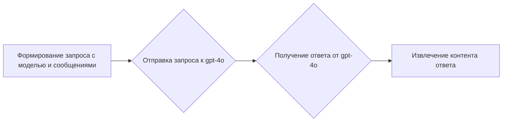

# Документация для `text_completions_demo_sync.py`

## Обзор

Этот файл демонстрирует синхронный запрос к модели `gpt-4o` через клиент `g4f` для получения ответа на вопрос пользователя.

## Подробнее

Файл показывает пример использования библиотеки `g4f` для запроса к модели `gpt-4o`. Он создает клиент, формирует запрос с системным сообщением и вопросом пользователя, а затем выводит полученный ответ.

## Функции

### `create`

```python
response = client.chat.completions.create(
    model="gpt-4o",
    messages=[
        {"role": "system", "content": "You are a helpful assistant."},
        {"role": "user", "content": "how does a court case get to the Supreme Court?"}
    ],
)
```

**Назначение**: Отправляет запрос к модели `gpt-4o` и получает ответ.

**Параметры**:
- `model` (str): Идентификатор модели для запроса (в данном случае, `gpt-4o`).
- `messages` (list): Список сообщений, формирующих контекст запроса. Содержит системное сообщение и вопрос пользователя.

**Возвращает**:
- `response`: Объект ответа от модели.

**Как работает функция**:

1. Формирует запрос к модели `gpt-4o` с использованием предоставленных сообщений.
2. Получает ответ от модели.
3. Извлекает контент ответа из объекта `response`.



**Примеры**:

```python
from g4f.client import Client

client = Client()

response = client.chat.completions.create(
    model="gpt-4o",
    messages=[
        {"role": "system", "content": "You are a helpful assistant."},
        {"role": "user", "content": "how does a court case get to the Supreme Court?"}
    ],
)

print(response.choices[0].message.content)
```