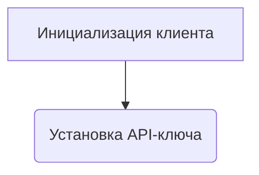
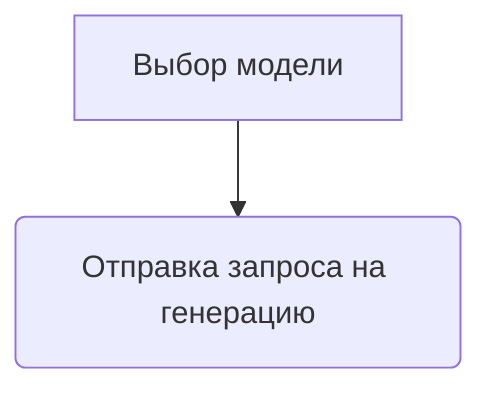
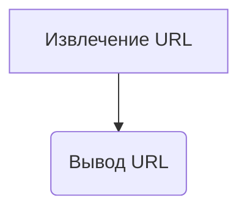

# Модуль для работы с видео-моделями G4F через API HuggingFaceMedia
=================================================================

Модуль содержит пример кода для работы с видео-моделями G4F (GPT4Free) через API HuggingFaceMedia.
Он демонстрирует, как получить список доступных видео-моделей и сгенерировать видеоролик на основе текстового запроса.

## Обзор

Данный модуль предоставляет пример использования библиотеки `g4f` для работы с видео-моделями через API HuggingFaceMedia. Он демонстрирует процесс получения списка доступных видео-моделей и генерации видеоролика на основе текстового запроса. Код предназначен для демонстрации базовой функциональности и может быть адаптирован для более сложных сценариев использования.

## Подробнее

Этот модуль позволяет разработчикам понять, как использовать `g4f` для создания видеоконтента. Он показывает, как установить API-ключ, выбрать модель и отправить запрос на генерацию видео. Расположение этого файла в директории `hypotez/src/endpoints/gpt4free/etc/examples/` указывает на то, что он является частью примеров использования библиотеки `g4f` в контексте проекта `hypotez`.

## Функции

### `client`

```python
client = Client(
    provider=g4f.Provider.HuggingFaceMedia,
    api_key="hf_***" # Your API key here
)
```

**Назначение**: Инициализация клиента для работы с API HuggingFaceMedia.

**Параметры**:

- `provider`: Указывает провайдера API, в данном случае `g4f.Provider.HuggingFaceMedia`.
- `api_key`: API-ключ для доступа к сервисам HuggingFace.

**Как работает функция**:

1. **Инициализация клиента**: Создается экземпляр класса `Client` с указанием провайдера HuggingFaceMedia и API-ключа.
2. **Установка API-ключа**: API-ключ используется для аутентификации при запросах к API HuggingFace.



**Примеры**:

```python
client = Client(
    provider=g4f.Provider.HuggingFaceMedia,
    api_key="hf_test"
)
```

### `video_models`

```python
video_models = client.models.get_video()
```

**Назначение**: Получение списка доступных видео-моделей.

**Параметры**:

- Нет параметров.

**Возвращает**:

- `List[str]`: Список доступных видео-моделей.

**Как работает функция**:

1. **Запрос списка моделей**: Метод `get_video()` класса `client.models` используется для получения списка доступных видео-моделей.

```mermaid
graph TD
A[Вызов get_video()] --> B(Получение списка моделей)
```

**Примеры**:

```python
video_models = client.models.get_video()
print(video_models)
```

### `result`

```python
result = client.media.generate(
    model=video_models[0],
    prompt="G4F AI technology is the best in the world.",
    response_format="url"
)
```

**Назначение**: Генерация видеоролика на основе текстового запроса.

**Параметры**:

- `model`: Видео-модель для генерации видео.
- `prompt`: Текстовый запрос для генерации видео.
- `response_format`: Формат ответа, в данном случае "url".

**Возвращает**:

- `dict`: Объект с данными о сгенерированном видео, включая URL.

**Как работает функция**:

1. **Выбор модели**: Выбирается первая модель из списка `video_models`.
2. **Отправка запроса на генерацию**: Метод `generate()` класса `client.media` используется для отправки запроса на генерацию видео с указанным текстовым запросом и форматом ответа.



**Примеры**:

```python
result = client.media.generate(
    model=video_models[0],
    prompt="G4F AI technology is the best in the world.",
    response_format="url"
)
print(result.data[0].url)
```

### `print(result.data[0].url)`

**Назначение**: Вывод URL сгенерированного видео.

**Параметры**:

- Нет параметров.

**Как работает функция**:

1. **Извлечение URL**: URL сгенерированного видео извлекается из объекта `result`.
2. **Вывод URL**: URL выводится в консоль.



**Примеры**:

```python
print(result.data[0].url)