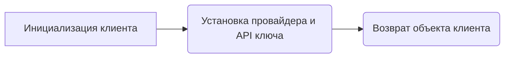

# Модуль для генерации видео с использованием G4F AI

## Обзор

Модуль предоставляет пример кода для генерации видео с использованием G4F AI через API `HuggingFaceMedia`. Он демонстрирует, как получить список доступных видео моделей и сгенерировать видео на основе заданного промпта.

## Подробней

Этот код предназначен для демонстрации возможности генерации видео с использованием G4F AI. Он использует API `HuggingFaceMedia` для доступа к моделям генерации видео. Ключевым моментом является получение списка доступных видео моделей и последующая генерация видео с использованием одной из этих моделей. В примере используется промпт "G4F AI technology is the best in the world.".

## Функции

### `Client`

```python
client = Client(
    provider=g4f.Provider.HuggingFaceMedia,
    api_key="hf_***" # Your API key here
)
```

**Назначение**: Инициализация клиента для взаимодействия с API `HuggingFaceMedia`.

**Параметры**:
- `provider` (g4f.Provider): Провайдер API, в данном случае `HuggingFaceMedia`.
- `api_key` (str): API ключ для доступа к сервису.

**Возвращает**:
- `Client`: Объект клиента, настроенный для работы с `HuggingFaceMedia`.

**Как работает функция**:

1.  **Инициализация клиента**: Создается экземпляр класса `Client` с указанием провайдера и API ключа.
2.  **Настройка параметров**: Устанавливаются необходимые параметры для взаимодействия с API `HuggingFaceMedia`.



**Примеры**:

```python
client = Client(
    provider=g4f.Provider.HuggingFaceMedia,
    api_key="hf_***"  # Замените на ваш API ключ
)
```

### `client.models.get_video()`

```python
video_models = client.models.get_video()
```

**Назначение**: Получение списка доступных видео моделей.

**Параметры**:
- Нет параметров.

**Возвращает**:
- `list`: Список доступных видео моделей.

**Как работает функция**:

1.  **Вызов API**: Метод `get_video()` вызывается у объекта `client.models` для получения списка видео моделей.
2.  **Получение списка**: API возвращает список доступных моделей.

```mermaid
graph LR
    A[Вызов API get_video()] --> B(Получение списка видео моделей)
    B --> C(Возврат списка моделей)
```

**Примеры**:

```python
video_models = client.models.get_video()
print(video_models)
```

### `client.media.generate`

```python
result = client.media.generate(
    model=video_models[0],
    prompt="G4F AI technology is the best in the world.",
    response_format="url"
)
```

**Назначение**: Генерация видео с использованием выбранной модели и промпта.

**Параметры**:
- `model` (str): Выбранная видео модель из списка `video_models`.
- `prompt` (str): Текстовый промпт для генерации видео.
- `response_format` (str): Формат ответа, в данном случае "url".

**Возвращает**:
- `object`: Объект с данными о сгенерированном видео, включая URL.

**Как работает функция**:

1.  **Вызов API**: Метод `generate()` вызывается у объекта `client.media` с указанием модели, промпта и формата ответа.
2.  **Генерация видео**: API генерирует видео на основе предоставленных параметров.
3.  **Получение результата**: API возвращает объект с данными о сгенерированном видео.

```mermaid
graph LR
    A[Вызов API generate()] --> B(Генерация видео на основе модели и промпта)
    B --> C(Получение объекта с данными о видео)
    C --> D(Возврат объекта)
```

**Примеры**:

```python
result = client.media.generate(
    model=video_models[0],
    prompt="G4F AI technology is the best in the world.",
    response_format="url"
)
print(result.data[0].url)
```

### `result.data[0].url`

```python
print(result.data[0].url)
```

**Назначение**: Извлечение URL сгенерированного видео из объекта `result`.

**Параметры**:
- Нет параметров.

**Возвращает**:
- `str`: URL сгенерированного видео.

**Как работает функция**:

1.  **Доступ к данным**: Из объекта `result` извлекается список `data`, берется первый элемент (индекс 0).
2.  **Извлечение URL**: Из первого элемента списка `data` извлекается атрибут `url`, содержащий URL сгенерированного видео.

```mermaid
graph LR
    A[Доступ к данным result.data[0]] --> B(Извлечение URL)
    B --> C(Возврат URL)
```

**Примеры**:

```python
print(result.data[0].url)