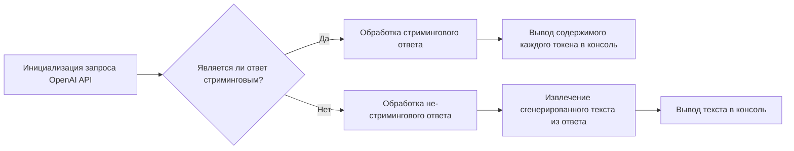

# Модуль для тестирования взаимодействия с OpenAI

## Обзор

Модуль предназначен для тестирования взаимодействия с API OpenAI. Он отправляет запрос на генерацию текста (в данном случае, стихотворения о дереве) и обрабатывает ответ, выводя сгенерированный текст в консоль.
Модуль позволяет проверить, как работает стриминг ответов от OpenAI, а также как обрабатываются ответы в формате JSON (когда стриминг не используется).

## Подробнее

Этот код используется для проверки интеграции с OpenAI API. Он может быть полезен при разработке и тестировании функциональности, связанной с генерацией текста. Расположение файла указывает на то, что это тестовый сценарий для проверки вмешательства или интеграции с OpenAI API.

## Функции

### `main`

```python
def main():
    """
    Отправляет запрос в OpenAI API для генерации стихотворения о дереве и обрабатывает ответ.

    Args:
        None

    Returns:
        None

    Raises:
        openai.error.OpenAIError: Если возникает ошибка при взаимодействии с OpenAI API.

    Example:
        >>> main()
        # Вывод стихотворения о дереве в консоль
    """
```

**Как работает функция**:

1. **Инициализация запроса к OpenAI API**: Функция вызывает `openai.ChatCompletion.create` для отправки запроса на генерацию стихотворения о дереве. Указывается модель `gpt-3.5-turbo` и передается сообщение с запросом.
2. **Обработка стримингового ответа (если применимо)**: Если `chat_completion` является итератором (то есть, используется стриминг), функция итерируется по каждому токену в ответе и выводит содержимое каждого токена в консоль.
3. **Обработка не-стримингового ответа (если применимо)**: Если `chat_completion` является словарем (то есть, стриминг не используется), функция извлекает сгенерированный текст из ответа и выводит его в консоль.



**Примеры**:

```python
main()
```

### `Внутренние функции`

Внутри main() нет внутренних функций

## Запуск модуля

```python
if __name__ == "__main__":
    main()
```

При запуске скрипта напрямую (а не при импорте модуля) вызывается функция `main()`.