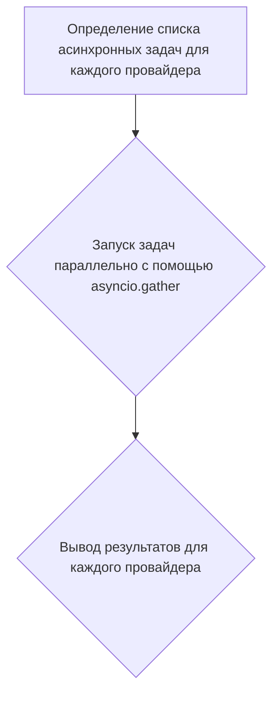
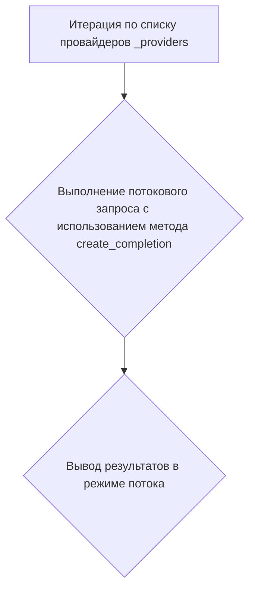
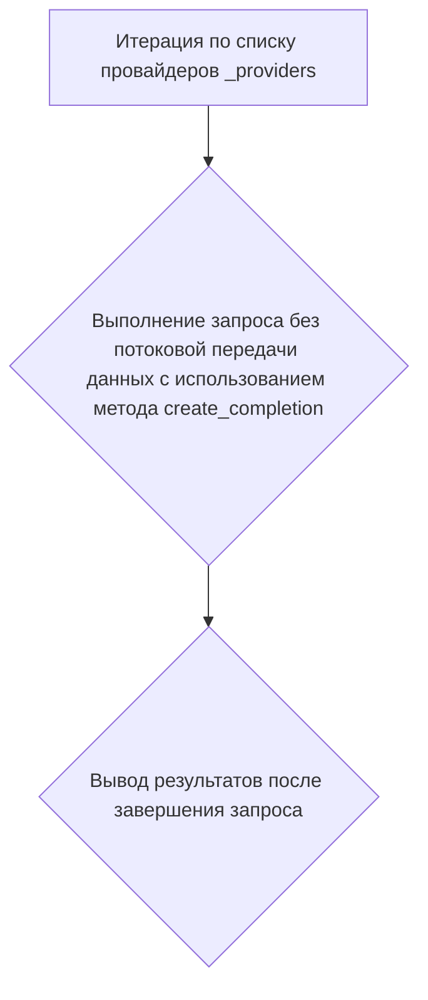

# Модуль для тестирования необходимости аутентификации для GPT4Free
## Обзор

Модуль `test_needs_auth.py` предназначен для проверки необходимости аутентификации при использовании различных провайдеров в библиотеке `g4f` (GPT4Free). Он содержит функции для асинхронного и потокового тестирования, а также для тестирования без потоковой передачи данных.

## Подробнее

Модуль позволяет оценить, какие провайдеры требуют аутентификацию для корректной работы. Тесты выполняются с использованием асинхронных и потоковых запросов, что позволяет оценить производительность и стабильность различных провайдеров. Расположение файла в директории `hypotez/src/endpoints/gpt4free/etc/testing/` указывает на его использование для тестирования функциональности GPT4Free в проекте `hypotez`.

## Классы

В данном модуле классы отсутствуют.

## Функции

### `run_async`

```python
async def run_async():
    """
    Асинхронно выполняет запросы к различным провайдерам и выводит результаты.

    Args:
        Нет.

    Returns:
        None: Ничего не возвращает.

    Как работает функция:
    1. Определяется список асинхронных задач для каждого провайдера из `_providers`.
    2. Задачи выполняются параллельно с использованием `asyncio.gather`.
    3. Результаты выводятся для каждого провайдера.

    Внутренние функции:
        Нет.

    Примеры:
    Нет примеров использования, так как функция вызывается внутри `asyncio.run`.

    """
    ...
```

**Как работает функция**:

Функция `run_async` асинхронно выполняет запросы к различным провайдерам, используя список `_providers`. Для каждого провайдера создается асинхронная задача, которая вызывает метод `create_async` провайдера с заданным запросом. Все задачи выполняются параллельно с помощью `asyncio.gather`, после чего результаты выводятся для каждого провайдера.


**Пример вызова функции**:
```python
 asyncio.run(log_time_async(run_async))
```

### `run_stream`

```python
def run_stream():
    """
    Выполняет потоковые запросы к различным провайдерам и выводит результаты.

    Args:
        Нет.

    Returns:
        None: Ничего не возвращает.

    Как работает функция:
    1. Итерируется по списку провайдеров `_providers`.
    2. Для каждого провайдера выполняется потоковый запрос с использованием метода `create_completion`.
    3. Результаты выводятся в режиме потока.

    Внутренние функции:
        Нет.

    Примеры:
        Нет примеров использования, так как функция вызывается внутри `log_time`.

    """
    ...
```

**Как работает функция**:

Функция `run_stream` выполняет потоковые запросы к различным провайдерам, используя список `_providers`. Для каждого провайдера вызывается метод `create_completion` в режиме потока, и результаты выводятся по мере их поступления.


**Пример вызова функции**:
```python
log_time(run_stream)
```

### `create_no_stream`

```python
def create_no_stream():
    """
    Выполняет запросы к различным провайдерам без потоковой передачи данных и выводит результаты.

    Args:
        Нет.

    Returns:
        None: Ничего не возвращает.

    Как работает функция:
    1. Итерируется по списку провайдеров `_providers`.
    2. Для каждого провайдера выполняется запрос без потоковой передачи данных с использованием метода `create_completion`.
    3. Результаты выводятся после завершения запроса.

    Внутренние функции:
        Нет.

    Примеры:
        Нет примеров использования, так как функция вызывается внутри `log_time`.

    """
    ...
```

**Как работает функция**:

Функция `create_no_stream` выполняет запросы к различным провайдерам без использования потоковой передачи данных. Для каждого провайдера из списка `_providers` вызывается метод `create_completion` с параметром `stream=False`, и результаты выводятся после завершения запроса.


**Пример вызова функции**:
```python
log_time(create_no_stream)