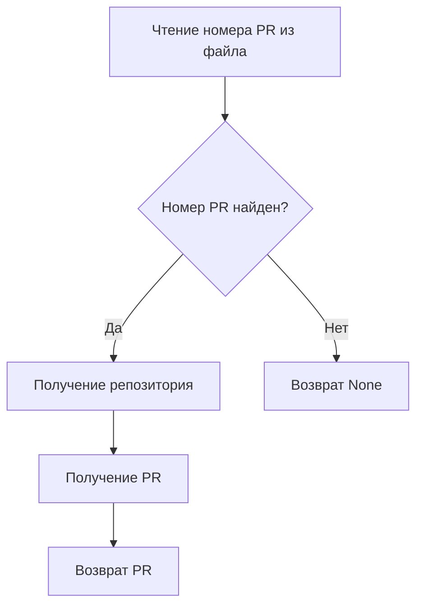
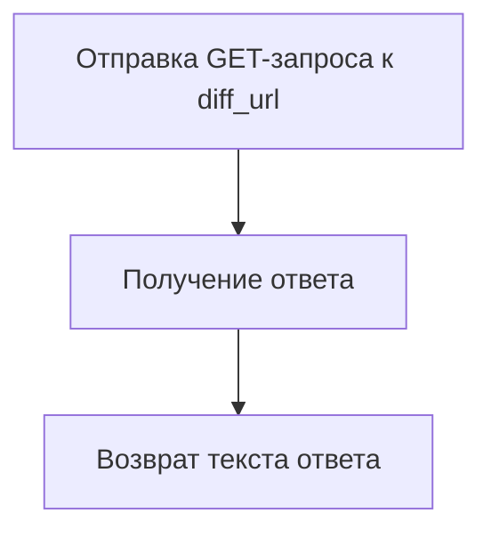
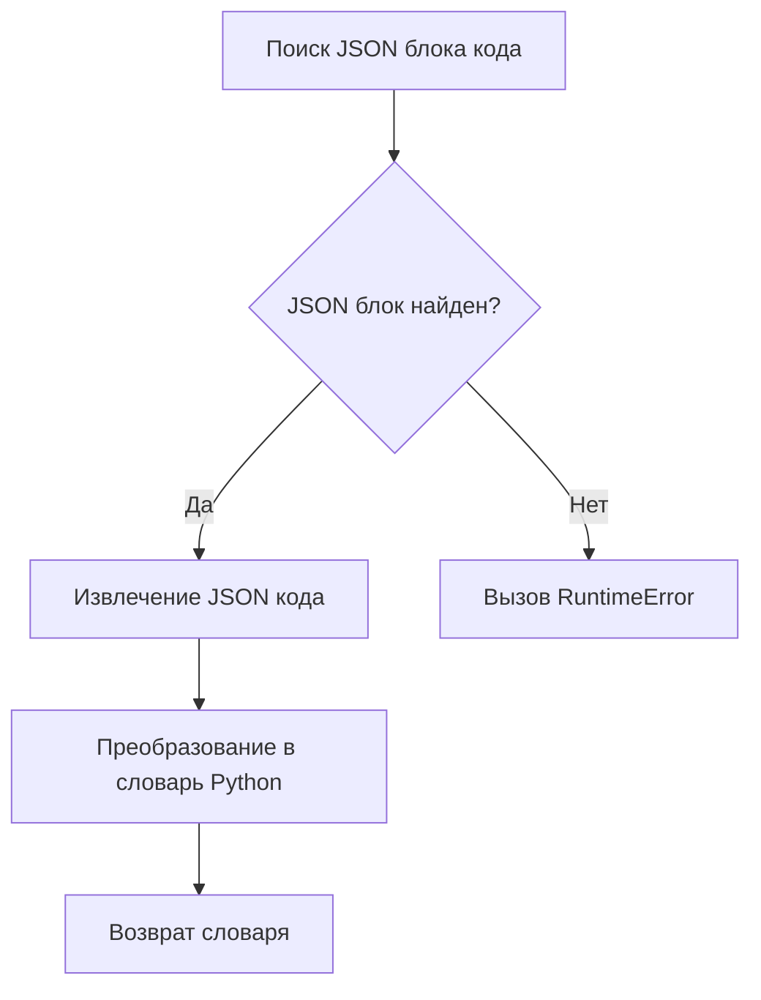
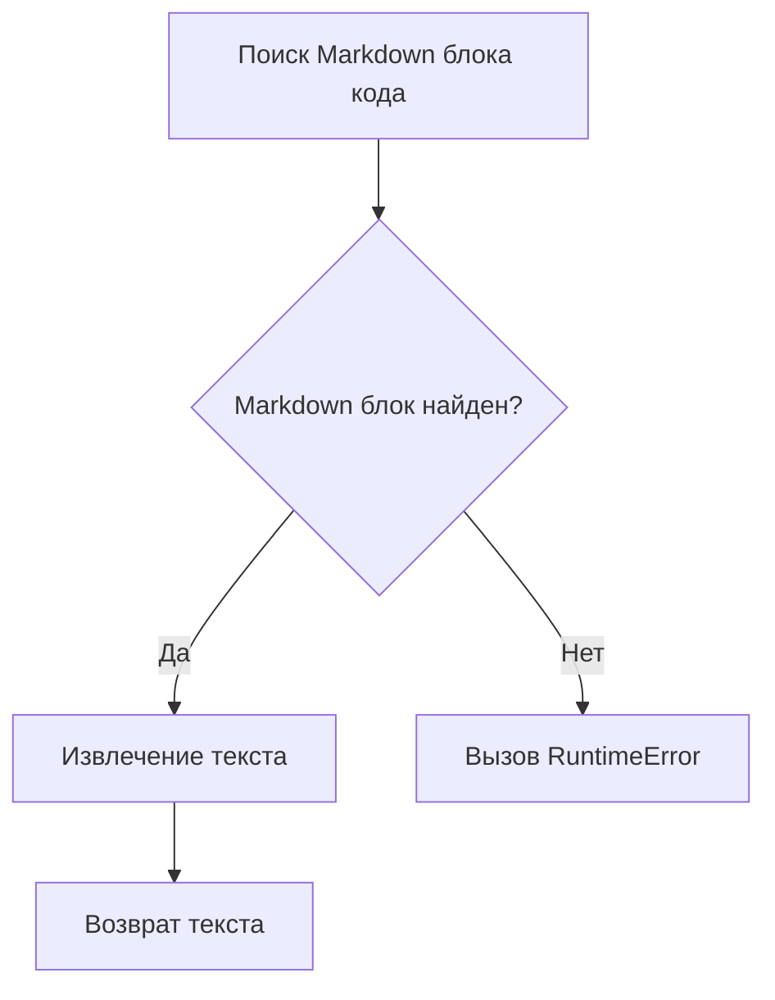
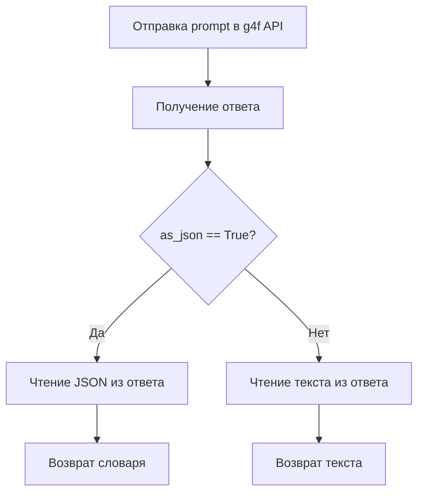
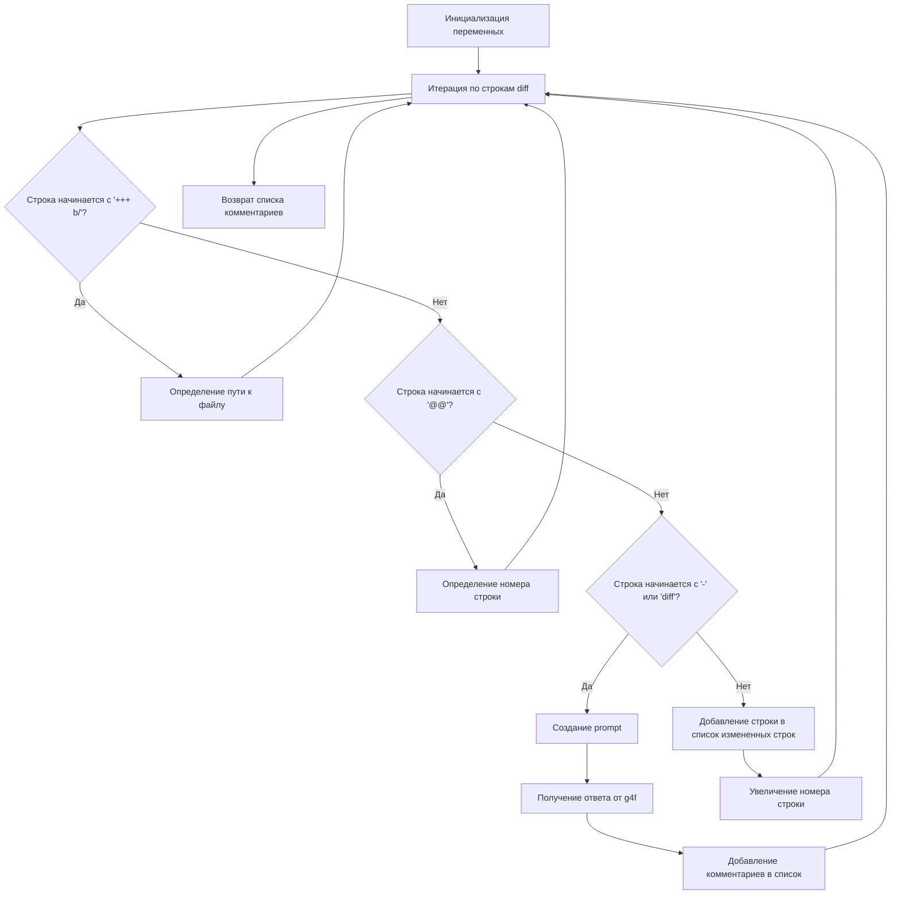
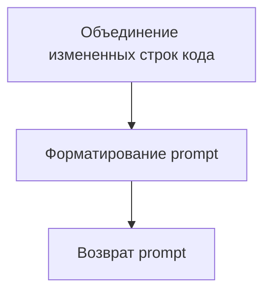
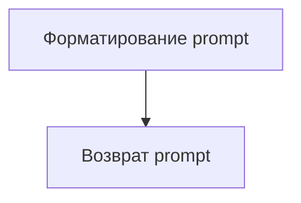

# Модуль для автоматического анализа Pull Request с использованием g4f API
====================================================================

Модуль предназначен для автоматического анализа изменений в Pull Request на GitHub с использованием моделей g4f (gpt4free). Он позволяет генерировать комментарии к изменениям кода и создавать общие ревью для Pull Request.

## Обзор

Модуль взаимодействует с GitHub API для получения информации о Pull Request, анализирует изменения в коде и использует g4f API для генерации комментариев и ревью.

## Подробней

Этот код предназначен для автоматизации процесса анализа Pull Request. Он использует GitHub API для получения информации о Pull Request, анализирует изменения в коде (`diff`) и использует g4f API для генерации комментариев и ревью. Код разбит на несколько функций, каждая из которых выполняет определенную задачу: получение деталей PR, получение `diff`, чтение JSON из текста, получение ответа от AI, анализ кода и создание prompt для ревью.

## Функции

### `get_pr_details`

```python
def get_pr_details(github: Github) -> PullRequest:
    """
    Retrieves the details of the pull request from GitHub.

    Args:
        github (Github): The Github object to interact with the GitHub API.

    Returns:
        PullRequest: An object representing the pull request.
    """
```

**Назначение**: Получает детали Pull Request из GitHub.

**Параметры**:
- `github` (Github): Объект Github для взаимодействия с GitHub API.

**Возвращает**:
- `PullRequest`: Объект, представляющий Pull Request.

**Как работает функция**:
1. Читает номер Pull Request из файла `./pr_number`.
2. Если номер PR не найден, возвращает `None`.
3. Получает репозиторий и Pull Request из GitHub API.



**Примеры**:
```python
# Пример использования функции
from github import Github
GITHUB_TOKEN = "YOUR_GITHUB_TOKEN"  # Замените на ваш токен GitHub
GITHUB_REPOSITORY = "user/repo"  # Замените на ваш репозиторий
github = Github(GITHUB_TOKEN)
pull_request = get_pr_details(github)
if pull_request:
    print(f"Pull Request title: {pull_request.title}")
```

### `get_diff`

```python
def get_diff(diff_url: str) -> str:
    """
    Fetches the diff of the pull request from a given URL.

    Args:
        diff_url (str): URL to the pull request diff.

    Returns:
        str: The diff of the pull request.
    """
```

**Назначение**: Получает diff Pull Request по заданному URL.

**Параметры**:
- `diff_url` (str): URL diff Pull Request.

**Возвращает**:
- `str`: Diff Pull Request.

**Как работает функция**:
1. Отправляет GET-запрос по указанному URL.
2. Возвращает текст ответа, содержащий diff.



**Примеры**:
```python
# Пример использования функции
diff_url = "https://github.com/user/repo/pull/123.diff"
diff = get_diff(diff_url)
print(f"Diff: {diff[:100]}...")
```

### `read_json`

```python
def read_json(text: str) -> dict:
    """
    Parses JSON code block from a string.

    Args:
        text (str): A string containing a JSON code block.

    Returns:
        dict: A dictionary parsed from the JSON code block.
    """
```

**Назначение**: Извлекает JSON из текстового блока.

**Параметры**:
- `text` (str): Строка, содержащая JSON код.

**Возвращает**:
- `dict`: Словарь, полученный из JSON кода.

**Вызывает исключения**:
- `RuntimeError`: Если JSON невалидный.

**Как работает функция**:
1. Ищет блок кода JSON в строке.
2. Извлекает JSON код из блока.
3. Преобразует JSON код в словарь Python.



**Примеры**:
```python
# Пример использования функции
text = "```json\n{\"key\": \"value\"}\n```"
data = read_json(text)
print(f"Data: {data}")
```

### `read_text`

```python
def read_text(text: str) -> str:
    """
    Extracts text from a markdown code block.

    Args:
        text (str): A string containing a markdown code block.

    Returns:
        str: The extracted text.
    """
```

**Назначение**: Извлекает текст из блока кода Markdown.

**Параметры**:
- `text` (str): Строка, содержащая блок кода Markdown.

**Возвращает**:
- `str`: Извлеченный текст.

**Вызывает исключения**:
- `RuntimeError`: Если Markdown невалидный.

**Как работает функция**:
1. Ищет блок кода Markdown в строке.
2. Извлекает текст из блока.



**Примеры**:
```python
# Пример использования функции
text = "```markdown\nSome text\n```"
extracted_text = read_text(text)
print(f"Extracted text: {extracted_text}")
```

### `get_ai_response`

```python
def get_ai_response(prompt: str, as_json: bool = True) -> Union[dict, str]:
    """
    Gets a response from g4f API based on the prompt.

    Args:
        prompt (str): The prompt to send to g4f.
        as_json (bool): Whether to parse the response as JSON.

    Returns:
        Union[dict, str]: The parsed response from g4f, either as a dictionary or a string.
    """
```

**Назначение**: Получает ответ от g4f API на основе prompt.

**Параметры**:
- `prompt` (str): Prompt для отправки в g4f.
- `as_json` (bool): Флаг, указывающий, нужно ли парсить ответ как JSON.

**Возвращает**:
- `dict | str`: Ответ от g4f, либо в виде словаря, либо в виде строки.

**Как работает функция**:
1. Отправляет prompt в g4f API.
2. Если `as_json` равен `True`, пытается прочитать JSON из ответа.
3. Если `as_json` равен `False`, пытается прочитать текст из ответа.



**Примеры**:
```python
# Пример использования функции
prompt = "Write a short poem."
response = get_ai_response(prompt, False)
print(f"Response: {response}")
```

### `analyze_code`

```python
def analyze_code(pull: PullRequest, diff: str)-> list[dict]:
    """
    Analyzes the code changes in the pull request.

    Args:
        pull (PullRequest): The pull request object.
        diff (str): The diff of the pull request.

    Returns:
        list[dict]: A list of comments generated by the analysis.
    """
```

**Назначение**: Анализирует изменения кода в Pull Request.

**Параметры**:
- `pull` (PullRequest): Объект Pull Request.
- `diff` (str): Diff Pull Request.

**Возвращает**:
- `list[dict]`: Список комментариев, сгенерированных анализом.

**Как работает функция**:
1. Итерируется по строкам diff.
2. Определяет путь к измененному файлу.
3. Собирает измененные строки кода.
4. Создает prompt для g4f на основе измененных строк.
5. Получает ответ от g4f и добавляет комментарии в список.



**Примеры**:
```python
# Пример использования функции
# from github import Github #Уже определен выше
# GITHUB_TOKEN = "YOUR_GITHUB_TOKEN"  # Замените на ваш токен GitHub
# GITHUB_REPOSITORY = "user/repo"  # Замените на ваш репозиторий
# github = Github(GITHUB_TOKEN)
# pull = get_pr_details(github)
# diff = get_diff(pull.diff_url)
# comments = analyze_code(pull, diff)
# print(f"Comments: {comments}")
```

### `create_analyze_prompt`

```python
def create_analyze_prompt(changed_lines: list[str], pull: PullRequest, file_path: str):
    """
    Creates a prompt for the g4f model.

    Args:
        changed_lines (list[str]): The lines of code that have changed.
        pull (PullRequest): The pull request object.
        file_path (str): The path to the file being reviewed.

    Returns:
        str: The generated prompt.
    """
```

**Назначение**: Создает prompt для модели g4f.

**Параметры**:
- `changed_lines` (list[str]): Список измененных строк кода.
- `pull` (PullRequest): Объект Pull Request.
- `file_path` (str): Путь к файлу.

**Возвращает**:
- `str`: Сгенерированный prompt.

**Как работает функция**:
1. Объединяет измененные строки кода в одну строку.
2. Форматирует prompt, включая инструкции для g4f, название файла, заголовок и описание Pull Request.



**Примеры**:
```python
# Пример использования функции
changed_lines = ["1:  def foo():", "2:      print('hello')"]
# from github import Github #Уже определен выше
# GITHUB_TOKEN = "YOUR_GITHUB_TOKEN"  # Замените на ваш токен GitHub
# GITHUB_REPOSITORY = "user/repo"  # Замените на ваш репозиторий
# github = Github(GITHUB_TOKEN)
# pull = get_pr_details(github)
file_path = "example.py"
prompt = create_analyze_prompt(changed_lines, pull, file_path)
print(f"Prompt: {prompt}")
```

### `create_review_prompt`

```python
def create_review_prompt(pull: PullRequest, diff: str):
    """
    Creates a prompt to create a review comment.

    Args:
        pull (PullRequest): The pull request object.
        diff (str): The diff of the pull request.

    Returns:
        str: The generated prompt for review.
    """
```

**Назначение**: Создает prompt для создания ревью.

**Параметры**:
- `pull` (PullRequest): Объект Pull Request.
- `diff` (str): Diff Pull Request.

**Возвращает**:
- `str`: Сгенерированный prompt для ревью.

**Как работает функция**:
1. Форматирует prompt, включая инструкции для g4f, имя автора Pull Request, заголовок и описание Pull Request, а также diff.



**Примеры**:
```python
# Пример использования функции
# from github import Github #Уже определен выше
# GITHUB_TOKEN = "YOUR_GITHUB_TOKEN"  # Замените на ваш токен GitHub
# GITHUB_REPOSITORY = "user/repo"  # Замените на ваш репозиторий
# github = Github(GITHUB_TOKEN)
# pull = get_pr_details(github)
# diff = get_diff(pull.diff_url)
prompt = create_review_prompt(pull, diff)
print(f"Prompt: {prompt}")
```

### `main`

```python
def main():
    try:
        github = Github(GITHUB_TOKEN)
        pull = get_pr_details(github)
        if not pull:
            print(f"No PR number found")
            exit()
        diff = get_diff(pull.diff_url)
    except Exception as e:
        print(f"Error get details: {e.__class__.__name__}: {e}")
        exit(1)
    try:
        review = get_ai_response(create_review_prompt(pull, diff), False)
    except Exception as e:
        print(f"Error create review: {e}")
        exit(1)
    if pull.get_reviews().totalCount > 0 or pull.get_issue_comments().totalCount > 0:
        pull.create_issue_comment(body=review)
        return
    try:
        comments = analyze_code(pull, diff)
    except Exception as e:
        print(f"Error analyze: {e}")
        exit(1)
    print("Comments:", comments)
    try:
        if comments:
            pull.create_review(body=review, comments=comments)
        else:
            pull.create_issue_comment(body=review)
    except Exception as e:
        print(f"Error posting review: {e}")
        exit(1)
```

**Назначение**: Главная функция, которая выполняет анализ Pull Request и создает ревью.

**Как работает функция**:
1. Инициализирует объект Github.
2. Получает детали Pull Request.
3. Получает diff Pull Request.
4. Создает prompt для ревью и получает ответ от g4f.
5. Анализирует код и генерирует комментарии.
6. Создает ревью или комментарий к Pull Request.

```mermaid
graph TD
    A[Инициализация Github] --> B[Получение деталей PR];
    B --> C[Получение diff PR];
    C --> D[Создание prompt для ревью];
    D --> E[Получение ответа от g4f];
    E --> F[Анализ кода];
    F --> G[Создание ревью или комментария];