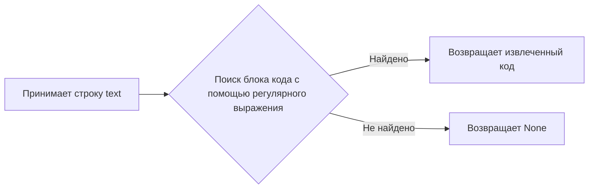

# Модуль для создания провайдеров g4f

## Обзор

Этот модуль предназначен для автоматического создания новых провайдеров для библиотеки `g4f` на основе cURL команд. Он принимает cURL команду в качестве входных данных, генерирует код провайдера на основе этой команды и сохраняет его в соответствующем файле. Модуль также добавляет импорт нового провайдера в файл `__init__.py`.

## Подробнее

Модуль предоставляет функциональность для создания новых провайдеров для библиотеки `g4f`. Он использует модель `gpt-4o` для генерации кода на основе предоставленной cURL команды. Генерируемый код сохраняется в файле провайдера, а также добавляется импорт этого провайдера в файл `__init__.py`.

## Функции

### `read_code`

```python
def read_code(text):
    """Извлекает код Python из текстового блока, заключенного в тройные обратные кавычки.

    Args:
        text (str): Текст, содержащий код Python в блоке ```python ... ```.

    Returns:
        str | None: Извлеченный код Python или None, если код не найден.

    Как работает функция:
    1. Функция принимает строку `text` в качестве входных данных.
    2. Использует регулярное выражение для поиска блока кода, заключенного в ```python ... ``` или ```py ... ```.
    3. Если блок кода найден, функция возвращает извлеченный код.
    4. Если блок кода не найден, функция возвращает `None`.

    Примеры:
        >>> read_code("```python\\nprint('Hello')\\n```")
        "print('Hello')"
        >>> read_code("No code here")
        None
    """
    ...
```

**Как работает функция**:



**Примеры**:

```python
>>> read_code("```python\nprint('Hello')\n```")
"print('Hello')"

>>> read_code("No code here")
None
```

### `input_command`

```python
def input_command() -> str:
    """Считывает многострочный ввод от пользователя до тех пор, пока не будет введен символ конца файла (EOF).

    Args:
        None

    Returns:
        str: Объединенные строки ввода, разделенные символами новой строки.

    Как работает функция:
    1. Выводит сообщение "Enter/Paste the cURL command. Ctrl-D or Ctrl-Z ( windows ) to save it.".
    2. В цикле считывает строки ввода от пользователя до тех пор, пока не будет достигнут конец файла (EOF).
    3. Объединяет все введенные строки в одну строку, разделяя их символами новой строки.
    4. Возвращает полученную строку.

    Примеры:
        Для использования этой функции в интерактивном режиме:
        1. Вызовите функцию `input_command()`.
        2. Введите несколько строк текста.
        3. Нажмите Ctrl-D (в Linux/macOS) или Ctrl-Z (в Windows), чтобы завершить ввод.
        Функция вернет объединенную строку.
    """
    ...
```

**Как работает функция**:


**Примеры**:

```python
# Пример использования в интерактивном режиме:
# 1. Вызовите функцию `input_command()`.
# 2. Введите несколько строк текста.
# 3. Нажмите Ctrl-D (в Linux/macOS) или Ctrl-Z (в Windows), чтобы завершить ввод.
# Функция вернет объединенную строку.
```

## Основной код

Основной код модуля выполняет следующие шаги:

1. Запрашивает у пользователя имя провайдера.
2. Формирует путь к файлу провайдера.
3. Проверяет, существует ли файл провайдера.
4. Если файл не существует, запрашивает у пользователя cURL команду.
5. Формирует запрос к модели `gpt-4o` для генерации кода провайдера на основе cURL команды.
6. Получает ответ от модели и извлекает код провайдера.
7. Сохраняет код провайдера в файл.
8. Добавляет импорт нового провайдера в файл `__init__.py`.
9. Если файл провайдера существует, считывает код из файла.

## Переменные

- `name` (str): Имя провайдера, введенное пользователем.
- `provider_path` (str): Путь к файлу провайдера.
- `example` (str): Пример кода провайдера, используемый в запросе к модели.
- `command` (str): cURL команда, введенная пользователем.
- `prompt` (str): Запрос к модели `gpt-4o` для генерации кода провайдера.
- `response` (str): Ответ от модели `gpt-4o`.
- `code` (str): Извлеченный код провайдера.