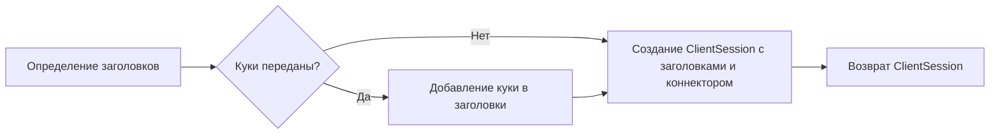

# Модуль для создания изображений через Bing

## Обзор

Модуль предоставляет функции для создания изображений на основе текстового запроса с использованием сервиса Bing. Он включает в себя функции для создания сессии, отправки запроса на генерацию изображений, опроса статуса выполнения и извлечения URL-адресов созданных изображений.

## Подробнее

Этот модуль позволяет автоматизировать процесс создания изображений с использованием сервиса Bing Image Creator. Он обрабатывает запросы, устанавливает необходимые заголовки и куки, а также обрабатывает ответы от сервиса. Модуль также включает обработку ошибок и проверку на наличие нежелательных изображений.

## Функции

### `create_session`

```python
def create_session(cookies: Dict[str, str], proxy: str = None, connector: BaseConnector = None) -> ClientSession:
    """
    Создает новый клиентский сеанс с указанными куки и заголовками.

    Args:
        cookies (Dict[str, str]): Куки, которые будут использоваться для сеанса.
        proxy (str, optional): Прокси-сервер для использования в сеансе. По умолчанию `None`.
        connector (BaseConnector, optional): Коннектор для клиентского сеанса. По умолчанию `None`.

    Returns:
        ClientSession: Созданный клиентский сеанс.
    """
    ...
```

**Назначение**: Создает клиентскую сессию `aiohttp.ClientSession` с заданными заголовками и куки.

**Параметры**:
- `cookies` (Dict[str, str]): Словарь, содержащий куки для сессии.
- `proxy` (str, optional): URL прокси-сервера для использования в сессии. По умолчанию `None`.
- `connector` (BaseConnector, optional): Пользовательский коннектор для сессии. По умолчанию `None`.

**Возвращает**:
- `ClientSession`: Объект клиентской сессии, настроенный с заданными параметрами.

**Как работает функция**:
1. Функция определяет заголовки, необходимые для сессии, включая `accept`, `accept-encoding`, `accept-language`, `content-type` и `user-agent`.
2. Если переданы куки, они добавляются в заголовки.
3. Создается и возвращается объект `ClientSession` с заданными заголовками и коннектором. Если коннектор не указан, используется коннектор по умолчанию, полученный через функцию `get_connector`.



**Примеры**:

```python
cookies = {"_U": "value"}
session = create_session(cookies=cookies)
```

### `create_images`

```python
async def create_images(session: ClientSession, prompt: str, timeout: int = TIMEOUT_IMAGE_CREATION) -> List[str]:
    """
    Создает изображения на основе заданного запроса, используя сервис Bing.

    Args:
        session (ClientSession): Активная клиентская сессия.
        prompt (str): Запрос для генерации изображений.
        timeout (int): Время ожидания запроса.

    Returns:
        List[str]: Список URL-адресов созданных изображений.

    Raises:
        MissingRequirementsError: Если отсутствует пакет "beautifulsoup4".
        RuntimeError: Если не удается создать изображения или происходит таймаут.
        RateLimitError: Если закончились доступные "монеты" для создания изображений.
    """
    ...
```

**Назначение**: Асинхронная функция для создания изображений на основе текстового запроса с использованием сервиса Bing Image Creator.

**Параметры**:
- `session` (ClientSession): Активная клиентская сессия `aiohttp.ClientSession`.
- `prompt` (str): Текстовый запрос для генерации изображений.
- `timeout` (int, optional): Максимальное время ожидания выполнения запроса в секундах. По умолчанию `TIMEOUT_IMAGE_CREATION`.

**Возвращает**:
- `List[str]`: Список URL-адресов сгенерированных изображений.

**Вызывает исключения**:
- `MissingRequirementsError`: Если отсутствует библиотека `beautifulsoup4`.
- `RateLimitError`: Если превышен лимит запросов (нет доступных "монет").
- `RuntimeError`: В случае других ошибок при создании изображений, включая таймауты и блокировку запроса.

**Как работает функция**:
1. Проверяется наличие необходимой библиотеки `beautifulsoup4`. Если она отсутствует, выбрасывается исключение `MissingRequirementsError`.
2. Запрос кодируется в URL-совместимый формат.
3. Отправляется POST-запрос к сервису Bing Image Creator с закодированным запросом.
4. Обрабатываются возможные ошибки, такие как отсутствие "монет" или блокировка запроса. Если обнаружена ошибка, выбрасывается исключение `RateLimitError` или `RuntimeError`.
5. Если запрос успешен, из ответа извлекается URL для перенаправления.
6. Выполняется GET-запрос по URL перенаправления.
7. Организуется цикл опроса сервиса до тех пор, пока не будут получены результаты или не истечет время ожидания.
8. Из полученного HTML-контента извлекаются URL-адреса изображений с помощью функции `read_images`.
9. Возвращается список URL-адресов изображений.

```mermaid
graph LR
    A[Проверка наличия BeautifulSoup4] --> B{BeautifulSoup4 установлен?}
    B -- Нет --> C[Выброс MissingRequirementsError]
    B -- Да --> D[Кодирование запроса в URL]
    D --> E[Отправка POST-запроса в Bing Image Creator]
    E --> F[Обработка ошибок (монеты, блокировка)]
    F -- Ошибка --> G[Выброс RateLimitError/RuntimeError]
    F -- Успех --> H[Извлечение URL перенаправления]
    H --> I[GET-запрос по URL перенаправления]
    I --> J[Опрос сервиса до получения результатов или таймаута]
    J -- Таймаут --> K[Выброс RuntimeError (таймаут)]
    J -- Результаты --> L[Извлечение URL изображений из HTML (read_images)]
    L --> M[Возврат списка URL изображений]
```

**Примеры**:

```python
import asyncio
from aiohttp import ClientSession

async def main():
    async with ClientSession() as session:
        try:
            image_urls = await create_images(session, "чебурашка играет на балалайке")
            print(image_urls)
        except Exception as ex:
            print(f"Ошибка: {ex}")

if __name__ == "__main__":
    asyncio.run(main())
```

### `read_images`

```python
def read_images(html_content: str) -> List[str]:
    """
    Извлекает URL-адреса изображений из HTML-контента.

    Args:
        html_content (str): HTML-контент, содержащий URL-адреса изображений.

    Returns:
        List[str]: Список URL-адресов изображений.

    Raises:
        RuntimeError: Если не найдены изображения или обнаружены плохие изображения.
    """
    ...
```

**Назначение**: Извлекает URL-адреса изображений из предоставленного HTML-контента, используя библиотеку `BeautifulSoup4`.

**Параметры**:
- `html_content` (str): Строка, содержащая HTML-код, из которого нужно извлечь URL-адреса изображений.

**Возвращает**:
- `List[str]`: Список URL-адресов изображений, найденных в HTML-контенте.

**Вызывает исключения**:
- `RuntimeError`:
  - Если не удалось найти ни одного изображения в HTML-контенте.
  - Если среди найденных изображений обнаружены "плохие" изображения, URL-адреса которых содержатся в списке `BAD_IMAGES`.

**Как работает функция**:
1. Использует `BeautifulSoup` для парсинга HTML-контента.
2. Ищет все теги `img` с классами `mimg` или `gir_mmimg`.
3. Извлекает атрибут `src` из каждого найденного тега `img`, который содержит URL-адрес изображения.
4. Удаляет часть URL-адреса после `?w=`, чтобы получить "чистый" URL.
5. Проверяет, не содержатся ли полученные URL-адреса в списке "плохих" изображений (`BAD_IMAGES`). Если какое-либо изображение из списка `BAD_IMAGES` найдено, выбрасывает исключение `RuntimeError`.
6. Если список изображений пуст, выбрасывает исключение `RuntimeError`.
7. Возвращает список найденных URL-адресов изображений.

```mermaid
graph LR
    A[Парсинг HTML с BeautifulSoup] --> B[Поиск тегов img с классами mimg или gir_mmimg]
    B --> C{Теги img найдены?}
    C -- Нет --> D[Выброс RuntimeError("No images found")]
    C -- Да --> E[Извлечение URL из атрибута src]
    E --> F[Удаление части URL после "?w="]
    F --> G{URL в списке BAD_IMAGES?}
    G -- Да --> H[Выброс RuntimeError("Bad images found")]
    G -- Нет --> I[Возврат списка URL]
```

**Примеры**:

```python
html_content = """


"""
image_urls = read_images(html_content)
print(image_urls)  # Вывод: ['https://example.com/image1.jpg', 'https://example.com/image2.jpg']