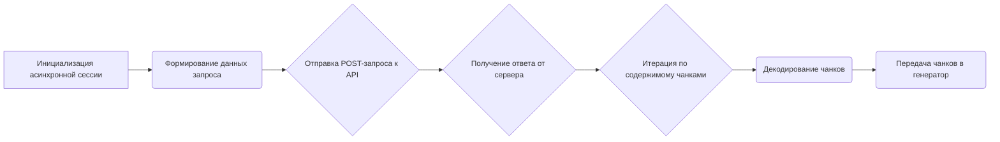
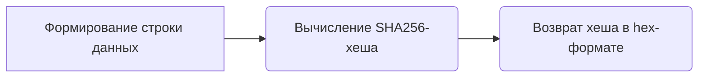

# Модуль Aibn
## Обзор

Модуль `Aibn` предоставляет асинхронтный генератор для взаимодействия с сервисом `aibn.cc`. Он поддерживает историю сообщений и модель `gpt-3.5-turbo`. Модуль использует асинхронные запросы для генерации ответов.

## Подробней

Модуль `Aibn` предназначен для работы с сервисом `aibn.cc` для генерации текста на основе предоставленных сообщений. Он использует асинхронные запросы для взаимодействия с API сервиса. Этот модуль является частью проекта `hypotez` и предоставляет возможность использовать различные модели, такие как `gpt-3.5-turbo`.

## Классы

### `Aibn(AsyncGeneratorProvider)`

**Описание**: Класс `Aibn` является провайдером асинхронных генераторов и наследуется от `AsyncGeneratorProvider`.

**Наследует**:
- `AsyncGeneratorProvider`: Обеспечивает базовый функционал для асинхронных провайдеров генераторов.

**Атрибуты**:
- `url` (str): URL-адрес сервиса `aibn.cc`.
- `working` (bool): Указывает, работает ли модуль в данный момент.
- `supports_message_history` (bool): Указывает, поддерживает ли модуль историю сообщений.
- `supports_gpt_35_turbo` (bool): Указывает, поддерживает ли модуль модель `gpt-3.5-turbo`.

**Методы**:
- `create_async_generator()`: Создает асинхронный генератор для генерации текста на основе предоставленных сообщений.

### `create_async_generator`

```python
    @classmethod
    async def create_async_generator(
        cls,
        model: str,
        messages: Messages,
        proxy: str = None,
        timeout: int = 120,
        **kwargs
    ) -> AsyncResult:
        """ Создает асинхронный генератор для генерации текста на основе предоставленных сообщений.
        Args:
            model (str): Название используемой модели.
            messages (Messages): Список сообщений для генерации ответа.
            proxy (str, optional): Прокси-сервер для использования. По умолчанию `None`.
            timeout (int, optional): Время ожидания ответа от сервера. По умолчанию `120`.
            **kwargs: Дополнительные аргументы.

        Returns:
            AsyncResult: Асинхронный генератор, выдающий чанки текста.

        Raises:
            Exception: В случае ошибки при запросе к серверу.

        Внутренние функции:
           Отсутствуют

        """
```

**Назначение**: Создает асинхронный генератор для генерации текста на основе предоставленных сообщений.

**Параметры**:
- `cls`: Ссылка на класс.
- `model` (str): Название используемой модели.
- `messages` (Messages): Список сообщений для генерации ответа.
- `proxy` (str, optional): Прокси-сервер для использования. По умолчанию `None`.
- `timeout` (int, optional): Время ожидания ответа от сервера. По умолчанию `120`.
- `**kwargs`: Дополнительные аргументы.

**Возвращает**:
- `AsyncResult`: Асинхронный генератор, выдающий чанки текста.

**Вызывает исключения**:
- `Exception`: В случае ошибки при запросе к серверу.

**Как работает функция**:

1. Инициализирует асинхронную сессию с использованием `StreamSession` для выполнения запросов.
2. Формирует данные для запроса, включая сообщения, временную метку и подпись.
3. Отправляет POST-запрос к API сервиса `aibn.cc` с сформированными данными.
4. Получает ответ от сервера и итерирует по содержимому чанками, декодируя их и передавая в генератор.



**Примеры**:

```python
# Пример использования create_async_generator
async def main():
    model = "gpt-3.5-turbo"
    messages = [{"role": "user", "content": "Hello, how are you?"}]
    proxy = None
    timeout = 120
    
    async for chunk in Aibn.create_async_generator(model=model, messages=messages, proxy=proxy, timeout=timeout):
        print(chunk, end="")

# Запуск примера (необходимо для асинхронного кода)
# import asyncio
# asyncio.run(main())
```

## Функции

### `generate_signature`

```python
def generate_signature(timestamp: int, message: str, secret: str = "undefined") -> str:
    """ Генерирует подпись для запроса к API.
    Args:
        timestamp (int): Временная метка запроса.
        message (str): Сообщение для подписи.
        secret (str, optional): Секретный ключ для подписи. По умолчанию `"undefined"`.

    Returns:
        str: Подпись, сгенерированная с использованием SHA256.

    Raises:
        Нет

    """
```

**Назначение**: Генерирует подпись для запроса к API.

**Параметры**:
- `timestamp` (int): Временная метка запроса.
- `message` (str): Сообщение для подписи.
- `secret` (str, optional): Секретный ключ для подписи. По умолчанию `"undefined"`.

**Возвращает**:
- `str`: Подпись, сгенерированная с использованием SHA256.

**Как работает функция**:

1. Формирует строку данных, объединяя временную метку, сообщение и секретный ключ.
2. Вычисляет SHA256-хеш от полученной строки.
3. Возвращает полученный хеш в шестнадцатеричном формате.



**Примеры**:

```python
# Пример использования generate_signature
timestamp = int(time.time())
message = "Hello, how are you?"
signature = generate_signature(timestamp, message)
print(f"Signature: {signature}")