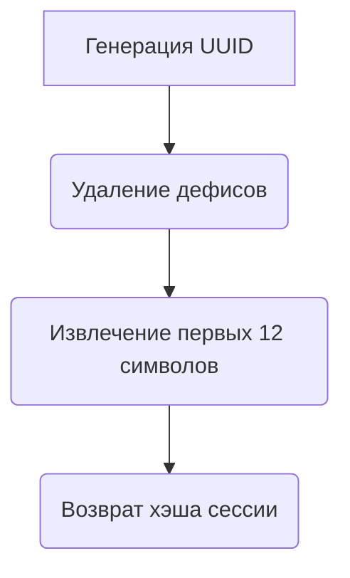
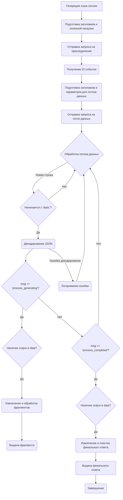

# Модуль `Qwen_Qwen_2_72B`

## Обзор

Модуль `Qwen_Qwen_2_72B` предоставляет асинхронный генератор для взаимодействия с моделью Qwen Qwen-2.72B через API Hugging Face Space. Он поддерживает потоковую передачу ответов, системные сообщения и предоставляет базовую интеграцию с другими компонентами проекта `hypotez`.

## Подробнее

Этот модуль является частью системы для работы с различными провайдерами моделей, такими как Qwen. Он использует асинхронные запросы для получения данных и предоставляет результаты в виде асинхронного генератора, что позволяет эффективно обрабатывать большие объемы текста. Модуль предназначен для интеграции в системы, требующие генерации текста в реальном времени, например, чат-боты или системы автоматического ответа.

## Классы

### `Qwen_Qwen_2_72B`

**Описание**: Класс `Qwen_Qwen_2_72B` предоставляет интерфейс для взаимодействия с моделью Qwen Qwen-2.72B, размещенной на Hugging Face Space.

**Наследует**:
- `AsyncGeneratorProvider`: Обеспечивает базовую функциональность для асинхронных генераторов.
- `ProviderModelMixin`: Предоставляет общие методы для работы с моделями провайдеров.

**Атрибуты**:
- `label` (str): Название провайдера ("Qwen Qwen-2.72B").
- `url` (str): URL Hugging Face Space, где размещена модель.
- `api_endpoint` (str): URL API для отправки запросов.
- `working` (bool): Флаг, указывающий, работает ли провайдер (True).
- `supports_stream` (bool): Флаг, указывающий, поддерживает ли провайдер потоковую передачу (True).
- `supports_system_message` (bool): Флаг, указывающий, поддерживает ли провайдер системные сообщения (True).
- `supports_message_history` (bool): Флаг, указывающий, поддерживает ли провайдер историю сообщений (False).
- `default_model` (str): Модель, используемая по умолчанию ("qwen-qwen2-72b-instruct").
- `model_aliases` (dict): Псевдонимы моделей ({"qwen-2-72b": default_model}).
- `models` (list): Список доступных моделей.

**Методы**:
- `create_async_generator`: Создает асинхронный генератор для получения ответов от модели.

## Функции

### `create_async_generator`

```python
@classmethod
async def create_async_generator(
    cls,
    model: str,
    messages: Messages,
    proxy: str = None,
    **kwargs
) -> AsyncResult:
    """Создает асинхронный генератор для получения ответов от модели Qwen Qwen-2.72B.

    Args:
        model (str): Название модели.
        messages (Messages): Список сообщений для отправки в модель.
        proxy (str, optional): Прокси-сервер для использования. По умолчанию None.
        **kwargs: Дополнительные аргументы.

    Returns:
        AsyncResult: Асинхронный генератор, выдающий фрагменты текста от модели.

    Внутренние функции:
        generate_session_hash(): Генерирует уникальный хэш сессии.
    """
    ...
```

**Назначение**:
Функция `create_async_generator` создает асинхронный генератор, который взаимодействует с моделью Qwen Qwen-2.72B для генерации текста на основе предоставленных сообщений. Она выполняет запросы к API Hugging Face Space и возвращает результаты в виде потока текстовых фрагментов.

**Параметры**:
- `cls`: Ссылка на класс `Qwen_Qwen_2_72B`.
- `model` (str): Название модели, которую необходимо использовать.
- `messages` (Messages): Список сообщений, отправляемых модели для генерации ответа.
- `proxy` (str, optional): Адрес прокси-сервера, если необходимо использовать прокси для подключения. По умолчанию `None`.
- `**kwargs`: Дополнительные параметры, которые могут быть переданы в функцию.

**Возвращает**:
- `AsyncResult`: Асинхронный генератор, выдающий текстовые фрагменты, сгенерированные моделью.

**Вызывает исключения**:
- `aiohttp.ClientError`: В случае проблем с сетевыми запросами.
- `json.JSONDecodeError`: Если не удается декодировать JSON из ответа сервера.

**Внутренние функции**:

#### `generate_session_hash`
```python
def generate_session_hash():
    """Генерирует уникальный хэш сессии."""
    return str(uuid.uuid4()).replace('-', '')[:12]
```

**Назначение**:
Генерирует уникальный идентификатор сессии, который используется для взаимодействия с API.

**Как работает функция**:



1.  **Генерация UUID**: Функция `uuid.uuid4()` генерирует случайный UUID (Universally Unique Identifier).
2.  **Удаление дефисов**: Метод `.replace('-', '')` удаляет все дефисы из UUID.
3.  **Извлечение первых 12 символов**: Из полученной строки извлекаются первые 12 символов `[:12]`.
4.  **Возврат хэша сессии**: Функция возвращает полученную строку, которая служит уникальным идентификатором сессии.

**Как работает функция `create_async_generator`**:



1.  **Генерация хэша сессии**: Вызывается функция `generate_session_hash()` для получения уникального идентификатора сессии.
2.  **Подготовка заголовков и полезной нагрузки**: Формируются заголовки и данные для отправки запросов к API.
3.  **Отправка запроса на присоединение**: Отправляется POST-запрос к `cls.api_endpoint` для присоединения к очереди обработки.
4.  **Получение ID события**: Из ответа извлекается идентификатор события (`event_id`).
5.  **Подготовка заголовков и параметров для потока данных**: Формируются заголовки и параметры для запроса к потоку данных.
6.  **Отправка запроса на поток данных**: Отправляется GET-запрос к `url_data` для получения потока данных.
7.  **Обработка потока данных**:
    *   Читается каждая строка из потока данных.
    *   Проверяется, начинается ли строка с префикса `data: `.
    *   Если строка начинается с `data: `, извлекается JSON-данные и декодируется.
    *   Проверяется значение ключа `msg` в JSON-данных:
        *   Если `msg == 'process_generating'`, извлекаются фрагменты текста из `output_data` и выдаются с помощью `yield`.
        *   Если `msg == 'process_completed'`, извлекается финальный ответ из `output_data`, очищается и выдается с помощью `yield`.
8.  **Завершение**: После обработки всех данных из потока функция завершает свою работу.
9.  **Обработка ошибок**:
    *   Если происходит ошибка декодирования JSON, она логируется с помощью `debug.log`.

**Примеры**:

```python
# Пример использования create_async_generator
import asyncio
from typing import AsyncGenerator, List, Dict

async def main():
    model_name = "qwen-qwen2-72b-instruct"
    messages = [
        {"role": "system", "content": "You are a helpful assistant."},
        {"role": "user", "content": "Tell me a joke."}
    ]

    generator: AsyncGenerator[str, None] = await Qwen_Qwen_2_72B.create_async_generator(model=model_name, messages=messages)
    async for fragment in generator:
        print(fragment, end="")

if __name__ == "__main__":
    asyncio.run(main())