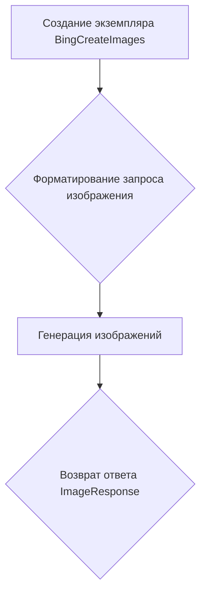

# Модуль BingCreateImages

## Обзор

Модуль `BingCreateImages` предоставляет функциональность для генерации изображений с использованием Microsoft Designer через Bing. Он позволяет создавать изображения на основе текстовых запросов и возвращает результат в формате Markdown. Этот модуль предназначен для асинхронного использования.

## Подробней

Модуль интегрируется с API Bing для генерации изображений на основе текстовых запросов. Он использует куки для аутентификации и поддерживает прокси для обхода ограничений сети. Основная задача модуля - предоставить удобный интерфейс для создания изображений и их представления в формате, подходящем для вставки в Markdown-документы.

## Классы

### `BingCreateImages`

**Описание**: Класс `BingCreateImages` является асинхронным генератором изображений, использующим Microsoft Designer в Bing.

**Наследует**:
- `AsyncGeneratorProvider`: Обеспечивает асинхронную генерацию данных.
- `ProviderModelMixin`: Предоставляет общие методы для работы с моделями.

**Атрибуты**:
- `label` (str): Метка провайдера ("Microsoft Designer in Bing").
- `url` (str): URL для создания изображений ("https://www.bing.com/images/create").
- `working` (bool): Указывает, что провайдер работает (True).
- `needs_auth` (bool): Указывает, что требуется аутентификация (True).
- `image_models` (List[str]): Список поддерживаемых моделей изображений (["dall-e-3"]).
- `models` (List[str]): Псевдоним для `image_models`.
- `cookies` (Cookies): Куки для аутентификации.
- `proxy` (str): Прокси для выполнения запросов.

**Методы**:
- `__init__`: Инициализирует экземпляр класса `BingCreateImages`.
- `create_async_generator`: Создает асинхронный генератор для создания изображений.
- `generate`: Асинхронно генерирует изображения на основе запроса.

### `__init__`

```python
def __init__(self, cookies: Cookies = None, proxy: str = None, api_key: str = None) -> None:
    """Инициализирует экземпляр класса `BingCreateImages`.

    Args:
        cookies (Cookies, optional): Куки для аутентификации. По умолчанию `None`.
        proxy (str, optional): Прокси для выполнения запросов. По умолчанию `None`.
        api_key (str, optional): API ключ для аутентификации. По умолчанию `None`.

    Returns:
        None

    """
```
**Назначение**: Инициализирует объект класса `BingCreateImages` с заданными куками, прокси и API-ключом.

**Параметры**:
- `cookies` (Cookies, optional): Куки для аутентификации. По умолчанию `None`.
- `proxy` (str, optional): Прокси-сервер для выполнения запросов. По умолчанию `None`.
- `api_key` (str, optional): API-ключ для аутентификации. Если предоставлен, он добавляется в куки как "_U". По умолчанию `None`.

**Как работает функция**:
1. Если передан `api_key`, он добавляется в словарь `cookies` под ключом "_U".
2. Сохраняет переданные `cookies` и `proxy` в атрибуты объекта.

**Примеры**:

```python
# Пример 1: Инициализация без куки и прокси
bing_images = BingCreateImages()

# Пример 2: Инициализация с куками
cookies = {"_U": "some_api_key"}
bing_images = BingCreateImages(cookies=cookies)

# Пример 3: Инициализация с прокси
bing_images = BingCreateImages(proxy="http://proxy.example.com")

# Пример 4: Инициализация с API ключом
bing_images = BingCreateImages(api_key="some_api_key")
```

### `create_async_generator`

```python
    @classmethod
    async def create_async_generator(
        cls,
        model: str,
        messages: Messages,
        prompt: str = None,
        api_key: str = None,
        cookies: Cookies = None,
        proxy: str = None,
        **kwargs
    ) -> AsyncResult:
        """Создает асинхронный генератор для создания изображений.

        Args:
            cls (type): Класс, для которого создается генератор.
            model (str): Модель для генерации изображений.
            messages (Messages): Сообщения для формирования запроса.
            prompt (str, optional): Текстовый запрос для генерации изображений. По умолчанию `None`.
            api_key (str, optional): API ключ для аутентификации. По умолчанию `None`.
            cookies (Cookies, optional): Куки для аутентификации. По умолчанию `None`.
            proxy (str, optional): Прокси для выполнения запросов. По умолчанию `None`.
            **kwargs: Дополнительные параметры.

        Yields:
            ImageResponse: Ответ с сгенерированными изображениями.

        """
```

**Назначение**: Создает асинхронный генератор для генерации изображений на основе предоставленных параметров.

**Параметры**:
- `cls` (type): Ссылка на класс `BingCreateImages`.
- `model` (str): Модель для генерации изображений.
- `messages` (Messages): Список сообщений для формирования запроса.
- `prompt` (str, optional): Текстовый запрос для генерации изображений. По умолчанию `None`.
- `api_key` (str, optional): API-ключ для аутентификации. По умолчанию `None`.
- `cookies` (Cookies, optional): Куки для аутентификации. По умолчанию `None`.
- `proxy` (str, optional): Прокси-сервер для выполнения запросов. По умолчанию `None`.
- `**kwargs`: Дополнительные параметры.

**Как работает функция**:



1. Создается экземпляр класса `BingCreateImages` с переданными куками, прокси и API-ключом.
2. Форматируется запрос изображения с использованием функции `format_image_prompt` из модуля `src.endpoints.gpt4free.g4f.helper`.
3. Генерируются изображения с использованием метода `generate` экземпляра `BingCreateImages`.
4. Возвращается объект `ImageResponse` с сгенерированными изображениями.

**Примеры**:

```python
# Пример: Создание асинхронного генератора
messages = [{"role": "user", "content": "Generate an image of a cat"}]
async for response in BingCreateImages.create_async_generator(model="dall-e-3", messages=messages):
    print(response)
```

### `generate`

```python
    async def generate(self, prompt: str) -> ImageResponse:
        """
        Asynchronously creates a markdown formatted string with images based on the prompt.

        Args:
            prompt (str): Prompt to generate images.

        Returns:
            str: Markdown formatted string with images.
        """
```

```python
    async def generate(self, prompt: str) -> ImageResponse:
        """
        Асинхронно создает markdown-форматированную строку с изображениями на основе запроса.

        Args:
            prompt (str): Текстовый запрос для генерации изображений.

        Returns:
            ImageResponse: Объект `ImageResponse`, содержащий список URL-адресов изображений, запрос и словарь с дополнительной информацией.

        Raises:
            MissingAuthError: Если отсутствует куки "_U".

        """
```

**Назначение**: Асинхронно генерирует изображения на основе предоставленного запроса.

**Параметры**:
- `prompt` (str): Текстовый запрос для генерации изображений.

**Как работает функция**:

```mermaid
graph TD
    A[Получение куки] --> B{Проверка наличия "_U" cookie};
    B -- Есть --> C[Создание сессии];
    B -- Нет --> E[Выброс MissingAuthError];
    C --> D[Создание изображений];
    D --> F{Формирование ImageResponse};
    F --> G[Возврат ImageResponse];
    E --> H[Завершение];
```

1. Получает куки из атрибута `self.cookies` или с помощью функции `get_cookies` из домена ".bing.com".
2. Проверяет наличие куки "_U". Если куки отсутствует, выбрасывается исключение `MissingAuthError`.
3. Создает асинхронную сессию с использованием функции `create_session` из модуля `src.endpoints.gpt4free.g4f.bing.create_images`.
4. Генерирует изображения с использованием функции `create_images` из модуля `src.endpoints.gpt4free.g4f.bing.create_images`.
5. Формирует объект `ImageResponse` с URL-адресами изображений, запросом и дополнительной информацией (словарь с ключом "preview", содержащий URL с уменьшенным разрешением, если изображений больше одного).
6. Возвращает объект `ImageResponse`.

**Примеры**:

```python
# Пример: Генерация изображений
bing_images = BingCreateImages(cookies={"_U": "some_api_key"})
response = await bing_images.generate(prompt="Generate an image of a cat")
print(response)
```
## Функции

В данном модуле отсутствуют отдельные функции, не относящиеся к классам.