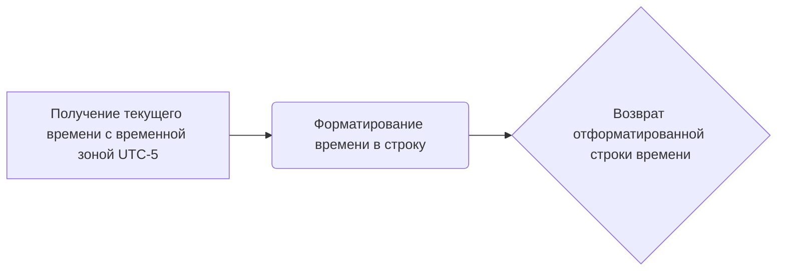
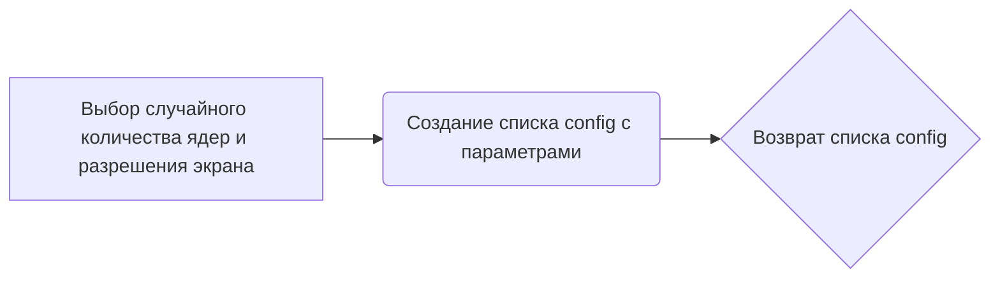
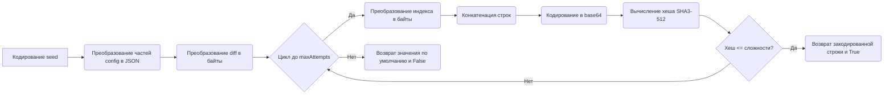
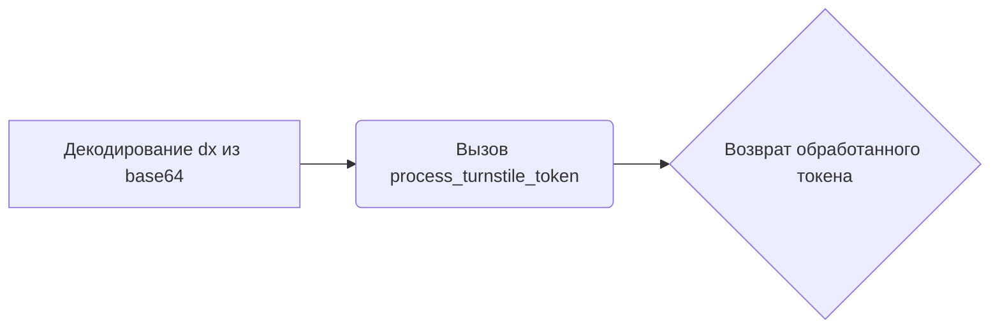
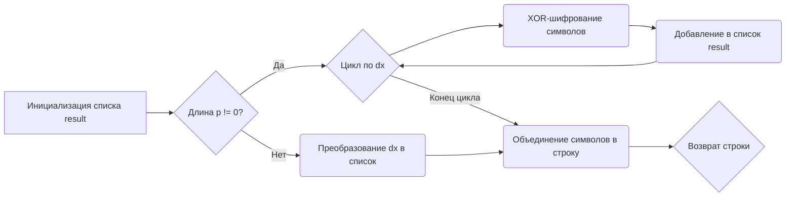
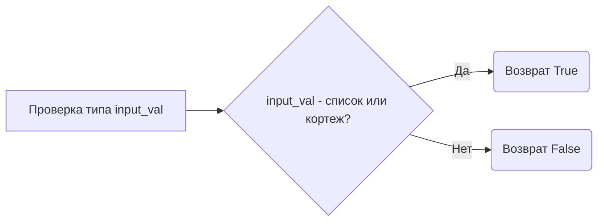
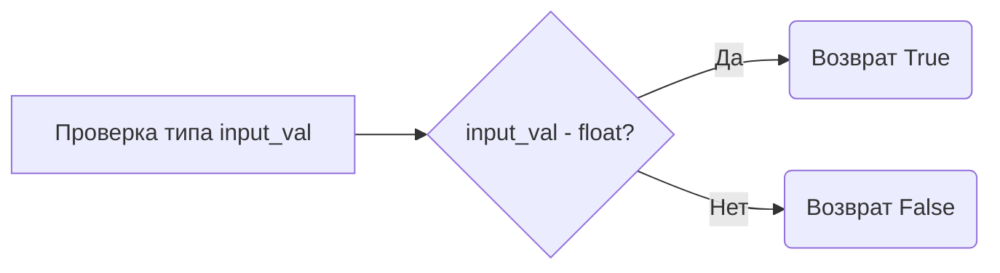
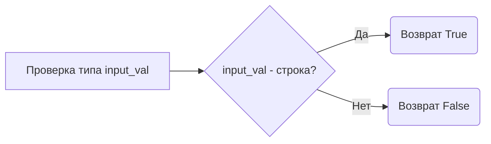
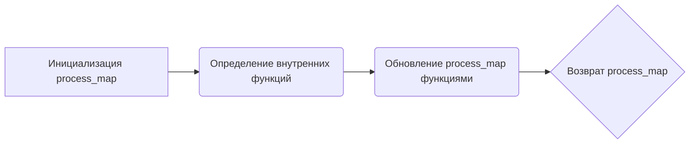

# Модуль для генерации токенов для взаимодействия с OpenAI

## Обзор

Модуль содержит функции для генерации токенов, необходимых для взаимодействия с API OpenAI. Включает в себя генерацию токенов для решения задач, токенов требований и токенов для turnstile.

## Подробней

Этот модуль предоставляет набор инструментов для генерации различных типов токенов, которые используются для аутентификации и обеспечения безопасности при взаимодействии с сервисами OpenAI. Он включает в себя функции для решения сложных математических задач, кодирования и декодирования данных, а также обработки turnstile токенов.

## Функции

### `get_parse_time`

```python
def get_parse_time() -> str:
    """
    Получает текущее время и форматирует его в определенном формате для использования в запросах.

    Returns:
        str: Текущее время, отформатированное в виде строки.

    Как работает функция:
    1. Получает текущее время с учетом временной зоны (UTC-5).
    2. Форматирует полученное время в строку, соответствующую формату "%a %b %d %Y %H:%M:%S GMT+0200 (Central European Summer Time)".

    Примеры:
        >>> get_parse_time()
        'Sun Jun 23 2024 10:30:00 GMT+0200 (Central European Summer Time)'
    """
```

**Как работает функция**:



### `get_config`

```python
def get_config(user_agent: str) -> list:
    """
    Создает конфигурацию, содержащую различные параметры, такие как количество ядер процессора, разрешение экрана и user agent.

    Args:
        user_agent (str): User agent браузера.

    Returns:
        list: Список, содержащий параметры конфигурации.

    Как работает функция:
    1. Выбирает случайное количество ядер процессора и разрешение экрана из предопределенных списков.
    2. Создает список config, содержащий различные параметры, включая выбранные значения, текущее время, user agent и случайные данные.

    Примеры:
        >>> get_config('Mozilla/5.0')
        [4016, 'Sun Jun 23 2024 10:30:00 GMT+0200 (Central European Summer Time)', None, 0.123, 'Mozilla/5.0', None, None, 'en-US', 'en-US,es-US,en,es', 0, 'random_key', 'location', 'random_window_key', 1.23, 'uuid', '', 8, 1687545600]
    """
```

**Как работает функция**:



### `get_answer_token`

```python
def get_answer_token(seed: str, diff: str, config: list) -> str:
    """
    Генерирует токен ответа на основе seed, сложности и конфигурации.

    Args:
        seed (str): Seed для генерации токена.
        diff (str): Сложность задачи.
        config (list): Конфигурация.

    Returns:
        str: Токен ответа, начинающийся с "gAAAAAB".

    Raises:
        Exception: Если не удалось решить задачу.

    Как работает функция:
    1. Вызывает функцию generate_answer для генерации ответа на основе seed, сложности и конфигурации.
    2. Если задача решена, возвращает токен, начинающийся с "gAAAAAB".
    3. Если задача не решена, вызывает исключение.

    Примеры:
        >>> get_answer_token('seed', 'diff', [1, 2, 3])
        'gAAAAABtoken'
    """
```

**Как работает функция**:

```mermaid
graph LR
    A[Вызов generate_answer с seed, diff и config] --> B{Задача решена?};
    B -- Да --> C(Возврат токена "gAAAAAB" + answer);
    B -- Нет --> D{Вызов исключения};
```

### `generate_answer`

```python
def generate_answer(seed: str, diff: str, config: list) -> tuple[str, bool]:
    """
    Пытается сгенерировать ответ на основе заданных параметров, выполняя хеширование и сравнение.

    Args:
        seed (str): Seed для генерации ответа.
        diff (str): Сложность задачи в шестнадцатеричном формате.
        config (list): Список конфигурационных параметров.

    Returns:
        tuple[str, bool]: Кортеж, содержащий сгенерированный ответ и флаг, указывающий, была ли задача решена.
                         Если задача решена, возвращается кортеж с закодированным ответом в формате base64 и True.
                         В противном случае возвращается кортеж с жестко заданным закодированным значением и False.

    Как работает функция:
    1. Кодирует seed в байты.
    2. Преобразует первые три элемента конфигурации в JSON-строку и кодирует ее.
    3. Преобразует элементы конфигурации с 4-го по 8-й в JSON-строку и кодирует ее.
    4. Преобразует элементы конфигурации, начиная с 10-го, в JSON-строку и кодирует ее.
    5. Преобразует сложность задачи из шестнадцатеричного формата в байты.
    6. В цикле (до maxAttempts раз):
        a. Преобразует текущий индекс и его половину в байты.
        b. Конкатенирует все части в одну строку.
        c. Кодирует строку в base64.
        d. Вычисляет SHA3-512 хеш от seed и закодированной строки.
        e. Сравнивает первые несколько байт хеша со сложностью задачи.
        f. Если хеш меньше или равен сложности, возвращает закодированную строку и True.
    7. Если задача не решена за maxAttempts попыток, возвращает жестко заданное значение и False.

    Примеры:
        >>> generate_answer('seed', '0fffff', [1, 2, 3, 4, 5, 6, 7, 8, 9, 10, 11, 12, 13, 14, 15, 16])
        ('wQ8Lk5FbGpA2NcR9dShT6gYjU7VxZ4D"c2VlZA=="', False)
    """
```

**Как работает функция**:



### `get_requirements_token`

```python
def get_requirements_token(config: list) -> str:
    """
    Генерирует токен требований на основе конфигурации.

    Args:
        config (list): Конфигурация.

    Returns:
        str: Токен требований, начинающийся с "gAAAAAC".

    Raises:
        Exception: Если не удалось решить задачу.

    Как работает функция:
    1. Вызывает функцию generate_answer для генерации ответа на основе случайного seed, сложности "0fffff" и конфигурации.
    2. Если задача решена, возвращает токен, начинающийся с "gAAAAAC".
    3. Если задача не решена, вызывает исключение.

    Примеры:
        >>> get_requirements_token([1, 2, 3])
        'gAAAAACtoken'
    """
```

**Как работает функция**:

```mermaid
graph LR
    A[Вызов generate_answer со случайным seed, сложностью и config] --> B{Задача решена?};
    B -- Да --> C(Возврат токена "gAAAAAC" + require);
    B -- Нет --> D{Вызов исключения};
```

### `OrderedMap`

```python
class OrderedMap:
    """Описание назначения класса
    Attributes:
        map (OrderedDict): Словарь для хранения данных в порядке добавления.

    Methods:
        add(key: str, value: Any): Добавляет пару ключ-значение в словарь.
        to_json(): Преобразует словарь в JSON-строку.
        __str__(): Возвращает JSON-представление словаря.
    """
    def __init__(self):
        """
        Инициализирует экземпляр класса OrderedMap.
        Создает пустой упорядоченный словарь для хранения данных.
        """

    def add(self, key: str, value: Any):
        """
        Добавляет пару ключ-значение в словарь.

        Args:
            key (str): Ключ.
            value (Any): Значение.
        """

    def to_json(self) -> str:
        """
        Преобразует словарь в JSON-строку.

        Returns:
            str: JSON-представление словаря.
        """

    def __str__(self) -> str:
        """
        Возвращает JSON-представление словаря.

        Returns:
            str: JSON-представление словаря.
        """
```

### `get_turnstile_token`

```python
def get_turnstile_token(dx: str, p: str) -> str:
    """
    Декодирует и обрабатывает turnstile токен.

    Args:
        dx (str): Закодированная строка.
        p (str): Ключ для обработки токена.

    Returns:
        str: Обработанный turnstile токен.

    Как работает функция:
    1. Декодирует строку dx из base64.
    2. Вызывает функцию process_turnstile_token для обработки токена.

    Примеры:
        >>> get_turnstile_token('encoded_string', 'key')
        'processed_token'
    """
```

**Как работает функция**:



### `process_turnstile_token`

```python
def process_turnstile_token(dx: str, p: str) -> str:
    """
    Обрабатывает turnstile токен путем XOR-шифрования.

    Args:
        dx (str): Строка для обработки.
        p (str): Ключ для XOR-шифрования.

    Returns:
        str: Обработанная строка.

    Как работает функция:
    1. Инициализирует пустой список для хранения результата.
    2. Если длина ключа `p` не равна 0:
        a. Проходит по каждому символу в строке `dx`.
        b. Выполняет операцию XOR между кодом символа в `dx` и кодом символа в `p` (с учетом длины `p`).
        c. Добавляет результат в список.
    3. Если длина ключа `p` равна 0, преобразует строку `dx` в список.
    4. Объединяет символы списка в строку и возвращает её.

    Примеры:
        >>> process_turnstile_token('string', 'key')
        'processed_string'
    """
```

**Как работает функция**:



### `is_slice`

```python
def is_slice(input_val: Any) -> bool:
    """
    Проверяет, является ли входное значение списком или кортежем.

    Args:
        input_val (Any): Входное значение для проверки.

    Returns:
        bool: True, если входное значение является списком или кортежем, иначе False.

    Как работает функция:
    1. Проверяет, является ли input_val экземпляром list или tuple.
    2. Возвращает True, если условие выполняется, иначе возвращает False.

    Примеры:
        >>> is_slice([1, 2, 3])
        True
        >>> is_slice((1, 2, 3))
        True
        >>> is_slice("string")
        False
    """
```

**Как работает функция**:



### `is_float`

```python
def is_float(input_val: Any) -> bool:
    """
    Проверяет, является ли входное значение числом с плавающей точкой.

    Args:
        input_val (Any): Входное значение для проверки.

    Returns:
        bool: True, если входное значение является числом с плавающей точкой, иначе False.

    Как работает функция:
    1. Проверяет, является ли input_val экземпляром float.
    2. Возвращает True, если условие выполняется, иначе возвращает False.

    Примеры:
        >>> is_float(3.14)
        True
        >>> is_float(5)
        False
        >>> is_float("string")
        False
    """
```

**Как работает функция**:



### `is_string`

```python
def is_string(input_val: Any) -> bool:
    """
    Проверяет, является ли входное значение строкой.

    Args:
        input_val (Any): Входное значение для проверки.

    Returns:
        bool: True, если входное значение является строкой, иначе False.

    Как работает функция:
    1. Проверяет, является ли input_val экземпляром str.
    2. Возвращает True, если условие выполняется, иначе возвращает False.

    Примеры:
        >>> is_string("string")
        True
        >>> is_string(5)
        False
        >>> is_string([1, 2, 3])
        False
    """
```

**Как работает функция**:



### `to_str`

```python
def to_str(input_val: Any) -> str:
    """
    Преобразует входное значение в строковое представление.

    Args:
        input_val (Any): Входное значение для преобразования.

    Returns:
        str: Строковое представление входного значения.
             Если input_val является None, возвращает "undefined".
             Если input_val является float, форматирует его до 16 знаков после запятой.
             Если input_val является строкой, возвращает специальные значения для известных строк, иначе возвращает саму строку.
             Если input_val является списком строк, объединяет их через запятую.
             В остальных случаях возвращает строковое представление входного значения.

    Как работает функция:
    1. Проверяет, является ли input_val None. Если да, возвращает "undefined".
    2. Проверяет, является ли input_val float. Если да, форматирует его до 16 знаков после запятой и возвращает.
    3. Проверяет, является ли input_val строкой. Если да:
        a. Проверяет, есть ли input_val в словаре special_cases.
        b. Если есть, возвращает соответствующее значение из словаря.
        c. Если нет, возвращает сам input_val.
    4. Проверяет, является ли input_val списком строк. Если да, объединяет их через запятую и возвращает.
    5. В остальных случаях возвращает строковое представление input_val.

    Примеры:
        >>> to_str(None)
        'undefined'
        >>> to_str(3.14)
        '3.1400000000000001'
        >>> to_str("window.Math")
        '[object Math]'
        >>> to_str(["a", "b", "c"])
        'a,b,c'
        >>> to_str([1, 2, 3])
        '[1, 2, 3]'
    """
```

**Как работает функция**:

```mermaid
graph LR
    A[Проверка input_val на None] --> B{input_val - None?};
    B -- Да --> C(Возврат "undefined");
    B -- Нет --> D[Проверка input_val на float];
    D --> E{input_val - float?};
    E -- Да --> F(Форматирование float);
    F --> G(Возврат отформатированной строки);
    E -- Нет --> H[Проверка input_val на строку];
    H --> I{input_val - строка?};
    I -- Да --> J[Проверка special_cases];
    J --> K{input_val в special_cases?};
    K -- Да --> L(Возврат значения из special_cases);
    K -- Нет --> M(Возврат input_val);
    I -- Нет --> N[Проверка input_val на список строк];
    N --> O{input_val - список строк?};
    O -- Да --> P(Объединение строк через запятую);
    P --> Q(Возврат объединенной строки);
    O -- Нет --> R(Преобразование в строку);
    R --> S(Возврат строкового представления);
```

### `get_func_map`

```python
def get_func_map() -> dict[float, Any]:
    """
    Создает и возвращает словарь с функциями для обработки turnstile токена.

    Returns:
        dict[float, Any]: Словарь, где ключи - float, а значения - функции или данные для обработки turnstile токена.

    Как работает функция:
    1. Инициализирует словарь `process_map` с функциями по умолчанию.
    2. Определяет несколько внутренних функций (`func_1`, `func_2`, `func_5`, `func_6`, `func_7`, `func_8`, `func_14`, `func_15`, `func_17`, `func_18`, `func_19`, `func_20`, `func_21`, `func_23`, `func_24`)
       - Каждая из этих функций выполняет определенную операцию над данными, полученными из `process_map`.
    3. Обновляет `process_map`, добавляя в него определенные ключи и соответствующие функции.
    4. Возвращает `process_map`.

    Внутренние функции:
        - `func_1(e: float, t: float)`: Выполняет операцию process_turnstile_token между значениями process_map[e] и process_map[t].
        - `func_2(e: float, t: Any)`: Присваивает значение t ключу e в process_map.
        - `func_5(e: float, t: float)`: Добавляет значение process_map[t] к process_map[e], обрабатывая случаи строк, чисел и списков.
        - `func_6(e: float, t: float, n: float)`: Формирует строку из process_map[t] и process_map[n], обрабатывая случай "window.document.location".
        - `func_7(e: float, *args)`: Вызывает функцию process_map[e] с аргументами *args, обрабатывая случай "window.Reflect.set".
        - `func_8(e: float, t: float)`: Присваивает process_map[e] значение process_map[t].
        - `func_14(e: float, t: float)`: Пытается распарсить process_map[t] как JSON, если это строка.
        - `func_15(e: float, t: float)`: Преобразует process_map[t] в JSON-строку.
        - `func_17(e: float, t: float, *args)`: Обрабатывает вызовы функций, таких как "window.performance.now", "window.Object.create", "window.Object.keys", "window.Math.random".
        - `func_18(e: float)`: Декодирует base64 значение process_map[e].
        - `func_19(e: float)`: Кодирует base64 значение process_map[e].
        - `func_20(e: float, t: float, n: float, *args)`: Вызывает функцию process_map[n] с аргументами *args, если process_map[e] равно process_map[t].
        - `func_21(*args)`: Пустая функция.
        - `func_23(e: float, t: float, *args)`: Вызывает функцию process_map[t] с аргументами *args.
        - `func_24(e: float, t: float, n: float)`: Формирует строку из process_map[t] и process_map[n].
    """
```

**Как работает функция**:



### `process_turnstile`

```python
def process_turnstile(dx: str, p: str) -> str:
    """
    Обрабатывает turnstile токен, используя предоставленные функции и данные.

    Args:
        dx (str): Закодированная строка turnstile.
        p (str): Ключ для обработки токена.

    Returns:
        str: Обработанный и закодированный base64 токен.

    Raises:
        Exception: Если происходит ошибка при обработке токена.

    Как работает функция:
    1. Получает turnstile токены с помощью функции `get_turnstile_token(dx, p)`.
    2. Инициализирует `res` как пустую строку.
    3. Преобразует токены в список `token_list` с помощью `json.loads(tokens)`.
    4. Получает карту функций `process_map` с помощью `get_func_map()`.
    5. Определяет внутреннюю функцию `func_3(e: str)`, которая кодирует строку `e` в base64 и присваивает результат переменной `res`.
    6. Добавляет функцию `func_3` в `process_map` под ключом `3`.
    7. Добавляет `token_list` в `process_map` под ключом `9`.
    8. Добавляет ключ `p` в `process_map` под ключом `16`.
    9. Для каждого токена в `token_list`:
        a. Извлекает идентификатор функции `e` из токена.
        b. Извлекает аргументы `t` из токена.
        c. Получает функцию `f` из `process_map` по идентификатору `e`.
        d. Если функция `f` существует, вызывает её с аргументами `t`.
        e. Если функция `f` не существует, пропускает итерацию.
    10. Возвращает `res`.
    """
```

**Как работает функция**:

```mermaid
graph LR
    A[Получение turnstile токенов] --> B(Инициализация переменных);
    B --> C(Получение token_list);
    C --> D(Получение process_map);
    D --> E(Определение func_3);
    E --> F(Добавление func_3 в process_map);
    F --> G(Добавление token_list в process_map);
    G --> H(Добавление p в process_map);
    H --> I{Цикл по token_list};
    I --> J(Извлечение e и t);
    J --> K(Получение f из process_map);
    K --> L{f существует?};
    L -- Да --> M(Вызов f с аргументами t);
    M --> I;
    L -- Нет --> I;
    I --> N{Конец цикла};
    N --> O(Возврат res);