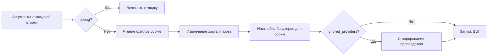

# Модуль для запуска графического интерфейса g4f

## Обзор

Этот модуль отвечает за запуск графического интерфейса (GUI) для g4f (Generative Functions for free), библиотеки для бесплатного доступа к большим языковым моделям. Он включает в себя парсинг аргументов командной строки, чтение файлов cookie, настройку провайдеров и запуск GUI.

## Подробней

Модуль `run.py` играет важную роль в проекте `hypotez`, обеспечивая графический интерфейс для взаимодействия с функциональностью g4f. Он позволяет пользователям настраивать параметры, такие как используемые браузеры для cookie, игнорируемые провайдеры и параметры хоста и порта для запуска GUI. Это облегчает взаимодействие с библиотекой g4f, делая её более доступной для пользователей, не имеющих опыта работы с командной строкой.

## Функции

### `run_gui_args`

```python
def run_gui_args(args):
    """Настраивает окружение и запускает графический интерфейс g4f.

    Args:
        args: Объект, содержащий аргументы командной строки, переданные в программу.

    Raises:
        Exception: Если возникает ошибка при настройке окружения или запуске графического интерфейса.

    """
```

**Как работает функция**:

1. **Включение отладки**: Если в аргументах командной строки указан флаг `--debug`, включается режим отладки в `g4f.debug.logging`.
2. **Чтение файлов cookie**: Если не указан флаг `--ignore-cookie-files`, выполняется чтение файлов cookie с использованием функции `read_cookie_files()`.
3. **Настройка хоста и порта**: Из аргументов командной строки извлекаются значения хоста и порта.
4. **Настройка браузеров для cookie**: Формируется список браузеров, которые будут использоваться для чтения cookie, на основе аргумента `--cookie-browsers`.
5. **Игнорирование провайдеров**: Если указаны игнорируемые провайдеры через аргумент `--ignored-providers`, они исключаются из списка рабочих провайдеров в `ProviderUtils.convert`.
6. **Запуск GUI**: Запускается графический интерфейс с использованием функции `run_gui()`, передавая ей настроенные значения хоста, порта и флага отладки.



**Примеры**:

Пример вызова функции:

```python
import argparse

# Создаем фиктивный объект args для примера
class Args:
    def __init__(self, debug=False, ignore_cookie_files=False, host='127.0.0.1', port=8000, cookie_browsers=['chrome'], ignored_providers=[]):
        self.debug = debug
        self.ignore_cookie_files = ignore_cookie_files
        self.host = host
        self.port = port
        self.cookie_browsers = cookie_browsers
        self.ignored_providers = ignored_providers

# Пример 1: Запуск с настройками по умолчанию
args1 = Args()
# run_gui_args(args1)  # Запуск с параметрами по умолчанию

# Пример 2: Запуск с включенным режимом отладки и игнорированием файлов cookie
args2 = Args(debug=True, ignore_cookie_files=True)
# run_gui_args(args2)  # Запуск с включенной отладкой и игнорированием cookie

# Пример 3: Запуск с указанием конкретных браузеров и игнорированием провайдеров
args3 = Args(cookie_browsers=['firefox', 'edge'], ignored_providers=['provider1', 'provider2'])
# run_gui_args(args3)  # Запуск с указанными браузерами и игнорируемыми провайдерами
```

## Main

```python
if __name__ == "__main__":
    parser = gui_parser()
    args = parser.parse_args()
    run_gui_args(args)
```

**Как работает**:

1.  **Создание парсера аргументов**: Создается экземпляр парсера аргументов командной строки с помощью функции `gui_parser()`.
2.  **Парсинг аргументов**: Выполняется парсинг аргументов командной строки с использованием метода `parse_args()` парсера.
3.  **Запуск GUI с аргументами**: Вызывается функция `run_gui_args()` с переданными аргументами для настройки и запуска графического интерфейса.