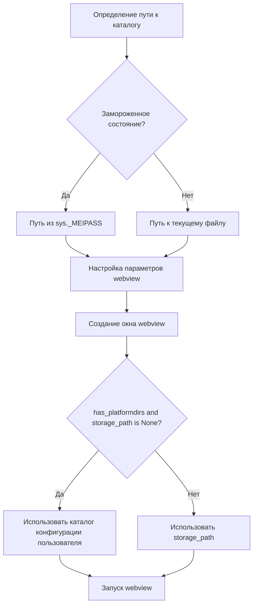

# Документация модуля webview

## Обзор

Модуль `webview.py` предназначен для запуска графического интерфейса пользователя (GUI) для проекта `g4f` (gpt4free) с использованием библиотеки `webview`. Он определяет функцию `run_webview`, которая создает окно с веб-интерфейсом, загружаемым из локального HTML-файла, и запускает веб-сервер для обслуживания этого интерфейса. Модуль также включает поддержку отладки, настройки порта HTTP и SSL.

## Подробнее

Модуль использует библиотеку `webview` для создания кроссплатформенного GUI, который отображает веб-контент. GUI загружается из HTML-файла, расположенного в подкаталоге `client`. Для взаимодействия между веб-интерфейсом и Python-кодом используется `js_api`.

В начале работы модуля проверяется, запущен ли он в замороженном состоянии (например, как исполняемый файл, созданный PyInstaller). В зависимости от этого определяется путь к каталогу, содержащему файлы веб-интерфейса.

Функция `run_webview` настраивает параметры `webview`, такие как разрешение открытия внешних ссылок в браузере и разрешение загрузок. Затем создается окно с указанным названием и загружается HTML-файл.

Если библиотека `platformdirs` доступна, и путь к хранилищу не был указан явно, используется каталог конфигурации пользователя, предоставляемый `platformdirs`, для хранения данных веб-интерфейса.

Наконец, функция `webview.start` запускает веб-сервер и отображает окно GUI.

В блоке `if __name__ == "__main__":` выполняется разбор аргументов командной строки с использованием `gui_parser`, и на основе этих аргументов запускается функция `run_webview`.

## Функции

### `run_webview`

```python
def run_webview(
    debug: bool = False,
    http_port: int = None,
    ssl: bool = True,
    storage_path: str = None,
    gui: str = None
) -> None:
    """
    Запускает графический интерфейс пользователя (GUI) для проекта g4f с использованием библиотеки webview.

    Args:
        debug (bool): Флаг, указывающий, следует ли запускать в режиме отладки. По умолчанию False.
        http_port (int): Номер порта HTTP для запуска веб-сервера. По умолчанию None.
        ssl (bool): Флаг, указывающий, следует ли использовать SSL. По умолчанию True.
        storage_path (str): Путь к каталогу для хранения данных веб-интерфейса. По умолчанию None.
        gui (str): Не используется.

    Raises:
        ImportError: Если не удается импортировать библиотеку platformdirs.

    Example:
        >>> run_webview(debug=True, http_port=8080, ssl=False)
    """
```

**Как работает функция**:

1. **Определение пути к каталогу**: Определяет путь к каталогу, содержащему файлы веб-интерфейса. Если приложение запущено в замороженном состоянии, используется путь из `sys._MEIPASS`, иначе используется путь к текущему файлу.
2. **Настройка параметров webview**: Устанавливает параметры `webview`, такие как разрешение открытия внешних ссылок в браузере и разрешение загрузок.
3. **Создание окна webview**: Создает окно с указанным названием (g4f - <версия>) и загружает HTML-файл из `os.path.join(dirname, "client/index.html")`.
4. **Определение пути к хранилищу**: Если библиотека `platformdirs` доступна и путь к хранилищу не был указан явно, используется каталог конфигурации пользователя, предоставляемый `platformdirs`, для хранения данных веб-интерфейса.
5. **Запуск webview**: Запускает веб-сервер и отображает окно GUI с помощью функции `webview.start`.



**Примеры**:

```python
run_webview(debug=True, http_port=8080, ssl=False)
run_webview(debug=False, storage_path="/tmp/g4f-webview")
```
```python
if __name__ == "__main__":
    parser = gui_parser()
    args = parser.parse_args()
    if args.debug:
        g4f.debug.logging = True
    run_webview(args.debug, args.port, not args.debug)