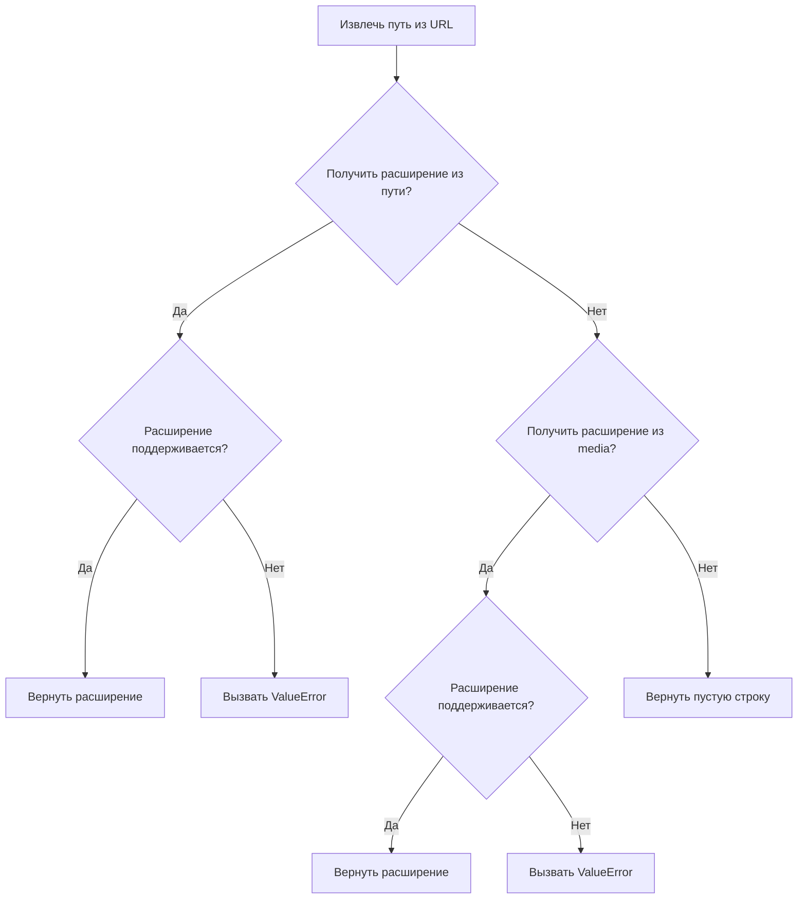
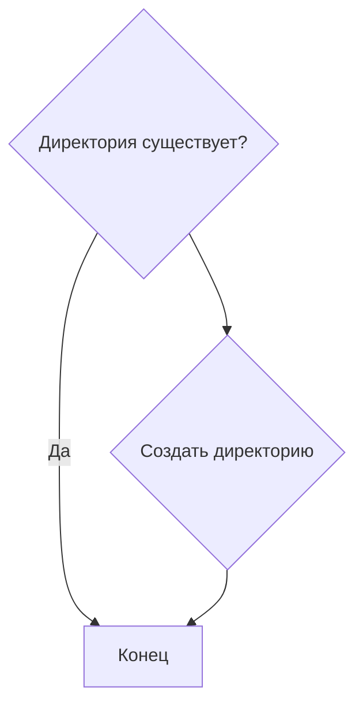
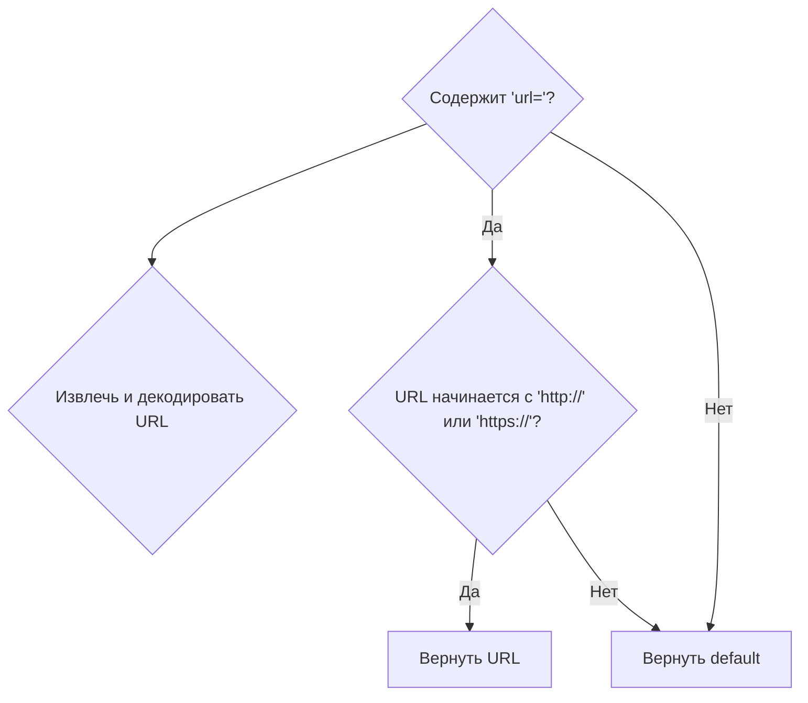
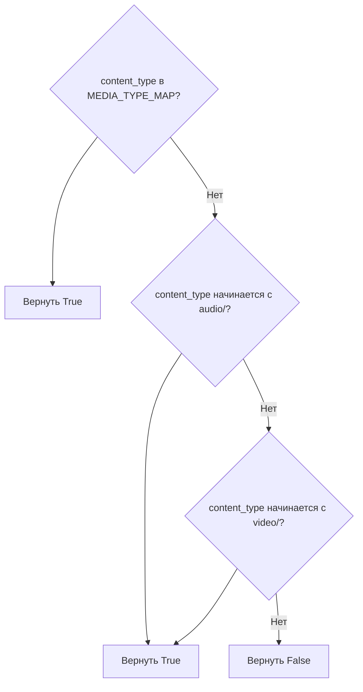
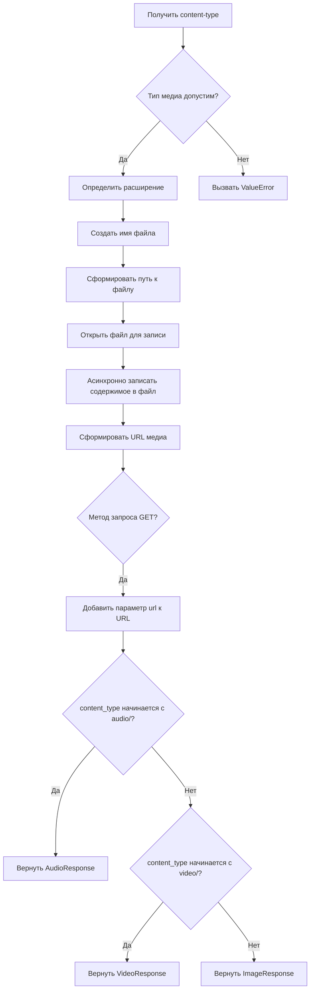

# Модуль для копирования изображений
## Обзор

Модуль `copy_images.py` предназначен для загрузки и хранения изображений локально, с использованием Unicode-безопасных имен файлов. Он содержит функции для обработки различных типов медиа, проверки форматов файлов и создания безопасных URL.

## Подробней

Данный модуль играет важную роль в проекте, обеспечивая возможность сохранения сгенерированных изображений на локальном диске и предоставления к ним доступа через URL. Это особенно полезно, когда необходимо обрабатывать изображения, полученные из различных источников, и гарантировать их корректное сохранение и отображение.
В модуле реализованы функции для:
- Проверки и извлечения расширений файлов из URL или имени файла.
- Создания директории для хранения изображений, если она не существует.
- Извлечения исходного URL из параметра изображения.
- Проверки допустимости типа медиа.
- Сохранения медиа из ответа на локальный файл.
- Создания имени файла на основе тегов, альтернативного текста и хеша изображения.
- Копирования медиа файлов, включая обработку `data:` URI и применение настроек `BackendApi`.

## Функции

### `get_media_extension`

```python
def get_media_extension(media: str) -> str:
    """Extract media file extension from URL or filename"""
```

**Назначение**: Извлекает расширение медиафайла из URL или имени файла.

**Параметры**:
- `media` (str): URL или имя файла медиа.

**Возвращает**:
- `str`: Расширение файла (например, ".jpg", ".png"). Возвращает пустую строку, если расширение не найдено.

**Вызывает исключения**:
- `ValueError`: Если расширение не поддерживается.

**Как работает функция**:

1. Извлекает путь из URL, используя `urllib.parse.urlparse`.
2. Получает расширение файла с помощью `os.path.splitext`.
3. Если расширение не найдено, пытается извлечь его непосредственно из `media`.
4. Проверяет, поддерживается ли расширение.
5. Возвращает расширение.



**Примеры**:

```python
>>> get_media_extension("https://example.com/image.jpg")
'.jpg'
>>> get_media_extension("audio.mp3")
'.mp3'
```

### `ensure_images_dir`

```python
def ensure_images_dir():
    """Create images directory if it doesn't exist"""
```

**Назначение**: Создает директорию для изображений, если она не существует.

**Параметры**:
- Отсутствуют.

**Возвращает**:
- `None`: Функция ничего не возвращает.

**Как работает функция**:

1. Использует `os.makedirs` для создания директории `images_dir`, если она не существует. Параметр `exist_ok=True` предотвращает возникновение ошибки, если директория уже существует.



**Примеры**:

```python
>>> ensure_images_dir()
```

### `get_source_url`

```python
def get_source_url(image: str, default: str = None) -> str:
    """Extract original URL from image parameter if present"""
```

**Назначение**: Извлекает оригинальный URL из параметра изображения, если он присутствует.

**Параметры**:
- `image` (str): Строка, содержащая URL изображения.
- `default` (str, optional): Значение по умолчанию, которое возвращается, если URL не найден. По умолчанию `None`.

**Возвращает**:
- `str`: Оригинальный URL изображения или значение по умолчанию.

**Как работает функция**:

1. Проверяет, содержит ли строка `image` параметр `url=`.
2. Если параметр найден, извлекает URL, декодирует его с помощью `urllib.parse.unquote`.
3. Проверяет, начинается ли декодированный URL с "http://" или "https://".
4. Если все условия выполнены, возвращает декодированный URL.
5. В противном случае возвращает значение `default`.



**Примеры**:

```python
>>> get_source_url("image.jpg?url=https://example.com/image.jpg")
'https://example.com/image.jpg'
>>> get_source_url("image.jpg", "default_image.jpg")
'default_image.jpg'
```

### `is_valid_media_type`

```python
def is_valid_media_type(content_type: str) -> bool:
    """Проверяет, является ли указанный content_type допустимым типом мультимедиа."""
```

**Назначение**: Проверяет, является ли указанный `content_type` допустимым типом мультимедиа.

**Параметры**:
- `content_type` (str): Тип контента для проверки.

**Возвращает**:
- `bool`: `True`, если `content_type` является допустимым типом мультимедиа, иначе `False`.

**Как работает функция**:

1. Проверяет, содержится ли `content_type` в `MEDIA_TYPE_MAP`.
2. Проверяет, начинается ли `content_type` с "audio/" или "video/".
3. Возвращает `True`, если хотя бы одно из условий выполнено, иначе `False`.



**Примеры**:

```python
>>> is_valid_media_type("image/jpeg")
True
>>> is_valid_media_type("audio/mpeg")
True
>>> is_valid_media_type("text/html")
False
```

### `save_response_media`

```python
async def save_response_media(response: StreamResponse, prompt: str, tags: list[str]) -> AsyncIterator:
    """Save media from response to local file and return URL"""
```

**Назначение**: Сохраняет медиа из ответа на локальный файл и возвращает URL.

**Параметры**:
- `response` (StreamResponse): Объект ответа, содержащий медиа.
- `prompt` (str): Описание изображения.
- `tags` (list[str]): Список тегов для файла.

**Возвращает**:
- `AsyncIterator`: Асинхронный итератор, возвращающий объекты `ImageResponse`, `AudioResponse` или `VideoResponse`.

**Вызывает исключения**:
- `ValueError`: Если тип медиа не поддерживается.

**Как работает функция**:

1. Получает `content-type` из заголовков ответа.
2. Проверяет, является ли тип медиа допустимым с помощью `is_valid_media_type`.
3. Определяет расширение файла на основе `content_type`.
4. Создает имя файла с помощью `get_filename`.
5. Формирует полный путь к файлу.
6. Открывает файл для записи в бинарном режиме.
7. Асинхронно записывает содержимое ответа в файл чанками.
8. Формирует URL медиа.
9. Если метод запроса был GET, добавляет параметр `url` к URL медиа.
10. В зависимости от типа контента, возвращает объект `AudioResponse`, `VideoResponse` или `ImageResponse`.



**Примеры**:

```python
# Пример использования функции требует мокирования объекта response
```

### `get_filename`

```python
def get_filename(tags: list[str], alt: str, extension: str, image: str) -> str:
    return "".join((\
        f"{int(time.time())}_",\
        f"{secure_filename('+'.join([tag for tag in tags if tag]))}+" if tags else "",\
        f"{secure_filename(alt)}_",\
        hashlib.sha256(image.encode()).hexdigest()[:16],\
        extension\
    ))
```

**Назначение**: Создает имя файла на основе тегов, альтернативного текста, хеша изображения и расширения.

**Параметры**:
- `tags` (list[str]): Список тегов для файла.
- `alt` (str): Альтернативный текст.
- `extension` (str): Расширение файла.
- `image` (str): Изображение (используется для хеширования).

**Возвращает**:
- `str`: Сгенерированное имя файла.

**Как работает функция**:

1. Формирует имя файла, объединяя:
   - Текущее время в секундах.
   - Безопасные теги (если есть).
   - Безопасный альтернативный текст.
   - Первые 16 символов SHA256 хеша изображения.
   - Расширение файла.
2. Использует `secure_filename` для обеспечения безопасности имени файла.

```mermaid
graph TD
A[Получить текущее время] --> B{Теги существуют?}
B -- Да --> C[Безопасные теги]
B -- Нет --> C[Пустая строка]
C --> D[Безопасный альтернативный текст]
D --> E[Хеш изображения (SHA256)]
E --> F[Объединить все компоненты]
F --> G[Вернуть имя файла]
```

**Примеры**:

```python
>>> get_filename(["tag1", "tag2"], "alt_text", ".jpg", "image_data")
'1678886400_tag1+tag2+alt_text_a665a45920422f0b.jpg'
```

### `copy_media`

```python
async def copy_media(
    images: list[str],
    cookies: Optional[Cookies] = None,
    headers: Optional[dict] = None,
    proxy: Optional[str] = None,
    alt: str = None,
    tags: list[str] = None,
    add_url: bool = True,
    target: str = None,
    ssl: bool = None
) -> list[str]:
    """
    Download and store images locally with Unicode-safe filenames
    Returns list of relative image URLs
    """
```

**Назначение**: Загружает и сохраняет изображения локально с использованием Unicode-безопасных имен файлов.

**Параметры**:
- `images` (list[str]): Список URL изображений для загрузки.
- `cookies` (Optional[Cookies], optional): Cookie для запросов. По умолчанию `None`.
- `headers` (Optional[dict], optional): Заголовки для запросов. По умолчанию `None`.
- `proxy` (Optional[str], optional): Прокси-сервер для запросов. По умолчанию `None`.
- `alt` (str, optional): Альтернативный текст для имени файла. По умолчанию `None`.
- `tags` (list[str], optional): Список тегов для имени файла. По умолчанию `None`.
- `add_url` (bool, optional): Добавлять ли параметр `url` к URL изображения. По умолчанию `True`.
- `target` (str, optional): Целевой путь для сохранения изображения. По умолчанию `None`.
- `ssl` (bool, optional): Использовать ли SSL. По умолчанию `None`.

**Возвращает**:
- `list[str]`: Список относительных URL изображений.

**Как работает функция**:

1. Если `add_url` установлен в `True`, и cookies не предоставлены, `add_url` остается `True`.
2. Вызывает `ensure_images_dir` для создания директории для изображений, если она не существует.
3. Создает асинхронную сессию `ClientSession` с заданными параметрами (connector, cookies, headers).
4. Определяет внутреннюю асинхронную функцию `copy_image`, которая обрабатывает отдельное изображение.
5. Использует `asyncio.gather` для параллельной обработки всех изображений.

**Внутренние функции**:

### `copy_image`

```python
async def copy_image(image: str, target: str = None) -> str:
    """Process individual image and return its local URL"""
```

**Назначение**: Обрабатывает отдельное изображение и возвращает его локальный URL.

**Параметры**:
- `image` (str): URL изображения для загрузки.
- `target` (str, optional): Целевой путь для сохранения изображения. По умолчанию `None`.

**Возвращает**:
- `str`: Локальный URL изображения.

**Как работает функция**:

1. Проверяет, является ли изображение уже локальным (начинается с "/"). Если да, возвращает его.
2. Если `target` не указан, создает имя файла с помощью `get_filename` и формирует полный путь к файлу.
3. Обрабатывает различные типы изображений:
   - Если изображение является `data:` URI, извлекает данные и записывает их в файл.
   - Если изображение начинается с URL `BackendApi`, применяет соответствующие заголовки и SSL.
   - Иначе выполняет GET-запрос к изображению, проверяет `content-type` и записывает содержимое в файл.
4. Проверяет формат файла с помощью `is_accepted_format` и переименовывает файл, если необходимо.
5. Формирует URL с безопасным кодированием и возвращает его.
6. В случае ошибки логирует ошибку и возвращает исходный URL (или `default`).

```mermaid
graph TD
A{Изображение локальное?} --> B[Вернуть изображение]
A -- Нет --> C{Целевой путь указан?}
C -- Да --> D[Использовать целевой путь]
C -- Нет --> E[Создать имя файла и путь]
E --> F{Изображение data: URI?}
F -- Да --> G[Извлечь данные и записать в файл]
F -- Нет --> H{URL начинается с BackendApi?}
H -- Да --> I[Применить заголовки и SSL BackendApi]
H -- Нет --> J[Использовать предоставленные заголовки и SSL]
J --> K[Выполнить GET-запрос]
K --> L[Проверить content-type]
L --> M[Записать содержимое в файл]
M --> N[Проверить формат файла]
N --> O[Переименовать файл (если необходимо)]
O --> P[Сформировать и вернуть URL]
I --> K
```

**Примеры**:

```python
# Пример использования функции требует мокирования асинхронной сессии и объектов response
```

**Как работает функция `copy_media`**:

1. Проверяет необходимость добавления URL в зависимости от наличия cookies.
2. Создает директорию для сохранения изображений с помощью `ensure_images_dir()`.
3. Инициализирует асинхронную сессию `ClientSession` для выполнения HTTP-запросов.
4. Определяет внутреннюю функцию `copy_image()` для обработки каждого изображения.
5. Использует `asyncio.gather()` для параллельной загрузки и обработки всех изображений.
6. Возвращает список локальных URL загруженных изображений.

```mermaid
graph TD
A{Проверить add_url и cookies} --> B[Создать директорию для изображений]
B --> C[Инициализировать асинхронную сессию ClientSession]
C --> D[Определить внутреннюю функцию copy_image()]
D --> E[Использовать asyncio.gather() для параллельной загрузки и обработки]
E --> F[Вернуть список локальных URL]
```

**Примеры**:

```python
# Пример использования функции требует мокирования асинхронной сессии и объектов response