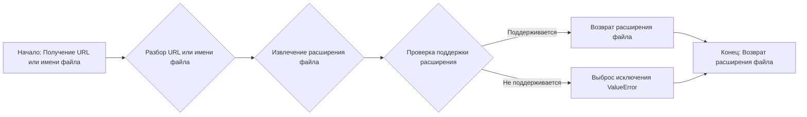
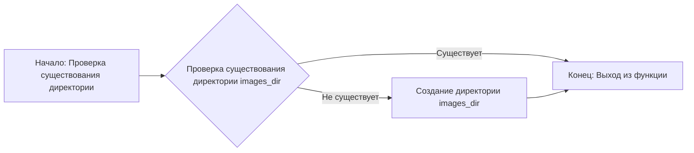
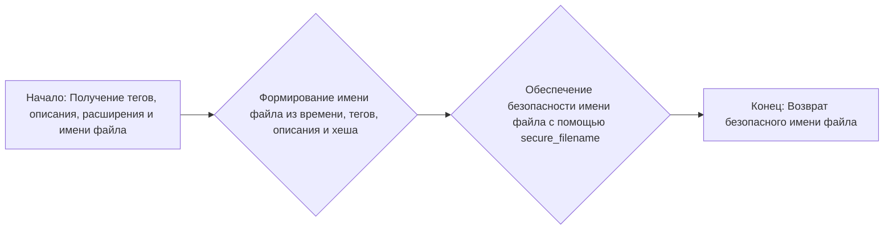
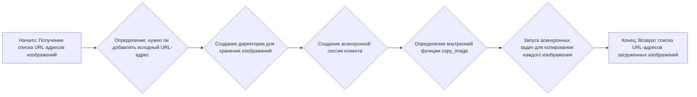

# Модуль для копирования изображений
## Обзор

Модуль `copy_images.py` предназначен для скачивания и локального хранения изображений, полученных из различных источников, с поддержкой Unicode-безопасных имен файлов. Он обеспечивает функциональность для обработки изображений из URL-адресов и data URI, сохранения их на диск и возвращения относительных URL-адресов для доступа к ним. Модуль также включает функции для проверки типов медиафайлов и обработки исключений при копировании изображений.
Модуль входит в состав проекта `hypotez` и используется для обработки изображений, сгенерированных или полученных из внешних источников, чтобы обеспечить их локальное хранение и доступность.
Модуль обрабатывает изображения, полученные из разных источников, сохраняет их локально и возвращает URL-адреса для доступа к ним.

## Подробней

Этот модуль предоставляет следующие возможности:

1.  **Загрузка и сохранение изображений**: Скачивает изображения из URL-адресов или извлекает их из data URI и сохраняет локально.
2.  **Unicode-безопасные имена файлов**: Генерирует имена файлов, безопасные для Unicode, чтобы избежать проблем с кодировкой.
3.  **Проверка типа медиа**: Проверяет типы медиафайлов для обеспечения их поддержки.
4.  **Обработка исключений**: Обрабатывает исключения, которые могут возникнуть при копировании изображений.
5.  **Использование `aiohttp`**: Применяет асинхронную библиотеку `aiohttp` для выполнения сетевых запросов.
6.  **Поддержка `BackendApi`**: Учитывает настройки `BackendApi` для обработки запросов к определенным URL-адресам.

## Функции

### `get_media_extension`

```python
def get_media_extension(media: str) -> str:
    """Extract media file extension from URL or filename"""
```

**Назначение**: Извлекает расширение медиафайла из URL-адреса или имени файла.

**Параметры**:

*   `media` (str): URL-адрес или имя файла, из которого нужно извлечь расширение.

**Возвращает**:

*   `str`: Расширение файла (например, ".jpg", ".png"). Возвращает пустую строку, если расширение не найдено.

**Вызывает исключения**:

*   `ValueError`: Если расширение файла не поддерживается.

**Как работает функция**:

1.  Разбирает URL-адрес или имя файла, чтобы извлечь путь.
2.  Извлекает расширение файла из пути.
3.  Проверяет, поддерживается ли расширение.
4.  Возвращает расширение файла.



**Примеры**:

```python
>>> get_media_extension("https://example.com/image.jpg")
'.jpg'
>>> get_media_extension("image.png")
'.png'
>>> get_media_extension("audio.mp3")
'.mp3'
```

### `ensure_images_dir`

```python
def ensure_images_dir():
    """Create images directory if it doesn't exist"""
```

**Назначение**: Создает директорию для хранения изображений, если она не существует.

**Параметры**:

*   Нет.

**Возвращает**:

*   Нет.

**Вызывает исключения**:

*   Нет.

**Как работает функция**:

1.  Проверяет, существует ли директория `images_dir`.
2.  Если директория не существует, создает ее.



**Примеры**:

```python
>>> ensure_images_dir()
```

### `get_source_url`

```python
def get_source_url(image: str, default: str = None) -> str:
    """Extract original URL from image parameter if present"""
```

**Назначение**: Извлекает исходный URL-адрес из параметра изображения, если он присутствует.

**Параметры**:

*   `image` (str): Параметр изображения, который может содержать URL-адрес.
*   `default` (str, optional): Значение по умолчанию, которое возвращается, если URL-адрес не найден. По умолчанию `None`.

**Возвращает**:

*   `str`: Исходный URL-адрес, если он найден. В противном случае возвращает значение по умолчанию.

**Вызывает исключения**:

*   Нет.

**Как работает функция**:

1.  Проверяет, содержит ли параметр `image` строку "url=".
2.  Если строка "url=" присутствует, извлекает URL-адрес из параметра.
3.  Проверяет, начинается ли извлеченный URL-адрес с "http://" или "https://".
4.  Возвращает URL-адрес, если он валиден. В противном случае возвращает значение по умолчанию.

```mermaid
graph LR
A[Начало: Проверка наличия URL в параметре image] --> B{Проверка наличия строки "url=" в image};
B -- Есть --> C{Извлечение URL из image};
B -- Нет --> E[Возврат значения по умолчанию];
C --> D{Проверка валидности URL};
D -- Валиден --> F[Возврат URL];
D -- Не валиден --> E;
E --> G[Конец: Возврат значения по умолчанию или URL];
F --> G;
```

**Примеры**:

```python
>>> get_source_url("image.jpg?url=https://example.com/image.jpg")
'https://example.com/image.jpg'
>>> get_source_url("image.jpg", "https://example.com/default.jpg")
'https://example.com/default.jpg'
```

### `is_valid_media_type`

```python
def is_valid_media_type(content_type: str) -> bool:
    """Checking if the content type is valid"""
```

**Назначение**: Проверяет, является ли указанный тип контента допустимым типом медиа.

**Параметры**:

*   `content_type` (str): Тип контента для проверки.

**Возвращает**:

*   `bool`: `True`, если тип контента является допустимым типом медиа, в противном случае `False`.

**Вызывает исключения**:

*   Нет.

**Как работает функция**:

1.  Проверяет, содержится ли `content_type` в `MEDIA_TYPE_MAP`.
2.  Проверяет, начинается ли `content_type` с "audio/" или "video/".
3.  Возвращает `True`, если одно из условий выполняется, в противном случае `False`.

```mermaid
graph LR
A[Начало: Проверка типа контента] --> B{Проверка наличия content_type в MEDIA_TYPE_MAP};
B -- Да --> E[Возврат True];
B -- Нет --> C{Проверка начала content_type с "audio/" или "video/"};
C -- Да --> E;
C -- Нет --> D[Возврат False];
E --> F[Конец: Возврат True или False];
D --> F;
```

**Примеры**:

```python
>>> is_valid_media_type("image/jpeg")
True
>>> is_valid_media_type("audio/mpeg")
True
>>> is_valid_media_type("application/json")
False
```

### `save_response_media`

```python
async def save_response_media(response: StreamResponse, prompt: str, tags: list[str]) -> AsyncIterator:
    """Save media from response to local file and return URL"""
```

**Назначение**: Сохраняет медиафайл из ответа на локальный файл и возвращает URL-адрес.

**Параметры**:

*   `response` (StreamResponse): Объект ответа, содержащий медиафайл.
*   `prompt` (str): Описание или подсказка для медиафайла.
*   `tags` (list[str]): Список тегов, связанных с медиафайлом.

**Возвращает**:

*   `AsyncIterator`: Асинхронный итератор, возвращающий объекты `AudioResponse`, `VideoResponse` или `ImageResponse`.

**Вызывает исключения**:

*   `ValueError`: Если тип медиафайла не поддерживается.

**Как работает функция**:

1.  Определяет тип контента из заголовков ответа.
2.  Извлекает расширение файла на основе типа контента.
3.  Генерирует имя файла с использованием тегов, описания и расширения.
4.  Формирует целевой путь для сохранения файла.
5.  Сохраняет содержимое ответа в файл.
6.  Формирует URL-адрес для доступа к сохраненному файлу.
7.  Возвращает объект ответа в зависимости от типа контента (`AudioResponse`, `VideoResponse` или `ImageResponse`).

```mermaid
graph LR
A[Начало: Получение ответа, описания и тегов] --> B{Определение типа контента из заголовков ответа};
B --> C{Извлечение расширения файла на основе типа контента};
C --> D{Генерация имени файла};
D --> E{Формирование целевого пути};
E --> F{Сохранение содержимого ответа в файл};
F --> G{Формирование URL-адреса};
G --> H{Возврат объекта ответа (AudioResponse, VideoResponse или ImageResponse)};
H --> I[Конец: Возврат URL-адреса];
```

**Примеры**:

```python
# Пример использования функции save_response_media (требуется мокирование response)
# async for media in save_response_media(response, "example", ["tag1", "tag2"]):
#     print(media)
```

### `get_filename`

```python
def get_filename(tags: list[str], alt: str, extension: str, image: str) -> str:
    """Generates a safe filename for the media file."""
```

**Назначение**: Генерирует безопасное имя файла для медиафайла.

**Параметры**:

*   `tags` (list[str]): Список тегов, связанных с медиафайлом.
*   `alt` (str): Альтернативное описание медиафайла.
*   `extension` (str): Расширение файла.
*   `image` (str): Исходное имя файла или URL-адрес изображения.

**Возвращает**:

*   `str`: Безопасное имя файла.

**Вызывает исключения**:

*   Нет.

**Как работает функция**:

1.  Формирует имя файла на основе текущего времени, тегов, альтернативного описания и хеша содержимого изображения.
2.  Использует `secure_filename` для обеспечения безопасности имени файла.
3.  Возвращает сгенерированное имя файла.



**Примеры**:

```python
>>> get_filename(["tag1", "tag2"], "example", ".jpg", "image.jpg")
'1678886400_tag1+tag2+example_8c7dd92ff631e7a7.jpg'
```

### `copy_media`

```python
async def copy_media(
    images: list[str],
    cookies: Optional[Cookies] = None,
    headers: Optional[dict] = None,
    proxy: Optional[str] = None,
    alt: str = None,
    tags: list[str] = None,
    add_url: bool = True,
    target: str = None,
    ssl: bool = None
) -> list[str]:
    """
    Download and store images locally with Unicode-safe filenames
    Returns list of relative image URLs
    """
```

**Назначение**: Загружает и сохраняет изображения локально, используя Unicode-безопасные имена файлов. Возвращает список относительных URL-адресов изображений.

**Параметры**:

*   `images` (list[str]): Список URL-адресов изображений для загрузки.
*   `cookies` (Optional[Cookies], optional): Cookie для использования при загрузке изображений. По умолчанию `None`.
*   `headers` (Optional[dict], optional): Заголовки для использования при загрузке изображений. По умолчанию `None`.
*   `proxy` (Optional[str], optional): Прокси-сервер для использования при загрузке изображений. По умолчанию `None`.
*   `alt` (str, optional): Альтернативное описание изображений. По умолчанию `None`.
*   `tags` (list[str], optional): Список тегов, связанных с изображениями. По умолчанию `None`.
*   `add_url` (bool, optional): Добавлять ли исходный URL-адрес в URL-адрес локального файла. По умолчанию `True`.
*   `target` (str, optional): Целевой путь для сохранения изображений. По умолчанию `None`.
*   `ssl` (bool, optional): Использовать ли SSL при загрузке изображений. По умолчанию `None`.

**Возвращает**:

*   `list[str]`: Список относительных URL-адресов загруженных изображений.

**Вызывает исключения**:

*   `ClientError`, `IOError`, `OSError`, `ValueError`: При возникновении ошибок при копировании изображений.

**Как работает функция**:

1.  Определяет, нужно ли добавлять исходный URL-адрес к URL-адресу локального файла.
2.  Создает директорию для хранения изображений, если она не существует.
3.  Создает асинхронную сессию клиента для выполнения HTTP-запросов.
4.  Определяет внутреннюю асинхронную функцию `copy_image` для обработки отдельных изображений.
5.  Функция `copy_image`:
    *   Проверяет, является ли изображение локальным. Если да, возвращает его.
    *   Формирует безопасное имя файла для изображения.
    *   Обрабатывает различные типы изображений (data URI и URL-адреса).
    *   Загружает изображение и сохраняет его локально.
    *   Проверяет формат файла и при необходимости переименовывает его.
    *   Формирует URL-адрес для доступа к сохраненному файлу.
6.  Запускает асинхронные задачи для копирования каждого изображения.
7.  Возвращает список URL-адресов загруженных изображений.

**Внутренние функции**:

### `copy_image`

```python
async def copy_image(image: str, target: str = None) -> str:
    """Process individual image and return its local URL"""
```

**Назначение**: Обрабатывает отдельное изображение и возвращает его локальный URL-адрес.

**Параметры**:

*   `image` (str): URL-адрес изображения для загрузки.
*   `target` (str, optional): Целевой путь для сохранения изображения. По умолчанию `None`.

**Возвращает**:

*   `str`: Локальный URL-адрес загруженного изображения.

**Вызывает исключения**:

*   `ClientError`, `IOError`, `OSError`, `ValueError`: При возникновении ошибок при копировании изображения.

**Как работает функция**:

1.  Проверяет, является ли изображение локальным. Если да, возвращает его.
2.  Формирует безопасное имя файла для изображения.
3.  Обрабатывает различные типы изображений (data URI и URL-адреса).
4.  Загружает изображение и сохраняет его локально.
5.  Проверяет формат файла и при необходимости переименовывает его.
6.  Формирует URL-адрес для доступа к сохраненному файлу.



**Примеры**:

```python
# Пример использования функции copy_media (требуется мокирование session)
# async def main():
#     urls = ["https://example.com/image1.jpg", "https://example.com/image2.png"]
#     result = await copy_media(urls, tags=["tag1", "tag2"])
#     print(result)
# asyncio.run(main())