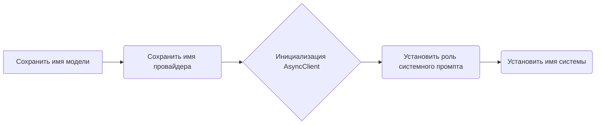
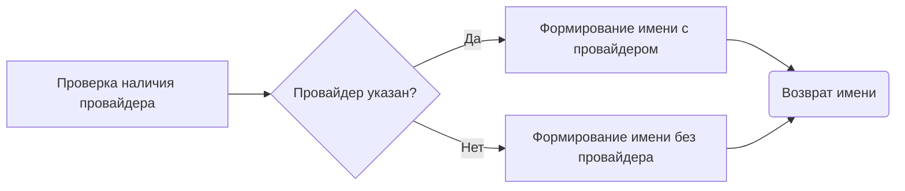
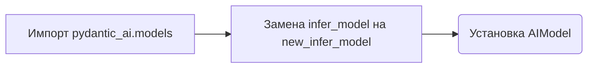

# Модуль интеграции pydantic_ai с g4f
## Обзор

Модуль предоставляет интеграцию между библиотекой `pydantic_ai` и API `g4f` (gpt4free). Он позволяет использовать модели, предоставляемые `g4f`, с помощью интерфейсов `pydantic_ai`. Это включает в себя определение класса `AIModel`, который расширяет возможности моделей `OpenAIModel` из `pydantic_ai`, а также функции для корректного определения и патчинга моделей.

## Подробнее

Данный код позволяет использовать модели `g4f` (GPT4Free) в экосистеме `pydantic_ai`. Он определяет класс `AIModel`, который наследуется от `OpenAIModel` и адаптирован для работы с асинхронным клиентом `g4f`. Также предоставляются функции `new_infer_model` и `patch_infer_model` для динамического определения и замены стандартных моделей `pydantic_ai` моделями, использующими `g4f`.
Код предназначен для упрощения использования моделей `g4f` с инструментами, разработанными для `pydantic_ai`.

## Классы

### `AIModel`

**Описание**: Класс `AIModel` представляет модель, которая использует API `G4F` (GPT4Free). Он наследуется от `OpenAIModel` и предназначен для интеграции с асинхронным клиентом.

**Наследует**:

- `OpenAIModel`: Предоставляет базовую функциональность для работы с моделями OpenAI.

**Атрибуты**:

- `client` (`AsyncClient`): Асинхронный клиент для взаимодействия с API `G4F`.
- `system_prompt_role` (`OpenAISystemPromptRole | None`): Роль системного запроса. Используется для определения роли системного сообщения. По умолчанию `None`.
- `_model_name` (`str`): Внутреннее имя модели.
- `_provider` (`str`): Внутреннее имя провайдера.
- `_system` (`Optional[str]`): Внутреннее представление имени системы.

**Методы**:

- `__init__`: Инициализирует экземпляр класса `AIModel`.
- `name`: Возвращает имя модели в формате `g4f:{provider}:{model_name}` или `g4f:{model_name}`, если провайдер не указан.

#### `__init__`
```python
def __init__(
        self,
        model_name: str,
        provider: str | None = None,
        *,
        system_prompt_role: OpenAISystemPromptRole | None = None,
        system: str | None = 'openai',
        **kwargs
    ):
        """Initialize an AI model.

        Args:
            model_name: The name of the AI model to use. List of model names available
                [here](https://github.com/openai/openai-python/blob/v1.54.3/src/openai/types/chat_model.py#L7)
                (Unfortunately, despite being ask to do so, OpenAI do not provide `.inv` files for their API).
            system_prompt_role: The role to use for the system prompt message. If not provided, defaults to `'system'`.
                In the future, this may be inferred from the model name.
            system: The model provider used, defaults to `openai`. This is for observability purposes, you must
                customize the `base_url` and `api_key` to use a different provider.
        """
        self._model_name = model_name
        self._provider = provider
        self.client = AsyncClient(provider=provider, **kwargs)
        self.system_prompt_role = system_prompt_role
        self._system = system
```

**Назначение**: Инициализирует объект `AIModel` с указанными параметрами.

**Параметры**:

- `model_name` (`str`): Имя используемой AI-модели.
- `provider` (`Optional[str]`, optional): Провайдер модели. По умолчанию `None`.
- `system_prompt_role` (`Optional[OpenAISystemPromptRole]`, optional): Роль системного промпта. Если не указана, используется `'system'`. По умолчанию `None`.
- `system` (`Optional[str]`, optional): Имя системы, предоставляющей модель. По умолчанию `'openai'`.
- `**kwargs`: Дополнительные аргументы, передаваемые асинхронному клиенту.

**Как работает функция**:

1.  Сохраняет имя модели в атрибуте `_model_name`.
2.  Сохраняет имя провайдера в атрибуте `_provider`.
3.  Инициализирует асинхронный клиент (`AsyncClient`) с указанным провайдером и дополнительными аргументами.
4.  Устанавливает роль системного промпта.
5.  Устанавливает имя системы.



#### `name`
```python
def name(self) -> str:
    if self._provider:
        return f'g4f:{self._provider}:{self._model_name}'
    return f'g4f:{self._model_name}'
```

**Назначение**: Возвращает имя модели.

**Возвращает**:

- `str`: Имя модели в формате `g4f:{provider}:{model_name}` или `g4f:{model_name}`, если провайдер не указан.

**Как работает функция**:

1.  Проверяет, указан ли провайдер (`self._provider`).
2.  Если провайдер указан, возвращает имя в формате `g4f:{self._provider}:{self._model_name}`.
3.  Если провайдер не указан, возвращает имя в формате `g4f:{self._model_name}`.



**Примеры**:

```python
from src.endpoints.gpt4free.g4f.integration.pydantic_ai import AIModel
from pydantic_ai.models.openai import OpenAISystemPromptRole

# Пример с указанием провайдера
model1 = AIModel(model_name='gpt-3.5-turbo', provider='openai')
print(model1.name())

# Пример без указания провайдера
model2 = AIModel(model_name='gpt-4')
print(model2.name())
```

## Функции

### `new_infer_model`
```python
def new_infer_model(model: Model | KnownModelName, api_key: str = None) -> Model:
    if isinstance(model, Model):
        return model
    if model.startswith("g4f:"):
        model = model[4:]
        if ":" in model:
            provider, model = model.split(":", 1)
            return AIModel(model, provider=provider, api_key=api_key)
        return AIModel(model)
    return infer_model(model)
```

**Назначение**: Определяет модель на основе её имени, поддерживая модели `g4f`.

**Параметры**:

- `model` (`Model | KnownModelName`): Модель или имя известной модели.
- `api_key` (`str`, optional): API-ключ. По умолчанию `None`.

**Возвращает**:

- `Model`: Экземпляр класса `Model` или `AIModel`.

**Как работает функция**:

1.  Проверяет, является ли входной параметр `model` экземпляром класса `Model`. Если да, возвращает его без изменений.
2.  Проверяет, начинается ли имя модели с префикса "g4f:".
3.  Если префикс "g4f:" присутствует, удаляет его и проверяет, содержит ли имя модели двоеточие.
4.  Если двоеточие есть, разделяет имя модели на провайдера и имя модели и возвращает экземпляр `AIModel` с указанными параметрами.
5.  Если двоеточия нет, возвращает экземпляр `AIModel` только с именем модели.
6.  Если имя модели не начинается с "g4f:", использует стандартную функцию `infer_model` для определения модели.

```mermaid
graph LR
A[Проверка типа model] --> B{model является Model?}
B -- Да --> C(Возврат model)
B -- Нет --> D[Проверка префикса "g4f:"]
D -- Да --> E(Удаление префикса)
E --> F{Содержит ":"?}
F -- Да --> G[Разделение на провайдера и имя]
G --> H(Создание AIModel с провайдером)
F -- Нет --> I(Создание AIModel без провайдера)
D -- Нет --> J{infer_model(model)}
H --> K(Возврат AIModel)
I --> K
J --> K
```

**Примеры**:

```python
from pydantic_ai.models import Model, KnownModelName
from src.endpoints.gpt4free.g4f.integration.pydantic_ai import new_infer_model

# Пример с g4f моделью и провайдером
model1: Model = new_infer_model("g4f:openai:gpt-3.5-turbo")
print(model1)

# Пример с g4f моделью без провайдера
model2: Model = new_infer_model("g4f:gpt-4")
print(model2)

# Пример с обычной моделью
model3: Model = new_infer_model("gpt-3.5-turbo")
print(model3)
```

### `patch_infer_model`
```python
def patch_infer_model(api_key: str | None = None):
    import pydantic_ai.models

    pydantic_ai.models.infer_model = partial(new_infer_model, api_key=api_key)
    pydantic_ai.models.AIModel = AIModel
```

**Назначение**: Заменяет стандартную функцию `infer_model` в модуле `pydantic_ai.models` на новую функцию `new_infer_model` и устанавливает `AIModel` в модуле `pydantic_ai.models`.

**Параметры**:

- `api_key` (`str | None`, optional): API-ключ. По умолчанию `None`.

**Как работает функция**:

1.  Импортирует модуль `pydantic_ai.models`.
2.  Заменяет функцию `infer_model` в модуле `pydantic_ai.models` на `new_infer_model` с использованием `partial`, передавая `api_key`.
3.  Устанавливает `AIModel` в модуле `pydantic_ai.models`.



**Примеры**:

```python
import pydantic_ai.models
from src.endpoints.gpt4free.g4f.integration.pydantic_ai import patch_infer_model, AIModel

# Патчим infer_model
patch_infer_model()

# Теперь pydantic_ai.models.infer_model использует new_infer_model
model = pydantic_ai.models.infer_model("g4f:gpt-3.5-turbo")
print(model)

# AIModel также доступен через pydantic_ai.models
print(pydantic_ai.models.AIModel)
```