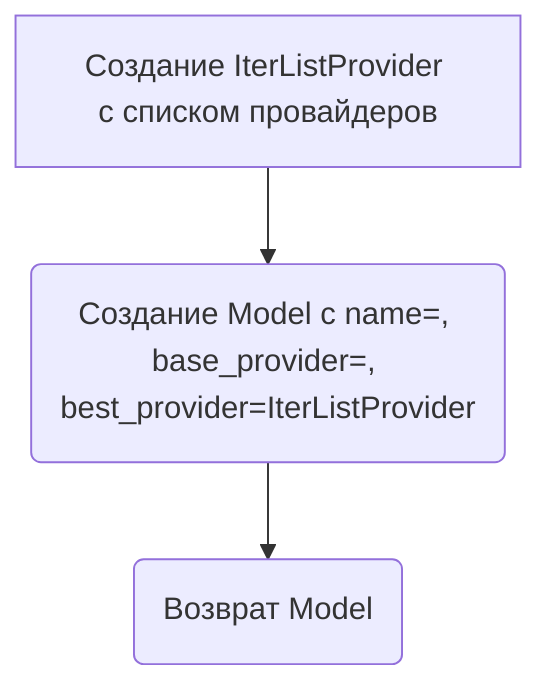
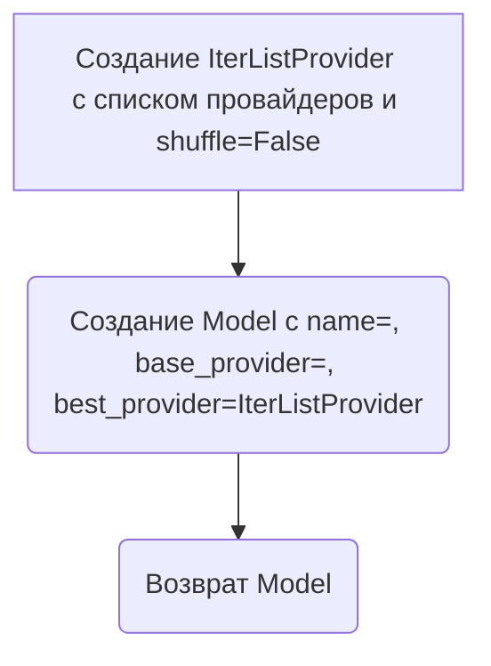

# Модуль для работы с моделями gpt4free
==========================================

Модуль содержит классы для представления и управления различными моделями машинного обучения, включая текстовые, аудио и визуальные модели.
Он также включает в себя утилиты для сопоставления строковых идентификаторов с экземплярами моделей и предоставляет список всех доступных моделей.

## Обзор

Этот модуль предназначен для централизованного управления и представления моделей, используемых в проекте `hypotez`.
Он определяет dataclass `Model`, который служит базовым классом для представления моделей машинного обучения.
Также определены подклассы `ImageModel`, `AudioModel` и `VisionModel` для представления моделей, специализирующихся на обработке изображений, аудио и видео, соответственно.

## Подробнее

Модуль предоставляет удобный способ организации и доступа к различным моделям машинного обучения, используемым в проекте `hypotez`.
Он позволяет легко добавлять новые модели и управлять ими, а также предоставляет централизованный способ получения информации о доступных моделях и их провайдерах.
Модуль также содержит утилиты для сопоставления строковых идентификаторов с экземплярами моделей, что упрощает использование моделей в коде.

## Классы

### `Model`

**Описание**: Представляет конфигурацию модели машинного обучения.

**Принцип работы**:
Класс `Model` является dataclass, который содержит информацию об имени модели, базовом провайдере и предпочтительном провайдере.
Он также предоставляет статический метод `__all__()`, который возвращает список всех имен моделей.

**Атрибуты**:
- `name` (str): Имя модели.
- `base_provider` (str): Базовый провайдер для модели.
- `best_provider` (ProviderType): Предпочтительный провайдер для модели, обычно с логикой повторных попыток.

**Методы**:
- `__all__()`: Возвращает список всех имен моделей.

### `ImageModel`

**Описание**: Представляет модель машинного обучения для обработки изображений.

**Принцип работы**:
Класс `ImageModel` наследуется от класса `Model` и представляет модель машинного обучения, специализирующуюся на обработке изображений.

### `AudioModel`

**Описание**: Представляет модель машинного обучения для обработки аудио.

**Принцип работы**:
Класс `AudioModel` наследуется от класса `Model` и представляет модель машинного обучения, специализирующуюся на обработке аудио.

### `VisionModel`

**Описание**: Представляет модель машинного обучения для обработки видео.

**Принцип работы**:
Класс `VisionModel` наследуется от класса `Model` и представляет модель машинного обучения, специализирующуюся на обработке видео.

### `ModelUtils`

**Описание**: Утилитный класс для сопоставления строковых идентификаторов с экземплярами `Model`.

**Принцип работы**:
Класс `ModelUtils` содержит словарь `convert`, который отображает строковые идентификаторы моделей на соответствующие экземпляры `Model`.
Это позволяет легко получать доступ к моделям по их имени.

**Атрибуты**:
- `convert` (dict[str, Model]): Словарь, отображающий строковые идентификаторы моделей на экземпляры `Model`.

## Функции

### `default`

```python
default = Model(
    name = "",
    base_provider = "",
    best_provider = IterListProvider([
        DDG,
        Blackbox,
        Copilot,
        DeepInfraChat,
        AllenAI,
        PollinationsAI,
        TypeGPT,
        OIVSCode,
        ChatGptEs,
        Free2GPT,
        FreeGpt,
        Glider,
        Dynaspark,
        OpenaiChat,
        Jmuz,
        Cloudflare,
    ])
)
```

**Назначение**: Создает модель по умолчанию с пустым именем и списком предпочитаемых провайдеров.

**Параметры**:
- `name` (str): Пустая строка.
- `base_provider` (str): Пустая строка.
- `best_provider` (IterListProvider): Экземпляр `IterListProvider`, содержащий список предпочитаемых провайдеров.

**Возвращает**:
- `Model`: Объект `Model` с указанными параметрами.

**Как работает функция**:

Функция `default` создает экземпляр класса `Model` с заданными параметрами:

1.  **Создание экземпляра IterListProvider**: Создается объект `IterListProvider`, который принимает список провайдеров: `DDG`, `Blackbox`, `Copilot`, `DeepInfraChat`, `AllenAI`, `PollinationsAI`, `TypeGPT`, `OIVSCode`, `ChatGptEs`, `Free2GPT`, `FreeGpt`, `Glider`, `Dynaspark`, `OpenaiChat`, `Jmuz`, `Cloudflare`. `IterListProvider` позволяет итерироваться по этому списку провайдеров, пока не будет найден рабочий.
2.  **Создание экземпляра Model**: Создается экземпляр класса `Model` с именем `""`, базовым провайдером `""` и `best_provider`, установленным как созданный `IterListProvider`.



**Примеры**:

```python
from .Provider import IterListProvider, DDG, Blackbox, Copilot, DeepInfraChat, AllenAI, PollinationsAI, TypeGPT, OIVSCode, ChatGptEs, Free2GPT, FreeGpt, Glider, Dynaspark, OpenaiChat, Jmuz, Cloudflare
from .Provider import IterListProvider
from dataclasses import dataclass
@dataclass(unsafe_hash=True)
class Model:
    name: str
    base_provider: str
from typing import List

class ProviderType:
    pass

class IterListProvider(ProviderType):
  def __init__(self, providers: List[ProviderType]):
    self.providers = providers
    self.working = True

class DDG(ProviderType):
  working = True
class Blackbox(ProviderType):
  working = True
class Copilot(ProviderType):
  working = True
class DeepInfraChat(ProviderType):
  working = True
class AllenAI(ProviderType):
  working = True
class PollinationsAI(ProviderType):
  working = True
class TypeGPT(ProviderType):
  working = True
class OIVSCode(ProviderType):
  working = True
class ChatGptEs(ProviderType):
  working = True
class Free2GPT(ProviderType):
  working = True
class FreeGpt(ProviderType):
  working = True
class Glider(ProviderType):
  working = True
class Dynaspark(ProviderType):
  working = True
class OpenaiChat(ProviderType):
  working = True
class Jmuz(ProviderType):
  working = True
class Cloudflare(ProviderType):
  working = True

default_model = Model(
    name = "",
    base_provider = "",
    best_provider = IterListProvider([
        DDG(),
        Blackbox(),
        Copilot(),
        DeepInfraChat(),
        AllenAI(),
        PollinationsAI(),
        TypeGPT(),
        OIVSCode(),
        ChatGptEs(),
        Free2GPT(),
        FreeGpt(),
        Glider(),
        Dynaspark(),
        OpenaiChat(),
        Jmuz(),
        Cloudflare(),
    ])
)

print(default_model)
# Model(name='', base_provider='', best_provider=<__main__.IterListProvider object at 0x7f2a5b5b7d90>)
```

### `default_vision`

```python
default_vision = Model(
    name = "",
    base_provider = "",
    best_provider = IterListProvider([
        Blackbox,
        OIVSCode,
        TypeGPT,
        DeepInfraChat,
        PollinationsAI,
        Dynaspark,
        HuggingSpace,
        GeminiPro,
        HuggingFaceAPI,
        CopilotAccount,
        OpenaiAccount,
        Gemini,
    ], shuffle=False)
)
```

**Назначение**: Создает модель визуализации по умолчанию с пустым именем и списком предпочитаемых провайдеров.

**Параметры**:
- `name` (str): Пустая строка.
- `base_provider` (str): Пустая строка.
- `best_provider` (IterListProvider): Экземпляр `IterListProvider`, содержащий список предпочитаемых провайдеров.

**Возвращает**:
- `Model`: Объект `Model` с указанными параметрами.

**Как работает функция**:

Функция `default_vision` создает экземпляр класса `Model` с заданными параметрами:

1.  **Создание экземпляра IterListProvider**: Создается объект `IterListProvider`, который принимает список провайдеров: `Blackbox`, `OIVSCode`, `TypeGPT`, `DeepInfraChat`, `PollinationsAI`, `Dynaspark`, `HuggingSpace`, `GeminiPro`, `HuggingFaceAPI`, `CopilotAccount`, `OpenaiAccount`, `Gemini`. Параметр `shuffle` установлен в `False`, что означает, что провайдеры не будут перемешиваться.
2.  **Создание экземпляра Model**: Создается экземпляр класса `Model` с именем `""`, базовым провайдером `""` и `best_provider`, установленным как созданный `IterListProvider`.



**Примеры**:

```python
from .Provider import IterListProvider, Blackbox, OIVSCode, TypeGPT, DeepInfraChat, PollinationsAI, Dynaspark, HuggingSpace, GeminiPro, HuggingFaceAPI, CopilotAccount, OpenaiAccount, Gemini
from .Provider import IterListProvider
from dataclasses import dataclass
@dataclass(unsafe_hash=True)
class Model:
    name: str
    base_provider: str
from typing import List

class ProviderType:
    pass

class IterListProvider(ProviderType):
  def __init__(self, providers: List[ProviderType], shuffle: bool = False):
    self.providers = providers
    self.working = True

class Blackbox(ProviderType):
  working = True
class OIVSCode(ProviderType):
  working = True
class TypeGPT(ProviderType):
  working = True
class DeepInfraChat(ProviderType):
  working = True
class PollinationsAI(ProviderType):
  working = True
class Dynaspark(ProviderType):
  working = True
class HuggingSpace(ProviderType):
  working = True
class GeminiPro(ProviderType):
  working = True
class HuggingFaceAPI(ProviderType):
  working = True
class CopilotAccount(ProviderType):
  working = True
class OpenaiAccount(ProviderType):
  working = True
class Gemini(ProviderType):
  working = True

default_vision_model = Model(
    name = "",
    base_provider = "",
    best_provider = IterListProvider([
        Blackbox(),
        OIVSCode(),
        TypeGPT(),
        DeepInfraChat(),
        PollinationsAI(),
        Dynaspark(),
        HuggingSpace(),
        GeminiPro(),
        HuggingFaceAPI(),
        CopilotAccount(),
        OpenaiAccount(),
        Gemini(),
    ], shuffle=False)
)

print(default_vision_model)
# Model(name='', base_provider='', best_provider=<__main__.IterListProvider object at 0x7f2a5b5b7d90>)
```

## Переменные

### `gpt_3_5_turbo`

```python
gpt_3_5_turbo = Model(
    name          = \'gpt-3.5-turbo\',\n
    base_provider = \'OpenAI\'
)
```

**Описание**: Определяет модель `gpt-3.5-turbo` с базовым провайдером `OpenAI`.

### `gpt_4`

```python
gpt_4 = Model(
    name          = \'gpt-4\',\n
    base_provider = \'OpenAI\',\n
    best_provider = IterListProvider([DDG, Jmuz, ChatGptEs, PollinationsAI, Yqcloud, Goabror, Copilot, OpenaiChat, Liaobots])\n
)
```

**Описание**: Определяет модель `gpt-4` с базовым провайдером `OpenAI` и списком предпочитаемых провайдеров.

### `gpt_4o`

```python
gpt_4o = VisionModel(
    name          = \'gpt-4o\',\n
    base_provider = \'OpenAI\',\n
    best_provider = IterListProvider([Blackbox, Jmuz, ChatGptEs, PollinationsAI, Liaobots, OpenaiChat])\n
)
```

**Описание**: Определяет визуальную модель `gpt-4o` с базовым провайдером `OpenAI` и списком предпочитаемых провайдеров.

### `gpt_4o_mini`

```python
gpt_4o_mini = Model(
    name          = \'gpt-4o-mini\',\n
    base_provider = \'OpenAI\',\n
    best_provider = IterListProvider([DDG, Blackbox, ChatGptEs, TypeGPT, PollinationsAI, OIVSCode, Liaobots, Jmuz, OpenaiChat])\n
)
```

**Описание**: Определяет модель `gpt-4o-mini` с базовым провайдером `OpenAI` и списком предпочитаемых провайдеров.

### `gpt_4o_audio`

```python
gpt_4o_audio = AudioModel(
    name          = \'gpt-4o-audio\',\n
    base_provider = \'OpenAI\',\n
    best_provider = PollinationsAI\n
)
```

**Описание**: Определяет аудио модель `gpt-4o-audio` с базовым провайдером `OpenAI` и предпочитаемым провайдером `PollinationsAI`.

### `o1`

```python
o1 = Model(
    name          = \'o1\',\n
    base_provider = \'OpenAI\',\n
    best_provider = IterListProvider([Blackbox, Copilot, OpenaiAccount])\n
)
```

**Описание**: Определяет модель `o1` с базовым провайдером `OpenAI` и списком предпочитаемых провайдеров.

### `o1_mini`

```python
o1_mini = Model(
    name          = \'o1-mini\',\n
    base_provider = \'OpenAI\',\n
    best_provider = OpenaiAccount\n
)
```

**Описание**: Определяет модель `o1-mini` с базовым провайдером `OpenAI` и предпочитаемым провайдером `OpenaiAccount`.

### `o3_mini`

```python
o3_mini = Model(
    name          = \'o3-mini\',\n
    base_provider = \'OpenAI\',\n
    best_provider = IterListProvider([DDG, Blackbox, PollinationsAI, Liaobots])\n
)
```

**Описание**: Определяет модель `o3-mini` с базовым провайдером `OpenAI` и списком предпочитаемых провайдеров.

### `gigachat`

```python
gigachat = Model(
    name          = \'GigaChat:latest\',\n
    base_provider = \'gigachat\',\n
    best_provider = GigaChat\n
)
```

**Описание**: Определяет модель `GigaChat:latest` с базовым провайдером `gigachat` и предпочитаемым провайдером `GigaChat`.

### `meta`

```python
meta = Model(
    name          = "meta-ai",
    base_provider = "Meta",
    best_provider = MetaAI
)
```

**Описание**: Определяет модель `meta-ai` с базовым провайдером `Meta` и предпочитаемым провайдером `MetaAI`.

### `llama_2_7b`

```python
llama_2_7b = Model(
    name          = "llama-2-7b",
    base_provider = "Meta Llama",
    best_provider = Cloudflare
)
```

**Описание**: Определяет модель `llama-2-7b` с базовым провайдером `Meta Llama` и предпочитаемым провайдером `Cloudflare`.

### `llama_3_8b`

```python
llama_3_8b = Model(
    name          = "llama-3-8b",
    base_provider = "Meta Llama",
    best_provider = IterListProvider([Jmuz, Cloudflare])
)
```

**Описание**: Определяет модель `llama-3-8b` с базовым провайдером `Meta Llama` и списком предпочитаемых провайдеров.

### `llama_3_70b`

```python
llama_3_70b = Model(
    name          = "llama-3-70b",
    base_provider = "Meta Llama",
    best_provider = Jmuz
)
```

**Описание**: Определяет модель `llama-3-70b` с базовым провайдером `Meta Llama` и предпочитаемым провайдером `Jmuz`.

### `llama_3_1_8b`

```python
llama_3_1_8b = Model(
    name          = "llama-3.1-8b",
    base_provider = "Meta Llama",
    best_provider = IterListProvider([DeepInfraChat, Glider, PollinationsAI, AllenAI, Jmuz, Cloudflare])
)
```

**Описание**: Определяет модель `llama-3.1-8b` с базовым провайдером `Meta Llama` и списком предпочитаемых провайдеров.

### `llama_3_1_70b`

```python
llama_3_1_70b = Model(
    name          = "llama-3.1-70b",
    base_provider = "Meta Llama",
    best_provider = IterListProvider([Glider, AllenAI, Jmuz])
)
```

**Описание**: Определяет модель `llama-3.1-70b` с базовым провайдером `Meta Llama` и списком предпочитаемых провайдеров.

### `llama_3_1_405b`

```python
llama_3_1_405b = Model(
    name          = "llama-3.1-405b",
    base_provider = "Meta Llama",
    best_provider = IterListProvider([AllenAI, Jmuz])
)
```

**Описание**: Определяет модель `llama-3.1-405b` с базовым провайдером `Meta Llama` и списком предпочитаемых провайдеров.

### `llama_3_2_1b`

```python
llama_3_2_1b = Model(
    name          = "llama-3.2-1b",
    base_provider = "Meta Llama",
    best_provider = Cloudflare
)
```

**Описание**: Определяет модель `llama-3.2-1b` с базовым провайдером `Meta Llama` и предпочитаемым провайдером `Cloudflare`.

### `llama_3_2_3b`

```python
llama_3_2_3b = Model(
    name          = "llama-3.2-3b",
    base_provider = "Meta Llama",
    best_provider = Glider
)
```

**Описание**: Определяет модель `llama-3.2-3b` с базовым провайдером `Meta Llama` и предпочитаемым провайдером `Glider`.

### `llama_3_2_11b`

```python
llama_3_2_11b = VisionModel(
    name          = "llama-3.2-11b",
    base_provider = "Meta Llama",
    best_provider = IterListProvider([Jmuz, HuggingChat, HuggingFace])
)
```

**Описание**: Определяет визуальную модель `llama-3.2-11b` с базовым провайдером `Meta Llama` и списком предпочитаемых провайдеров.

### `llama_3_2_90b`

```python
llama_3_2_90b = Model(
    name          = "llama-3.2-90b",
    base_provider = "Meta Llama",
    best_provider = IterListProvider([DeepInfraChat, Jmuz])
)
```

**Описание**: Определяет модель `llama-3.2-90b` с базовым провайдером `Meta Llama` и списком предпочитаемых провайдеров.

### `llama_3_3_70b`

```python
llama_3_3_70b = Model(
    name          = "llama-3.3-70b",
    base_provider = "Meta Llama",
    best_provider = IterListProvider([DDG, DeepInfraChat, LambdaChat, PollinationsAI, Jmuz, HuggingChat, HuggingFace])
)
```

**Описание**: Определяет модель `llama-3.3-70b` с базовым провайдером `Meta Llama` и списком предпочитаемых провайдеров.

### `mixtral_8x7b`

```python
mixtral_8x7b = Model(
    name          = "mixtral-8x7b",
    base_provider = "Mistral",
    best_provider = Jmuz
)
```

**Описание**: Определяет модель `mixtral-8x7b` с базовым провайдером `Mistral` и предпочитаемым провайдером `Jmuz`.

### `mixtral_8x22b`

```python
mixtral_8x22b = Model(
    name          = "mixtral-8x22b",
    base_provider = "Mistral",
    best_provider = DeepInfraChat
)
```

**Описание**: Определяет модель `mixtral-8x22b` с базовым провайдером `Mistral` и предпочитаемым провайдером `DeepInfraChat`.

### `mistral_nemo`

```python
mistral_nemo = Model(
    name          = "mistral-nemo",
    base_provider = "Mistral",
    best_provider = IterListProvider([PollinationsAI, HuggingChat, HuggingFace])
)
```

**Описание**: Определяет модель `mistral-nemo` с базовым провайдером `Mistral` и списком предпочитаемых провайдеров.

### `mixtral_small_24b`

```python
mixtral_small_24b = Model(
    name          = "mixtral-small-24b",
    base_provider = "Mistral",
    best_provider = IterListProvider([DDG, DeepInfraChat])
)
```

**Описание**: Определяет модель `mixtral-small-24b` с базовым провайдером `Mistral` и списком предпочитаемых провайдеров.

### `hermes_3`

```python
hermes_3 = Model(
    name          = "hermes-3",
    base_provider = "NousResearch",
    best_provider = LambdaChat
)
```

**Описание**: Определяет модель `hermes-3` с базовым провайдером `NousResearch` и предпочитаемым провайдером `LambdaChat`.

### `phi_3_5_mini`

```python
phi_3_5_mini = Model(
    name          = "phi-3.5-mini",
    base_provider = "Microsoft",
    best_provider = HuggingChat
)
```

**Описание**: Определяет модель `phi-3.5-mini` с базовым провайдером `Microsoft` и предпочитаемым провайдером `HuggingChat`.

### `phi_4`

```python
phi_4 = Model(
    name          = "phi-4",
    base_provider = "Microsoft",
    best_provider = IterListProvider([DeepInfraChat, PollinationsAI, HuggingSpace])
)
```

**Описание**: Определяет модель `phi-4` с базовым провайдером `Microsoft` и списком предпочитаемых провайдеров.

### `wizardlm_2_7b`

```python
wizardlm_2_7b = Model(
    name = \'wizardlm-2-7b\',\n
    base_provider = \'Microsoft\',\n
    best_provider = DeepInfraChat
)
```

**Описание**: Определяет модель `wizardlm-2-7b` с базовым провайдером `Microsoft` и предпочитаемым провайдером `DeepInfraChat`.

### `wizardlm_2_8x22b`

```python
wizardlm_2_8x22b = Model(
    name = \'wizardlm-2-8x22b\',\n
    base_provider = \'Microsoft\',\n
    best_provider = IterListProvider([DeepInfraChat, Jmuz])
)
```

**Описание**: Определяет модель `wizardlm-2-8x22b` с базовым провайдером `Microsoft` и списком предпочитаемых провайдеров.

### `gemini`

```python
gemini = Model(
    name          = \'gemini-2.0\',\n
    base_provider = \'Google\',\n
    best_provider = Gemini
)
```

**Описание**: Определяет модель `gemini-2.0` с базовым провайдером `Google` и предпочитаемым провайдером `Gemini`.

### `gemini_exp`

```python
gemini_exp = Model(
    name          = \'gemini-exp\',\n
    base_provider = \'Google\',\n
    best_provider = Jmuz
)
```

**Описание**: Определяет модель `gemini-exp` с базовым провайдером `Google` и предпочитаемым провайдером `Jmuz`.

### `gemini_1_5_flash`

```python
gemini_1_5_flash = Model(
    name          = \'gemini-1.5-flash\',\n
    base_provider = \'Google DeepMind\',\n
    best_provider = IterListProvider([Free2GPT, FreeGpt, TeachAnything, Websim, Dynaspark, Jmuz, GeminiPro])
)
```

**Описание**: Определяет модель `gemini-1.5-flash` с базовым провайдером `Google DeepMind` и списком предпочитаемых провайдеров.

### `gemini_1_5_pro`

```python
gemini_1_5_pro = Model(
    name          = \'gemini-1.5-pro\',\n
    base_provider = \'Google DeepMind\',\n
    best_provider = IterListProvider([Free2GPT, FreeGpt, TeachAnything, Websim, Jmuz, GeminiPro])
)
```

**Описание**: Определяет модель `gemini-1.5-pro` с базовым провайдером `Google DeepMind` и списком предпочитаемых провайдеров.

### `gemini_2_0_flash`

```python
gemini_2_0_flash = Model(
    name          = \'gemini-2.0-flash\',\n
    base_provider = \'Google DeepMind\',\n
    best_provider = IterListProvider([Dynaspark, GeminiPro, Gemini])
)
```

**Описание**: Определяет модель `gemini-2.0-flash` с базовым провайдером `Google DeepMind` и списком предпочитаемых провайдеров.

### `gemini_2_0_flash_thinking`

```python
gemini_2_0_flash_thinking = Model(
    name          = \'gemini-2.0-flash-thinking\',\n
    base_provider = \'Google DeepMind\',\n
    best_provider = Gemini
)
```

**Описание**: Определяет модель `gemini-2.0-flash-thinking` с базовым провайдером `Google DeepMind` и предпочитаемым провайдером `Gemini`.

### `gemini_2_0_flash_thinking_with_apps`

```python
gemini_2_0_flash_thinking_with_apps = Model(
    name          = \'gemini-2.0-flash-thinking-with-apps\',\n
    base_provider = \'Google DeepMind\',\n
    best_provider = Gemini
)
```

**Описание**: Определяет модель `gemini-2.0-flash-thinking-with-apps` с базовым провайдером `Google DeepMind` и предпочитаемым провайдером `Gemini`.

### `claude_3_haiku`

```python
claude_3_haiku = Model(
    name          = \'claude-3-haiku\',\n
    base_provider = \'Anthropic\',\n
    best_provider = IterListProvider([DDG, Jmuz])
)
```

**Описание**: Определяет модель `claude-3-haiku` с базовым провайдером `Anthropic` и списком предпочитаемых провайдеров.

### `claude_3_5_sonnet`

```python
claude_3_5_sonnet = Model(
    name          = \'claude-3.5-sonnet\',\n
    base_provider = \'Anthropic\',\n
    best_provider = IterListProvider([Jmuz, Liaobots])
)
```

**Описание**: Определяет модель `claude-3.5-sonnet` с базовым провайдером `Anthropic` и списком предпочитаемых провайдеров.

### `claude_3_7_sonnet`

```python
claude_3_7_sonnet = Model(
    name          = \'claude-3.7-sonnet\',\n
    base_provider = \'Anthropic\',\n
    best_provider = IterListProvider([Blackbox, Liaobots])
)
```

**Описание**: Определяет модель `claude-3.7-sonnet` с базовым провайдером `Anthropic` и списком предпочитаемых провайдеров.

### `reka_core`

```python
reka_core = Model(
    name = \'reka-core\',\n
    base_provider = \'Reka AI\',\n
    best_provider = Reka
)
```

**Описание**: Определяет модель `reka-core` с базовым провайдером `Reka AI` и предпочитаемым провайдером `Reka`.

### `blackboxai`

```python
blackboxai = Model(
    name = \'blackboxai\',\n
    base_provider = \'Blackbox AI\',\n
    best_provider = Blackbox
)
```

**Описание**: Определяет модель `blackboxai` с базовым провайдером `Blackbox AI` и предпочитаемым провайдером `Blackbox`.

### `blackboxai_pro`

```python
blackboxai_pro = Model(
    name = \'blackboxai-pro\',\n
    base_provider = \'Blackbox AI\',\n
    best_provider = Blackbox
)
```

**Описание**: Определяет модель `blackboxai-pro` с базовым провайдером `Blackbox AI` и предпочитаемым провайдером `Blackbox`.

### `command_r`

```python
command_r = Model(
    name = \'command-r\',\n
    base_provider = \'CohereForAI\',\n
    best_provider = HuggingSpace
)
```

**Описание**: Определяет модель `command-r` с базовым провайдером `CohereForAI` и предпочитаемым провайдером `HuggingSpace`.

### `command_r_plus`

```python
command_r_plus = Model(
    name = \'command-r-plus\',\n
    base_provider = \'CohereForAI\',\n
    best_provider = IterListProvider([HuggingSpace, HuggingChat])
)
```

**Описание**: Определяет модель `command-r-plus` с базовым провайдером `CohereForAI` и списком предпочитаемых провайдеров.

### `command_r7b`

```python
command_r7b = Model(
    name = \'command-r7b\',\n
    base_provider = \'CohereForAI\',\n
    best_provider = HuggingSpace
)
```

**Описание**: Определяет модель `command-r7b` с базовым провайдером `CohereForAI` и предпочитаемым провайдером `HuggingSpace`.

### `command_a`

```python
command_a = Model(
    name = \'command-a\',\n
    base_provider = \'CohereForAI\',\n
    best_provider = HuggingSpace
)
```

**Описание**: Определяет модель `command-a` с базовым провайдером `CohereForAI` и предпочитаемым провайдером `HuggingSpace`.

### `qwen_1_5_7b`

```python
qwen_1_5_7b = Model(
    name = \'qwen-1.5-7b\',\n
    base_provider = \'Qwen\',\n
    best_provider = Cloudflare
)
```

**Описание**: Определяет модель `qwen-1.5-7b` с базовым провайдером `Qwen` и предпочитаемым провайдером `Cloudflare`.

### `qwen_2_72b`

```python
qwen_2_72b = Model(
    name = \'qwen-2-72b\',\n
    base_provider = \'Qwen\',\n
    best_provider = IterListProvider([DeepInfraChat, HuggingSpace])
)
```

**Описание**: Определяет модель `qwen-2-72b` с базовым провайдером `Qwen` и списком предпочитаемых провайдеров.

### `qwen_2_vl_7b`

```python
qwen_2_vl_7b = VisionModel(
    name = "qwen-2-vl-7b",
    base_provider = \'Qwen\',\n
    best_provider = HuggingFaceAPI
)
```

**Описание**: Определяет визуальную модель `qwen-2-vl-7b` с базовым провайдером `Qwen` и предпочитаемым провайдером `HuggingFaceAPI`.

### `qwen_2_5`

```python
qwen_2_5 = Model(