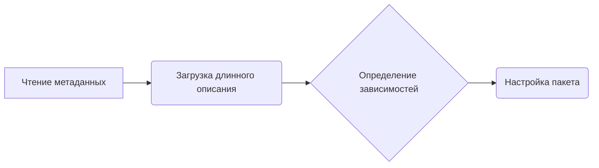

# Модуль настройки `setup.py`

## Обзор

Этот модуль используется для настройки и установки пакета `g4f` (gpt4free). Он определяет метаданные пакета, зависимости и точки входа.

## Подробнее

Модуль `setup.py` является стандартным файлом для дистрибуции Python-пакетов. Он содержит информацию о пакете, такую как имя, версия, автор, описание, зависимости и другие метаданные. Этот файл используется утилитой `setuptools` для сборки, установки и публикации пакета.

В данном случае, `setup.py` определяет пакет `g4f`, его зависимости, дополнительные требования и точки входа. Он также включает длинное описание из файла `README.md`, что обеспечивает подробную информацию о проекте при установке.

## Функции

### `setup`

```python
setup(
    name='g4f',
    version=os.environ.get("G4F_VERSION"),
    author='Tekky',
    author_email='<support@g4f.ai>',
    description=DESCRIPTION,
    long_description_content_type='text/markdown',
    long_description=long_description,
    packages=find_packages(),
    package_data={
        'g4f': ['g4f/interference/*', 'g4f/gui/client/*', 'g4f/gui/server/*', 'g4f/Provider/npm/*', 'g4f/local/models/*']
    },
    include_package_data=True,
    install_requires=INSTALL_REQUIRE,
    extras_require=EXTRA_REQUIRE,
    entry_points={
        'console_scripts': ['g4f=g4f.cli:main'],
    },
    url='https://github.com/xtekky/gpt4free',  # Link to your GitHub repository
    project_urls={
        'Source Code': 'https://github.com/xtekky/gpt4free',  # GitHub link
        'Bug Tracker': 'https://github.com/xtekky/gpt4free/issues',  # Link to issue tracker
    },
    keywords=[
        'python',
        'chatbot',
        'reverse-engineering',
        'openai',
        'chatbots',
        'gpt',
        'language-model',
        'gpt-3',
        'gpt3',
        'openai-api',
        'gpt-4',
        'gpt4',
        'chatgpt',
        'chatgpt-api',
        'openai-chatgpt',
        'chatgpt-free',
        'chatgpt-4',
        'chatgpt4',
        'chatgpt4-api',
        'free',
        'free-gpt',
        'gpt4free',
        'g4f',
    ],
    classifiers=[
        'Development Status :: 2 - Pre-Alpha',
        'Intended Audience :: Developers',
        'Programming Language :: Python :: 3',
        'Operating System :: Unix',
        'Operating System :: MacOS :: MacOS X',
        'Operating System :: Microsoft :: Windows',
    ],
)
```

**Назначение**:
Настраивает и устанавливает пакет `g4f`.

**Параметры**:
- `name` (str): Имя пакета (`g4f`).
- `version` (str): Версия пакета, полученная из переменной окружения `G4F_VERSION`.
- `author` (str): Автор пакета (`Tekky`).
- `author_email` (str): Электронная почта автора (`<support@g4f.ai>`).
- `description` (str): Краткое описание пакета.
- `long_description_content_type` (str): Тип содержимого длинного описания (`text/markdown`).
- `long_description` (str): Длинное описание пакета, загруженное из файла `README.md`.
- `packages` (list): Список пакетов, найденных с помощью `find_packages()`.
- `package_data` (dict): Дополнительные файлы, включаемые в пакет.
- `include_package_data` (bool): Флаг, указывающий, нужно ли включать данные пакета.
- `install_requires` (list): Список обязательных зависимостей пакета.
- `extras_require` (dict): Словарь дополнительных зависимостей пакета, разделенных по категориям.
- `entry_points` (dict): Словарь точек входа, определяющих скрипты командной строки.
- `url` (str): URL репозитория GitHub.
- `project_urls` (dict): Словарь URL проекта, включая ссылку на исходный код и трекер ошибок.
- `keywords` (list): Список ключевых слов, связанных с пакетом.
- `classifiers` (list): Список классификаторов, описывающих пакет.

**Возвращает**:
- `None`

**Вызывает исключения**:
- `None`

**Как работает функция**:

1. **Чтение метаданных**: Загружает метаданные пакета, такие как имя, версия, автор и описание.
2. **Загрузка длинного описания**: Читает длинное описание из файла `README.md` и заменяет ссылки на изображения и документацию GitHub.
3. **Определение зависимостей**: Указывает обязательные и дополнительные зависимости пакета.
4. **Настройка пакета**: Вызывает функцию `setup` из `setuptools` с переданными параметрами для настройки и установки пакета.



**Примеры**:

```python
# Пример вызова setup с минимальным набором параметров
setup(
    name='g4f',
    version='1.0.0',
    packages=find_packages(),
)

# Пример вызова setup с полным набором параметров
setup(
    name='g4f',
    version='1.0.0',
    author='Tekky',
    author_email='<support@g4f.ai>',
    description='The official gpt4free repository',
    long_description_content_type='text/markdown',
    long_description='Подробное описание пакета...',
    packages=find_packages(),
    install_requires=['requests', 'aiohttp'],
    extras_require={'dev': ['pytest', 'flake8']},
    entry_points={'console_scripts': ['g4f=g4f.cli:main']},
    url='https://github.com/xtekky/gpt4free',
    classifiers=[
        'Development Status :: 3 - Alpha',
        'Intended Audience :: Developers',
        'Programming Language :: Python :: 3',
    ],
)