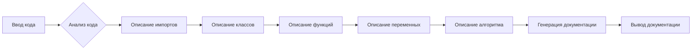
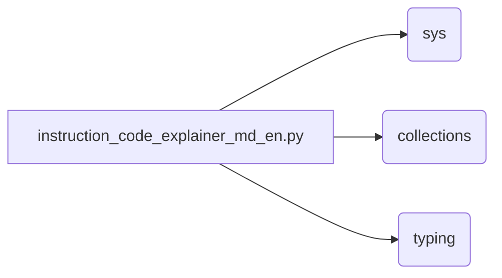

# Документация для instruction_code_explainer_md_en.py

## Обзор

Этот модуль предоставляет инструкцию для анализа Python-кода и генерации документации в формате Markdown. Инструкция описывает шаги по анализу кода, включая представление кода, описание алгоритма в виде блок-схемы, диаграмму зависимостей в формате mermaid, объяснение импортов, классов, функций, переменных и потенциальных ошибок.

## Алгоритм

**Шаг 1: Чтение кода**

Ввод: Текст Python-кода.
Вывод: Код в формате строки.
Пример:

```python
def my_function(x):
    return x * 2
```

**Шаг 2: Анализ кода**

Ввод: Считанный код.
Вывод: Разбор кода, включая импорты, классы, функции и переменные.
Пример:

```python
# Импорты: collections, sys, typing
class MyClass:
    pass
def my_function(x):
    pass
```


**Шаг 3: Описание алгоритма**

Ввод: Разбор кода.
Вывод: Подробное описание алгоритма в виде блок-схемы.
Пример:




**Шаг 4: Генерация документации**

Ввод: Разбор кода, описание алгоритма и переменных.
Вывод: Документация в формате Markdown.

## Диаграмма зависимостей (Mermaid)



**Описание зависимостей:**

* `sys`: Модуль `sys` предоставляет доступ к интерпретатору Python, например, для работы с аргументами командной строки.
* `collections`: Модуль `collections` предоставляет специализированные типы данных.
* `typing`: Модуль `typing` предоставляет средства для статической типизации Python.

## Объяснения

**Импорты:**

* `sys`, `collections`, `typing`: Эти модули используются для работы с кодом, анализа его структуры и для статической типизации.

**Классы:**

* Модуль, вероятно, не содержит классов, но если они будут присутствовать, будет указано их назначение и методы.

**Функции:**

* Модуль, вероятно, не содержит функций, но если они будут присутствовать, будет указано их назначение, параметры, возвращаемое значение и потенциальные исключения.

**Переменные:**

* Модуль, вероятно, не содержит переменных, но если они будут присутствовать, будет указано их тип и предназначение.

**Потенциальные ошибки:**

* Необходимость четкого определения структуры, формата и правил для анализа кода.  Возможные проблемы: неточный или неполный анализ кода; некорректная генерация документации.

**Связь с другими частями проекта:**

* Данный модуль предназначен для работы с кодом, и как часть проекта, он связан с другими модулями, которые используют или генерируют Python-код.  Без конкретного контекста проекта, сложно определить такие связи.


## Функции

Этот модуль не содержит функций в текущем виде.