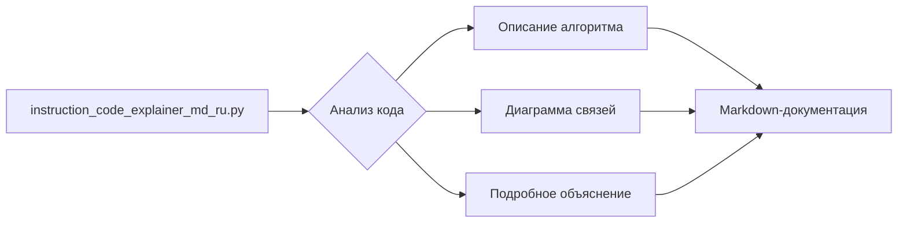

# Документация к файлу instruction_code_explainer_md_ru.py

## Обзор

Данный файл содержит инструкцию для анализа и документирования Python-кода. Инструкция описывает шаги, которые необходимо выполнить для создания подробной документации в формате Markdown, включая описание алгоритма, диаграммы связей, объяснение импортов, классов, функций и переменных.

## Алгоритм

Инструкция описывает пошаговый алгоритм анализа кода и генерации документации.  В данном файле нет конкретного Python кода, поэтому алгоритм описан теоретически.

### Этапы анализа:

1. **Чтение кода:** Программа считывает входной Python-код.
2. **Анализ кода:** Программа анализирует структуру кода, идентифицирует импорты, классы, функции, переменные.
3. **Генерация описания алгоритма (алгоритм):** Составляется описание алгоритма в текстовом формате с использованием блок-схем и примеров.
4. **Генерация диаграммы зависимостей (mermaid):** Строится диаграмма связей между модулями и классами с использованием Mermaid.
5. **Генерация подробного объяснения (explanation):** Создается подробное объяснение импортов, классов, функций, переменных, возможных ошибок и областей для улучшения.
6. **Форматирование документации:** Результаты анализа кода структурируются в Markdown-документации.

## Диаграмма (mermaid)

## Объяснение

### Импорты

Файл не содержит Python-кода, поэтому нет импортов для анализа.

### Классы

Файл не содержит Python-кода, поэтому нет классов для анализа.

### Функции

Файл не содержит Python-кода, поэтому нет функций для анализа.

### Переменные

Файл не содержит Python-кода, поэтому нет переменных для анализа.

### Возможные ошибки и улучшения

Инструкция не содержит кода, поэтому не может быть выявлено каких-либо ошибок или областей для улучшения.  Для корректной работы, необходимо, чтобы инструкция работала с конкретным Python-файлом, а не с текстовым описанием задачи.

## Заключение

Данный файл представляет инструкцию для анализа и документирования Python-кода. Она описывает шаги для создания документации в формате Markdown, включая описание алгоритма, диаграммы связей и объяснение кода.