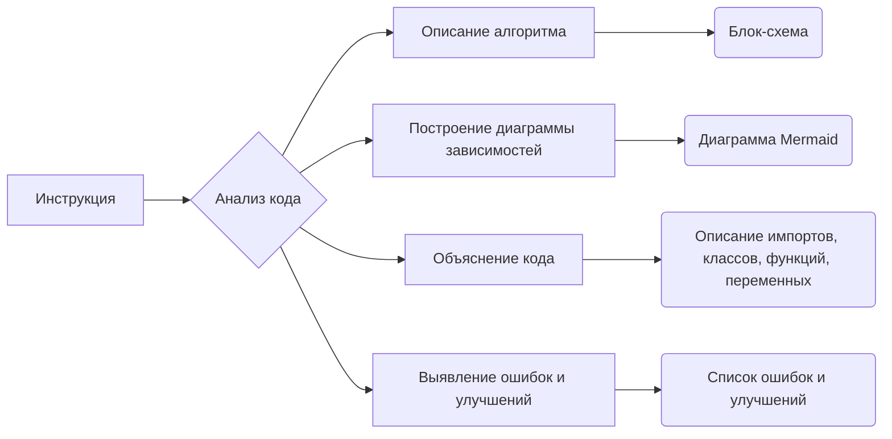

# Документация для instruction_code_explainer

## Обзор

Данный файл содержит инструкцию для анализа и документирования Python-кода. Инструкция описывает шаги, которые необходимо выполнить для создания подробной документации в формате Markdown.  Документация включает в себя описание алгоритма, диаграмму зависимостей (mermaid), объяснение кода (импорты, классы, функции, переменные), возможные ошибки и области для улучшений.

## Импорты

Инструкция не содержит импортов Python-кода.

## Алгоритм

Инструкция описывает алгоритм работы инструментария для анализа кода. Алгоритм заключается в последовательном выполнении следующих шагов:

1. **Анализ кода**: Программа разбирает предоставленный код Python.
2. **Описание алгоритма**: Формируется описание алгоритма в формате блок-схемы.  Этот блок включает примеры работы и визуализацию потока данных.
3. **Построение диаграммы зависимостей**:  Генерируется диаграмма зависимостей в формате mermaid. Эта диаграмма иллюстрирует связи между различными модулями и компонентами кода.
4. **Объяснение кода**: Разбираются импорты, классы, функции, переменные и их взаимосвязи.
5. **Выявление ошибок и улучшений**: Определяются потенциальные ошибки и области для улучшения кода.

## Диаграмма зависимостей (Mermaid)

## Объяснение

Инструкция не содержит кода Python. Она является инструкцией для написания анализа кода в формате markdown.

## Возможные ошибки и области для улучшения

Инструкция не содержит конкретного кода, поэтому потенциальные ошибки и области для улучшения зависят от вводимого кода. Инструкция описывает требуемый формат, но не предоставляет возможность для его проверки.

## Цепочка взаимосвязей

Инструкция по написанию документации для кода взаимосвязана с необходимостью анализировать код на предмет возможных проблем и ошибок. Выполнение данной инструкции поможет получить подробное понимание кода, его архитектуры и возможных неэффективных мест. Информация, полученная в результате анализа, может быть полезна при написании корректной и понятной документации для последующего использования и поддержания проекта.