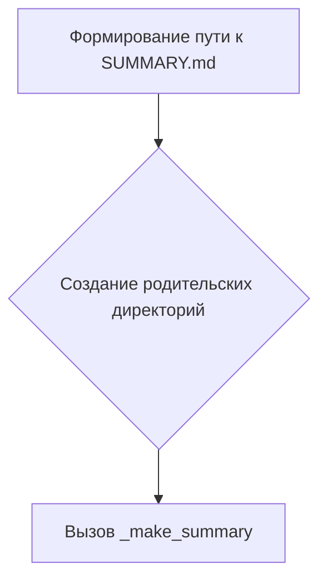
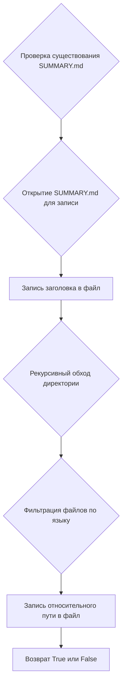
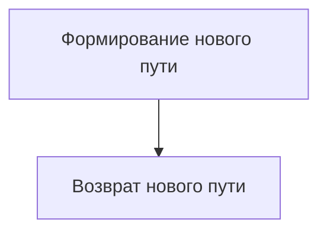

# Модуль для создания файла `SUMMARY.md`

## Обзор

Модуль `src.endpoints.hypo69.code_assistant.make_summary` предназначен для автоматического создания файла `SUMMARY.md`, который используется для навигации в документации, собранной при помощи `mdbook`. Он рекурсивно обходит указанную директорию, и создает список всех `.md` файлов в формате, пригодном для `mdbook`.  Файлы могут быть отфильтрованы по языку (русский или английский) на основе суффикса в имени файла.

## Подробней

Этот модуль упрощает процесс создания и обновления структуры документации для проектов, использующих `mdbook`. Он автоматизирует сбор информации о структуре файлов и формирует файл `SUMMARY.md`, который служит оглавлением для документации.  Модуль позволяет фильтровать файлы по языку, что позволяет создавать отдельные версии документации на разных языках.

## Функции

### `make_summary`

```python
def make_summary(docs_dir: Path, lang: str = 'en') -> None:
    """
    Создает файл SUMMARY.md, рекурсивно обходя папку.

    Args:
        docs_dir (Path): Путь к исходной директории 'src'.
        lang (str): Язык фильтрации файлов. Возможные значения: 'ru' или 'en'.
    """
    ...
```

**Назначение**: Создает файл `SUMMARY.md` в указанной директории, используя функцию `_make_summary`.

**Параметры**:

*   `docs_dir` (Path): Путь к исходной директории `'src'`.
*   `lang` (str, optional): Язык фильтрации файлов. Возможные значения: `'ru'` или `'en'`. По умолчанию `'en'`.

**Возвращает**:

*   `None`: Функция ничего не возвращает.

**Как работает функция**:

1.  Формирует путь к файлу `SUMMARY.md`, используя функцию `prepare_summary_path`.
2.  Создает родительские директории для файла `SUMMARY.md`, если они не существуют.
3.  Вызывает функцию `_make_summary` для фактического создания и записи содержимого в файл `SUMMARY.md`.



**Примеры**:

```python
from pathlib import Path
docs_dir = Path('./src')  # Укажите фактический путь к директории 'src'
make_summary(docs_dir, lang='ru')
```

### `_make_summary`

```python
def _make_summary(src_dir: Path, summary_file: Path, lang: str = 'en') -> bool:
    """
    Рекурсивно обходит папку и создает файл SUMMARY.md с главами на основе .md файлов.

    Args:
        src_dir (Path): Путь к папке с исходниками .md.
        summary_file (Path): Путь для сохранения файла SUMMARY.md.
        lang (str): Язык фильтрации файлов. Возможные значения: 'ru' или 'en'.
    """
    ...
```

**Назначение**: Рекурсивно обходит указанную директорию, фильтрует `.md` файлы по языку и создает файл `SUMMARY.md` с главами на основе этих файлов.

**Параметры**:

*   `src_dir` (Path): Путь к папке с исходниками `.md`.
*   `summary_file` (Path): Путь для сохранения файла `SUMMARY.md`.
*   `lang` (str, optional): Язык фильтрации файлов. Возможные значения: `'ru'` или `'en'`. По умолчанию `'en'`.

**Возвращает**:

*   `bool`: `True` в случае успеха, `False` в случае ошибки.

**Как работает функция**:

1.  Проверяет, существует ли файл `SUMMARY.md`, и, если существует, сообщает о его перезаписи.
2.  Открывает файл `SUMMARY.md` для записи в кодировке `utf-8`.
3.  Записывает заголовок `# Summary\n\n` в файл.
4.  Рекурсивно обходит директорию `src_dir` в поисках `.md` файлов.
5.  Фильтрует файлы по языку, пропуская файлы, не соответствующие указанному языку.
6.  Формирует относительный путь к файлу и записывает его в файл `SUMMARY.md` в формате `'- [path.stem](relative_path.as_posix())\n'`.
7.  Возвращает `True` в случае успеха или `False` в случае ошибки.



**Примеры**:

```python
from pathlib import Path
src_dir = Path('./src')  # Укажите фактический путь к директории 'src'
summary_file = Path('./docs/SUMMARY.md')  # Укажите фактический путь к файлу 'SUMMARY.md'
_make_summary(src_dir, summary_file, lang='en')
```

### `prepare_summary_path`

```python
def prepare_summary_path(src_dir: Path, file_name: str = 'SUMMARY.md') -> Path:
    """
    Формирует путь к файлу, заменяя часть пути 'src' на 'docs' и добавляя имя файла.

    Args:
        src_dir (Path): Исходный путь с 'src'.
        file_name (str): Имя файла, который нужно создать. По умолчанию 'SUMMARY.md'.

    Returns:
        Path: Новый путь к файлу.
    """
    ...
```

**Назначение**: Формирует путь к файлу `SUMMARY.md`, заменяя часть пути `'src'` на `'docs'`.

**Параметры**:

*   `src_dir` (Path): Исходный путь с `'src'`.
*   `file_name` (str, optional): Имя файла, который нужно создать. По умолчанию `'SUMMARY.md'`.

**Возвращает**:

*   `Path`: Новый путь к файлу.

**Как работает функция**:

1.  Формирует новый путь к файлу, заменяя часть пути `'src'` на `'docs'`.
2.  Возвращает новый путь.



**Примеры**:

```python
from pathlib import Path
src_dir = Path('./src')  # Укажите фактический путь к директории 'src'
prepare_summary_path(src_dir, file_name='SUMMARY.md')
```